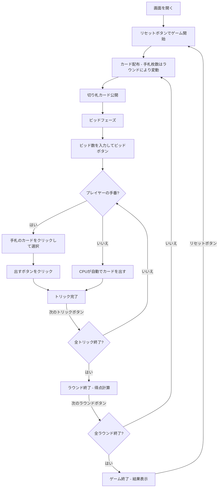

# オー・ヘル（Web版）遊び方

## ゲーム概要

4人（プレイヤー1人 + CPU 3人）で遊ぶトリックテイキング型カードゲームです。ラウンドごとに手札枚数が変動し、各ラウンドでビッド（獲得予想トリック数）を宣言します。全ラウンド終了後、累計得点が最も高いプレイヤーが勝者です。

## 起動方法

```sh
go run ./cmd/trumpcards web  # CLI経由でWebサーバーを起動
go run ./cmd/server          # 直接Webサーバーを起動
```

ブラウザで `http://localhost:8080` にアクセスし、ナビゲーションバーから「オー・ヘル」を選択します。
ナビバーのJA/ENボタンで日本語・英語を切り替えられます。

## ルール

### 基本ルール

- 52枚のトランプを4人に配布（手札枚数はラウンドごとに変動）
- 配り終わった山札の一番上のカードが**切り札（トランプ）スート**を決定
- 山札が残らないラウンドでは切り札なし
- 各ラウンド開始時にビッド（0〜手札枚数）を宣言
- **ディーラー制限（フック）**: ディーラーは全員のビッド合計が手札枚数と同じになるビッドを選べない
- リードスートに従う（フォロースート）
- トリックの勝者: 切り札が出ていれば最高の切り札、なければリードスートの最高値

### 得点

- **ビッド成功（正確に一致）**: 10 + ビッド数
- **ビッド失敗**: 0点（スタンダード方式）または -|差分|点（ペナルティ方式）

### ゲーム終了

- 全ラウンド終了後、累計得点が最も高いプレイヤーが勝利

### CPU難易度

- **Easy**: ランダムにビッド・カードを出す
- **Normal**: 基本的なトリック戦略（デフォルト）
- **Hard**: 戦略的なプレイ

## ゲームの流れ



## 画面の操作方法

### ビッドフェーズ

1. 数値入力欄にビッド数（0〜手札枚数）を入力します
2. **「ビッド」** ボタンで確定します
3. ディーラーの場合、制限されたビッド値は選択できません（フック制限）

### カードのプレイ（プレイフェーズ）

1. 手札のカードをクリックして選択します
2. フォロー必須のルールに従い、出せないカードは選択できません
3. **「カードを出す」** ボタンをクリックしてカードを場に出します

### ヒント

- ビッドフェーズまたはプレイフェーズで **「ヒント」** ボタンをクリックすると、CPUのHard戦略に基づく推奨が表示されます
- ビッドフェーズでは推奨ビッド数、プレイフェーズでは推奨カードが黄色のメッセージで表示されます

### トリック・ラウンドの進行

1. トリックが完了すると結果が表示されます
2. **「次のトリック」** ボタンで次のトリックに進みます
3. ラウンドが完了すると得点が表示されます
4. **「次のラウンド」** ボタンで次のラウンドに進みます

### キーボードショートカット

| キー | アクション | 有効条件 |
|------|-----------|---------|
| `1`〜`9`, `0` | カード選択/解除（1=1枚目, ..., 9=9枚目, 0=10枚目） | プレイヤーの手番 |
| `Enter` | カードを出す / ビッド確定 | プレイヤーの手番 / ビッドフェーズ |
| `Escape` | 選択クリア | プレイヤーの手番 |

※ テキスト入力欄にフォーカスがある場合、ショートカットは無効になります。

## 画面構成

```
┌────────────────────────────────────────────┐
│  ▶ 設定 (クリックで展開)                   │
│    CPU難易度:      [Normal▼]               │
│    最大手札枚数:   [10▼]                   │
│    スコアリング:   [Standard▼]             │
│    ラウンド方向:   [DownAndUp▼]            │
├────────────────────────────────────────────┤
│           CPU プレイヤーエリア              │
│ ┌──────────┐ ┌──────────┐ ┌──────────┐    │
│ │ CPU 1    │ │ CPU 2    │ │ CPU 3    │    │
│ │ 20点     │ │ 40点     │ │ 10点     │    │
│ │ B:3 W:2  │ │ B:1 W:1  │ │ B:2 W:0  │    │
│ └──────────┘ └──────────┘ └──────────┘    │
├────────────────────────────────────────────┤
│              ゲーム情報                     │
│  ラウンド 3/19 / トリック 2 (手札 8枚)     │
│  切り札: ♥ (♥K)  ディーラー: CPU 2        │
├────────────────────────────────────────────┤
│           現在のトリック                    │
│  CPU 1: ♣10   CPU 2: ♣K                  │
├────────────────────────────────────────────┤
│     フッター: あなた (30点, B:2 W:1)       │
│  [♠5][♣8][♥K][♦3]...                     │
│  [リセット] [ヒント] [カードを出す] [次のトリック] │
└────────────────────────────────────────────┘
```

- **設定パネル（▶ 設定）**:
  - 「CPU難易度」セレクト: Easy / Normal / Hard から選択
  - 「最大手札枚数」: 1〜13 から選択
  - 「スコアリング」: Standard / Penalty から選択
  - 「ラウンド方向」: DownOnly / DownAndUp から選択
  - 次のリセット時に設定が適用される
- **CPU プレイヤーエリア**: 各 CPU の累計得点、ビッド数、獲得トリック数を表示
  - 手番の CPU は金色枠
- **ゲーム情報**: 現在のラウンド/全ラウンド数、トリック番号、手札枚数、切り札スート、ディーラー
- **現在のトリック**: トリックに出されたカード
- **フッター（あなたの手札）**:
  - クリックで選択（緑枠 + 上に浮き上がる）
  - フォロー必須のカードのみ選択可能
- **スコアテーブル**: 各プレイヤーのビッド、獲得トリック数、ラウンドスコア、累積スコア

## 遊び方のコツ

- ビッドは手札の強さ（切り札の枚数、高いカード）を考慮して慎重に宣言しましょう
- ディーラーの場合はフック制限を意識してビッドしましょう
- 切り札が少ないラウンドではビッドを控えめにするのが安全です
- 手札枚数が少ないラウンドほど運の要素が強くなります
- 正確なビッドが高得点の鍵です（多くても少なくてもダメ）
- 迷った時はヒントボタンでCPUのHard戦略に基づく推奨を確認できます
