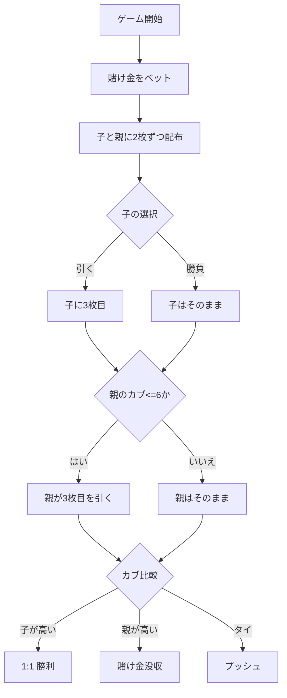

# おいちょかぶ（Web版）遊び方

## ゲーム概要

おいちょかぶ（Oicho-Kabu）は、カブ札（かぶふだ）で遊ぶ日本の伝統的なバンキングゲームです。子（プレイヤー）1 人が親（CPU）を相手に、手札の合計の 1 の位（10 で割った余り）を競います。9（カブ）が最強、0（ブタ）が最弱で、バカラによく似た運勝負に、3 枚目を「引くか勝負するか」という 1 手の判断が加わります。

## 使用する札（カブ札）

- カブ札は 1〜10 の数字が各 4 枚、合計 40 枚のデッキです（絵札・スートの強さはありません）。
- 各札の点数はその数字（1〜10）で、10 は 0 として数えます。
- 本ゲームでは専用アートの代わりに、数字を大きく描いた札として画面に表示されます。

## 起動方法

```sh
go run ./cmd/trumpcards web  # CLI経由でWebサーバーを起動
go run ./cmd/server          # 直接Webサーバーを起動
```

ブラウザで `http://localhost:8080` にアクセスし、ナビゲーションバーから「おいちょかぶ」を選択します。
ナビバーの JA/EN ボタンで日本語・英語を切り替えられます。

## ルール

### 得点（カブ）の数え方

- 手札の点数を合計し、その **1 の位** がその手の「カブ」になります。
- 例: 4 + 5 = 9 → カブ 9（最強）。8 + 9 = 17 → カブ 7。10 + 10 = 20 → カブ 0（ブタ、最弱）。

### 基本ルール

1. 賭け金を置きます。
2. 子（あなた）と親に 2 枚ずつ配られます（親の手は結果まで伏せられます）。
3. 子は 3 枚目を **引く** か、このまま **勝負（スタンド）** するかを選びます。
4. 続いて親は、自分のカブが **6 以下なら 3 枚目を引き**、7 以上ならそのまま勝負します。
5. 子と親のカブを比べ、**高い方が勝ち**（9 が最強、0 が最弱）。
6. **子 > 親** なら賭け金に対して 1:1 を獲得、**子 < 親** なら賭け金を没収、**同じ（タイ）** ならプッシュ（引き分け）で賭け金は戻ります。

## ゲームの流れ



## 画面の操作方法

- **ベット入力**: チップ額を入力して「ベット」ボタンをクリック。
- **引く**: 引くフェーズで 3 枚目を引きます。
- **勝負**: 引くフェーズでそのまま親と勝負します。
- **リセット**: 結果フェーズで「リセット」をクリックして新規ゲームへ。
- キーボードショートカット: `b` ベット、`d` 引く、`s` 勝負、`r` リセット。

## 画面構成

- **フェーズ表示**: 現在のフェーズとチップ残高
- **子の手札**: あなたのカードとカブ
- **親の手札**: 結果フェーズでのみ公開されるカードとカブ
- **配当表示**: 結果フェーズで合計配当を表示
- **ヒント**: 引くフェーズで引く／勝負の推奨を表示（オプション）

## 遊び方のコツ

- カブが 0〜3 のような低い手は、3 枚目を引いても崩れにくく、伸びしろが大きいため「引く」が有利です。
- カブが 7 以上の高い手は、3 枚目でかえって下がりやすいので「勝負」が基本です。
- 親はカブ 6 以下で必ず引くため、子は中途半端な手のときこそ引くか勝負かの判断が問われます。
