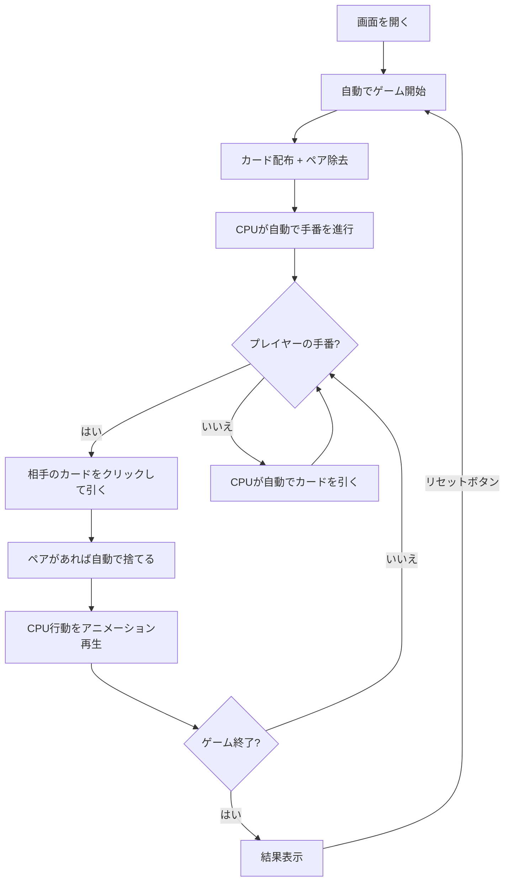

# ババ抜き（Web版）遊び方

## ゲーム概要

4人（プレイヤー1人 + CPU 3人）で遊ぶカードゲームです。ペアを揃えて手札をなくしていき、最後にジョーカーを持っているプレイヤーが負けです。

## 起動方法

```sh
go run ./cmd/cli web        # CLI経由でWebサーバーを起動
go run ./cmd/server         # 直接Webサーバーを起動
```

ブラウザで `http://localhost:8080` にアクセスし、ナビゲーションバーから「Old Maid」を選択します。

## ルール

### 基本ルール

- 52枚のトランプ + ジョーカー1枚（合計53枚）を使用
- 全カードを4人に配布し、最初に手札内のペア（同じ数字2枚）を全て捨てる
- 順番に次のプレイヤーの手札から1枚引き、ペアができたら捨てる
- 手札がなくなったプレイヤーから上がり
- 最後にジョーカーが残ったプレイヤーが負け

## ゲームの流れ



## 画面の操作方法

### ゲーム開始

画面を開くと自動的にリセットが実行され、ゲームが開始されます。

### プレイヤーの手番

1. 引く相手のCPUパネルが金色の枠で強調され、「← 引く相手」バッジが表示されます
2. そのCPUの手札が裏向きカード（CardBack）として表示されます
3. **裏向きカードをクリック**してカードを引きます
4. または **「ランダムに引く」** ボタンでランダムに1枚引きます

### CPU の手番

CPUの行動は自動で進行し、各アクションが800msの間隔でアニメーション再生されます。

### 捨てカード表示

最後に捨てたペアが「捨てカード」エリアに表向きで表示されます。

## 画面構成

```
┌────────────────────────────────────────────┐
│            CPU プレイヤーエリア             │
│ ┌──────────┐ ┌──────────┐ ┌──────────┐   │
│ │ CPU 1    │ │ CPU 2    │ │ CPU 3    │   │
│ │ 13枚     │ │ 上がり   │ │ 12枚     │   │
│ │ [裏][裏] │ │          │ │ [裏][裏] │   │
│ │← 引く相手│ │          │ │          │   │
│ └──────────┘ └──────────┘ └──────────┘   │
├────────────────────────────────────────────┤
│          捨てカード: [♥9] [♦9]            │
├────────────────────────────────────────────┤
│         [ランダムに引く] [リセット]        │
├────────────────────────────────────────────┤
│            プレイヤーの手札                 │
│  [♠3] [♥5] [♦9] [♣K] [JOKER] ...        │
└────────────────────────────────────────────┘
```

- **引く相手のCPU**: 金色枠 + 「← 引く相手」バッジ + クリック可能な裏向きカード
- **プレイヤーの手札**: 画面下部に表向きで表示（操作対象外、自分の手札確認用）
- **CPU の手札**: 枚数のみ表示、カード内容は非表示
- **捨てカード**: 最後に捨てたペアが表向きで表示

## 遊び方のコツ

- 引く相手の裏向きカードをクリックすることで、位置を指定してカードを引けます
- 「ランダムに引く」ボタンでもプレイ可能です
- CPUの行動はアニメーションで順次表示されるので、ゲームの進行を見守りましょう
