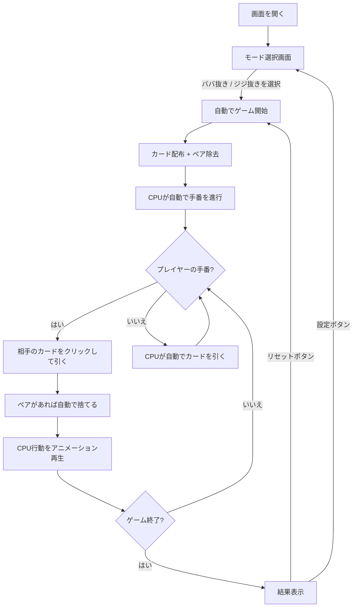

# ババ抜き（Web版）遊び方

## ゲーム概要

4人（プレイヤー1人 + CPU 3人）で遊ぶカードゲームです。ペアを揃えて手札をなくしていき、最後に「負け札」を持っているプレイヤーが負けです。

- **ババ抜き（ノーマルモード）**: ジョーカーが負け札
- **ジジ抜き**: ゲーム開始前にランダムな1枚が取り除かれ、その対となるカードが負け札（取り除かれたカードはゲーム終了時に公開）

## 起動方法

```sh
go run ./cmd/trumpcards web  # CLI経由でWebサーバーを起動
go run ./cmd/server          # 直接Webサーバーを起動
```

ブラウザで `http://localhost:8080` にアクセスし、ナビゲーションバーから「Old Maid」を選択します。
ナビバーのJA/ENボタンで日本語・英語を切り替えられます。

## ルール

### 基本ルール（共通）

- 全カードを4人に配布し、最初に手札内のペア（同じ数字2枚）を全て捨てる
- 順番に次のプレイヤーの手札から1枚引き、ペアができたら捨てる
- 手札がなくなったプレイヤーから上がり
- 最後に「負け札」が残ったプレイヤーが負け

### モード別ルール

| モード | 使用カード | 負け札 |
|--------|-----------|--------|
| ババ抜き（mode=0） | 52枚 + ジョーカー1枚（計53枚） | ジョーカー |
| ジジ抜き（mode=1） | 52枚からランダムに1枚除去（計51枚） | 除去されたカードのペアとなるカード |

## ゲームの流れ



## 画面の操作方法

### モード選択（ゲーム開始前）

画面を開くと最初にモード選択画面が表示されます。

| 選択肢 | mode値 | 説明 |
|--------|--------|------|
| ババ抜き | 0 | ジョーカーが負け札（ノーマルモード） |
| ジジ抜き | 1 | ランダムな1枚を除去し、その対となるカードが負け札 |

- **CPU心理戦** チェックボックス: 有効にすると、CPUは「負け札」を手札の端（最初または最後）に配置します。ゲーム中、CPU心理戦が有効な場合は負け札の疑いがあるカードが少し上にずれて表示されます。
- **CPU記憶AI** チェックボックス: 有効にすると、CPUは前回引いた位置を記憶し、戦略的にカードを選択します。
  - 前回ペアが不成立だった位置を避ける傾向（40%）
  - 前回ペアが成立した位置の近傍（±1）を好む傾向（40%）
  - 人間がシャッフルや並べ替えをした場合、記憶がリセットされ端を選ぶ確率が上がります（50%）
- **Meta-AI** チェックボックス: 有効にすると、CPUがセッション内のゲーム履歴（プレイヤーの端カード選択率）を学習し、戦略を適応的に調整します。
- **CPU迷い時間ディレイ** チェックボックス: 有効にすると、CPUがカードを引いた後の表示ディレイが引いたカードの内容に応じて変化します。
  - ジョーカーを引いた場合: 1000–1500ms（遅い — 悪いカードを引いた動揺）
  - ペアが成立した場合: 300–500ms（速い — 嬉しい反応）
  - 通常: 600–1000ms（中間）
- モード・オプションを選択後、「ゲーム開始」ボタンを押すとゲームが開始されます。

### ゲーム中の表示

- **ジジ抜きモードバッジ**: ジジ抜きでプレイ中は画面上部に赤い「ジジ抜き」バッジが表示されます。
- **ハイライトカード**: CPU心理戦が有効な場合、負け札の疑いがあるCPUのカードが他のカードより少し上にずれて表示されます（`cpuHighlightedCardIdx` が -1 以外のとき）。
- **取り除かれたカードの公開**: ジジ抜きモードでゲームが終了すると、ゲーム開始時に取り除かれたカードが公開されます（`removedCard`）。
- **設定ボタン**: ゲーム終了後に「設定」ボタンを押すとモード選択画面に戻ります。

### 引き履歴タイムライン

ゲーム中、画面に「引き履歴」パネルが表示されます。全プレイヤーの引きの履歴を番号付きで時系列に確認できます。

- 各エントリには「誰が誰から引いたか」「捨てたペア数」が表示されます
- 引いた結果上がったプレイヤーには「上がり」が付記されます
- カードの内容は表示されません（プライバシー設計）
- 新しいエントリが追加されると自動的にスクロールします
- ゲームリセット・設定画面への遷移で履歴はクリアされます

### 容疑者ピン

CPUプレイヤーに「負け札を持っている疑い」のマークを付けることができます。

- CPUプレイヤーのエリアにある「容疑者ピン」ボタンを押すと、そのCPUに赤い「容疑者」バッジが表示されます
- もう一度押すと解除されます
- ピンは純粋にクライアント側のメモ機能で、ゲームロジックには影響しません
- ゲームリセット・設定画面への遷移でピンはクリアされます

### プレイヤーの手番

1. 引く相手のCPUパネルが金色の枠で強調され、「← 引く相手」バッジが表示されます
2. そのCPUの手札が裏向きカード（CardBack）として表示されます
3. **裏向きカードをクリック**してカードを引きます
4. または **「ランダムに引く」** ボタンでランダムに1枚引きます

### 手札の並べ替え

CPUは手札の位置を参考にカードを引きます（30%の確率で端のカードを優先）。自分の手札を並べ替えることで、CPUに引かせたいカードの位置を戦略的にコントロールできます。

- **ドラッグ＆ドロップ**: プレイヤーの手札カードをドラッグして別の位置にドロップすることで、カードの順番を入れ替えられます
- **シャッフルボタン**: 「シャッフル」ボタンを押すと、手札をランダムに並べ替えます

### カード引きアニメーション

- カードを引いた後、引いたカードは最初に裏面（CardBack）で表示され、約600msの「ため」の後に表向きにフリップして公開されます
- ジョーカーを引いた場合、画面全体が震える（シェイク）アニメーションが再生されます

### CPU の手番

CPUの行動は自動で進行し、各アクションが800msの間隔でアニメーション再生されます。

### 捨てカード表示

最後に捨てたペアが「捨てカード」エリアに表向きで表示されます。

### キーボードショートカット

ゲーム中、以下のキーボードショートカットが使用できます。

| キー | アクション | 有効条件 |
|------|-----------|---------|
| `d` | ランダムに引く | プレイヤーの手番 |
| `s` | シャッフル | プレイヤーの手番 |
| `←` / `→` | 手札のフォーカス移動 | プレイヤーの手番 |
| `Shift` + `←` / `→` | 手札の入れ替え（並べ替え） | プレイヤーの手番 |
| `Escape` | フォーカス解除 | プレイヤーの手番 |

※ テキスト入力欄にフォーカスがある場合、ショートカットは無効になります。

## 画面構成

```
┌────────────────────────────────────────────┐
│  [ジジ抜き]           (モードバッジ)        │
├────────────────────────────────────────────┤
│            CPU プレイヤーエリア             │
│ ┌──────────┐ ┌──────────┐ ┌──────────┐   │
│ │ CPU 1    │ │ CPU 2    │ │ CPU 3    │   │
│ │ 13枚     │ │ 上がり   │ │ 12枚     │   │
│ │ [裏][裏↑]│ │          │ │ [裏][裏] │   │
│ │← 引く相手│ │          │ │          │   │
│ └──────────┘ └──────────┘ └──────────┘   │
├────────────────────────────────────────────┤
│          捨てカード: [♥9] [♦9]            │
├────────────────────────────────────────────┤
│ [ランダムに引く] [シャッフル] [リセット] [設定] │
├────────────────────────────────────────────┤
│          引き履歴タイムライン                │
│ 1. Player 1 → CPU 1: 1組捨て              │
│ 2. CPU 1 → CPU 2: 0組捨て                 │
│ 3. CPU 2 → CPU 3: 2組捨て (CPU 2 上がり)  │
├────────────────────────────────────────────┤
│       プレイヤーの手札（ドラッグで並替可）  │
│  [♠3] [♥5] [♦9] [♣K] ...               │
└────────────────────────────────────────────┘
```

- **引く相手のCPU**: 金色枠 + 「← 引く相手」バッジ + クリック可能な裏向きカード
- **プレイヤーの手札**: 画面下部に表向きで表示（ドラッグ＆ドロップで並べ替え可能）
- **CPU の手札**: 枚数のみ表示、カード内容は非表示
- **捨てカード**: 最後に捨てたペアが表向きで表示
- **[裏↑]**: CPU心理戦が有効なとき、ハイライトされたカード（負け札の疑いあり）が少し上にずれて表示される
- **[ジジ抜き]バッジ**: ジジ抜きモード中に画面上部に赤く表示
- **[設定]ボタン**: ゲーム終了後にモード選択画面へ戻る
- **引き履歴タイムライン**: 全プレイヤーの引きの履歴を番号付きで時系列表示
- **容疑者バッジ**: CPUプレイヤーに「容疑者」ピンを付けると赤いバッジが表示される

## 遊び方のコツ

- 引く相手の裏向きカードをクリックすることで、位置を指定してカードを引けます
- 「ランダムに引く」ボタンでもプレイ可能です
- CPUの行動はアニメーションで順次表示されるので、ゲームの進行を見守りましょう
- CPUは端のカードを優先して引く傾向があるので、「シャッフル」やドラッグ＆ドロップで手札を並べ替え、ジョーカーを端から遠ざけると有利です
- 引き履歴タイムラインを見て、誰がどこから引いたか・ペアが成立したかを分析すると、負け札の位置を推理しやすくなります
- 容疑者ピンを使って、負け札を持っていそうなCPUをマークしておくと整理しやすくなります
