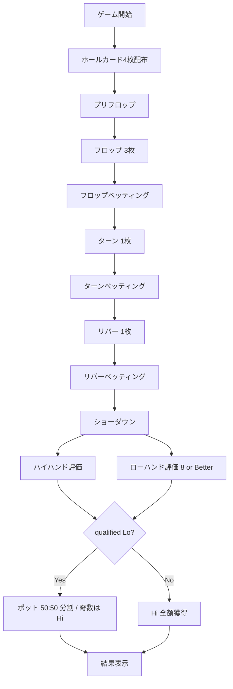

# オマハ ハイロー（Web版）遊び方

## ゲーム概要

オマハ ハイロー（Omaha 8 or Better）は、Omaha Hold'em のスプリットポット版。ショーダウン時にハイ最強手とローの 8-or-Better 最強手で **ポットを 50:50 に分割** します。同一プレイヤーが両方を取れば "scoop"（ポット全額獲得）となり、qualified なローが居なければハイが全額獲得します。

進行は通常のオマハと同じ（4枚のホールカード、フロップ／ターン／リバー、ホール 2 枚＋コミュニティ 3 枚で 5 枚を作るルール）。Web版は CPU 戦・CLI モード切替・チュートリアル・ヒント・棋譜（アクションログ）に対応します。

## 起動方法

```sh
go run ./cmd/trumpcards web  # CLI経由でWebサーバーを起動
go run ./cmd/server          # 直接Webサーバーを起動
```

ブラウザで `http://localhost:8080` にアクセスし、ナビゲーションバーから「オマハ ハイロー」を選択します。ナビバーの JA/EN ボタンで日本語・英語を切り替えられます。

## ルール

### 基本ルール

- 52枚のトランプを使用
- 各プレイヤーに **4 枚** のホールカードが配られる
- コミュニティカードを最大 5 枚共有（フロップ 3 / ターン 1 / リバー 1）
- **ハイハンド**：ホールから 2 枚＋コミュニティから 3 枚で 5 枚を作り、最強の役を競う（通常のオマハと同じ）
- **ローハンド**：同じくホール 2 枚＋コミュニティ 3 枚。**5 枚すべてが 8 以下（A=1）かつランクの重複が無い** 場合のみ qualified
- ハイとローで **別々の組み合わせ** を選んで構わない
- ローの強さは A-5 ローボール基準（最弱 = 最強）。最強ロー = A-2-3-4-5（"ホイール"）／最弱の qualified = 8-7-6-5-4
- ストレート・フラッシュはローの判定に影響しない（ハイ側でのみ評価）
- 各サイドポットを **ハイ : ロー = 50 : 50** で分配。**奇数チップは Hi 側に寄る**
- qualified なローが居なければハイが全額獲得

### スプリットポット例

| 局面 | 配分 |
|------|------|
| Hi 勝者 A、Lo 勝者 B、ポット 100 | A: 50、B: 50 |
| Hi 勝者 A、Lo 勝者 B、ポット 101 | A: 51、B: 50 |
| A が Hi も Lo も最強（"scoop"） | A: 100 |
| qualified Lo なし | Hi 勝者: 100 |

### 役の強さ

ハイ側はロイヤルストレートフラッシュ〜ハイカードまで通常のポーカー序列。役名・キッカーは通常のオマハと共通です。

## ゲームの流れ



## 画面の操作方法

ベッティング操作は通常のオマハと同一：

| 操作 | 内容 |
|------|------|
| **フォールド** | 手札を捨てる |
| **チェック** | 賭け額が同じならスキップ |
| **コール** | 現在の最高ベットに合わせる |
| **ベット / レイズ** | スライダーで額を指定 |
| **オールイン** | 残チップ全額を投入 |
| **マック / ショー** | 負け時に手札を見せるかどうか |
| **設定** | テーブルサイズ・ベットリミット・ブラインド・トーナメント・リバイ／アドオン |

ショーダウン後、結果セクションには **ハイの役** に加えて **Low: ...** がカード絵文字付きで表示されます（qualified な場合のみ）。獲得チップは `Hi:N / Lo:M` の内訳付きで表示されます。

## 画面構成

- **コミュニティカード**: 中央
- **ポット表示**: 中央上部
- **自分のホール 4 枚**: 下段（必ず 2 枚使用）
- **CPU プレイヤー**: テーブル周り。HUD（VPIP/PFR/3Bet/AF）はオマハと共通
- **アクションログ**: ハンド毎のベット履歴
- **ヒント / チュートリアル**: ハイ側はオマハ・ヒントを再利用。加えてホール 2 枚とボードの組み合わせで 8 以下の 5 ランクが揃う見込みがあるかをローのドロー判定として評価し、両取り可能なら「ハイ＋ローのスクープ圏内」、ハイが弱くてもローが濃厚なら「ロー成立濃厚」として表示します

## 遊び方のコツ

- **A-2 を含む 4 枚ホールはローの優良スターター**：ホイールの半分が確定
- **A♠ 2♠ X♥ Y♥ のような double-suited ハンド** はハイ（フラッシュドロー）とロー（ホイールドロー）の両取りを狙える
- **コミュニティに 8 以下が 3 枚出ない局面ではローは成立しない**：ハイ専用と割り切って通常のオマハ戦略で OK
- **ペアボードはローを潰す**：8 以下が並んでもペアになっているとローは作りづらい
- **scoop チャンスにはバリューを最大化**：相手が片方しか狙えていないと判断したら強くベット
