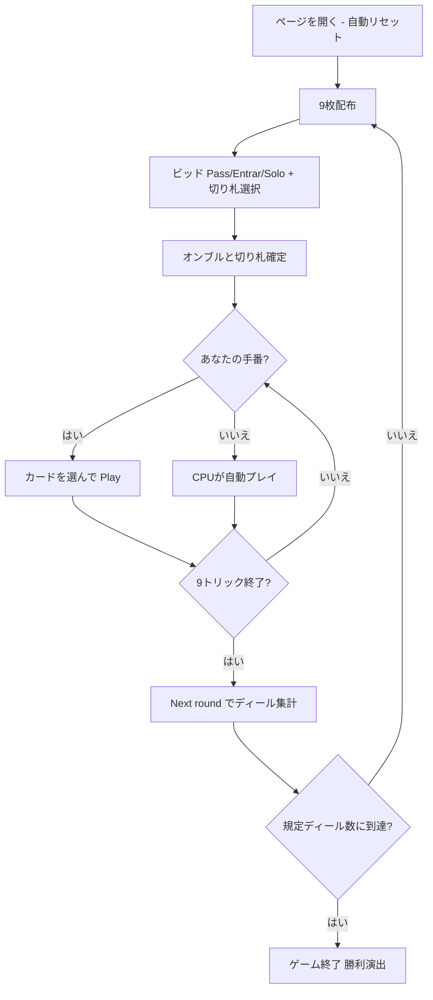

# オンブル（Web版）遊び方

## ゲーム概要

Ombre（Hombre / オンブル）は17世紀ヨーロッパを席巻したスペイン発祥の**トリックテイキングゲーム**です。40枚のスペイン式デッキ（8/9/10 を除く）を3人でプレイし、入札で名乗りを上げた1人の**オンブル（Ombre）**が残り2人の**連合（coalition）**を相手に9トリックを1人で戦います。あなたは席0としてプレイします。

## 起動方法

```sh
go run ./cmd/trumpcards web        # REST API + Web GUI サーバを起動
go run ./cmd/trumpcards web --open # 起動してブラウザを開く
```

ブラウザで `/ombre` にアクセスします。

## ルール

### デッキと配布

- **デッキ**: 40枚のスペイン式カード（A, 2, 3, 4, 5, 6, 7, J, Q, K × 4スート。8/9/10 は除外）
- **プレイヤー**: 3人（あなた = 席0、CPU1〜2）
- **配布**: 各プレイヤー9枚。残り13枚はストックとして未使用のまま残ります。

### ビッド（オークション）

前手から順に、各プレイヤーは**パス**・**エントラール**・**ソロ**のいずれかを宣言します。エントラール／ソロを宣言するときは**切り札スート**（♠♣♥♦）も選びます。最も高い宣言をしたプレイヤーが**オンブル**になります。

Web では切り札スートのボタン（♠♣♥♦）を選んでから **「Entrar」** **「Solo」** ボタンで宣言します。降りる場合は **「Pass」** ボタンです。

### 切り札とカードの強さ

切り札グループの強さ（強い順）: **スパディーユ（♠A）＞マニーユ（切り札の7）＞バスト（♣A）＞プント（切り札のA、赤のみ）＞K＞Q＞J＞6..2**。スパディーユ（♠A）とバスト（♣A）は常に切り札（マタドール）です。

### フォロー義務

- リードスートを持っていれば**必ず従わなければなりません（must-follow）**。ボイド時は任意の札（切り札を含む）を出せます。

### 得点計算と勝利条件

- **サカール（Sacar）**: オンブルが最多トリック → オンブル +2 / 各相手 -1。
- **プエスタ（Puesta）**: オンブルが並ばれる → オンブル -2 / 各相手 +1。
- **コディール（Codille）**: 相手がオンブルを上回る → オンブル -4 / 各相手 +2（失点倍）。
- 規定ディール数（既定 **5**）を配り終えた時点で累積得点が最上位のプレイヤーが勝利。

## ゲームの流れ



## 画面の操作方法

- **ビッド**: 切り札スート（♠♣♥♦）ボタンを選び、「Entrar」または「Solo」で宣言します。降りるときは「Pass」。
- **プレイ**: プレイ可能な札がハイライトされるので、選んで「Play」します。
- **トリック／ディール進行**: 「Next」でトリック結果を確認、「Next deal」で次のディールへ進みます。
- **その他**: 「Reset」で新規ゲーム、設定でヒントをONにすると推奨アクションが表示されます。

## 画面構成

- **ヘッダー**: ゲーム名・フェーズ表示（Bid / Play / …）・CLI 切り替え
- **情報サイドバー**: 各プレイヤーの累積得点・オンブルバッジ・獲得トリック数・ディール結果（サカール／プエスタ／コディール）
- **中央**: 現在のトリック・切り札スート
- **フッター**: あなたの手札（プレイ可能札がハイライト）・アクションボタン（切り札選択/Entrar/Solo/Pass/Play/Next/Next deal/Reset）

## 遊び方のコツ

- マタドール（スパディーユ・マニーユ・バスト）や長い切り札を持っているときだけ宣言し、弱い手ならパスしましょう。
- 手札で最も長く強いスートを切り札に選ぶのが基本です。
- 切り札がないスートのリードでは、ボイドを作って切り札を切る展開を狙いましょう。
- 連合側のときは、もう1人の連合と協力してコディール（相手勝ち）を狙い、失点を倍にしましょう。
- ヒント（設定でON）は、ビッド・プレイの各フェーズで推奨アクションを提示します。
