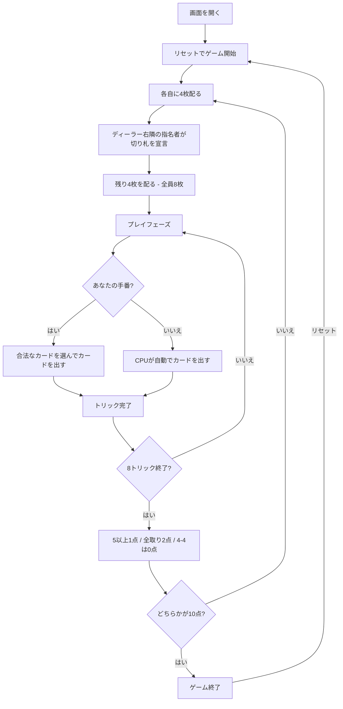

# オミ（Web版）遊び方

## ゲーム概要

オミは、4人（あなたとCPU 3人）が席0+2 対 席1+3 の2チームで競う、8トリックのマストフォロー型ゲームです。32枚（各スート7〜A）を使い、先に10点に到達したチームが勝ちます。

## 起動方法

```sh
go run ./cmd/trumpcards web     # CLI経由でWebサーバーを起動
go run ./cmd/server             # 直接Webサーバーを起動
```

ブラウザで `http://localhost:8080` にアクセスし、ナビゲーションバーから「オミ」を選択します。ナビバーのJA/ENボタンで日本語・英語を切り替えられます。

## ルール

### 配りと切り札

- ディーラーの右隣（`(dealerIdx+1)%4`）の1人が指名者です。パスはありません。
- まず各自に4枚を配り、指名者が切り札を宣言してから、残り4枚を配ります。宣言後は全員8枚です。
- 切り札は♠/♣/♥/♦のいずれかです。ジャック昇格はなく、同じスートの強さは `A > K > Q > J > 10 > 9 > 8 > 7` です。

### トリック

- 全8トリックを行います。リードスートを持っていれば必ずフォローします。
- リードスートがなければ、切り札を含む任意の札を出せます。切り札を強制するルールはありません。
- 切り札が出ていれば最強の切り札、なければリードスートの最強札が勝ち、勝者が次をリードします。

### 得点と終局

- 5トリック以上は1点、8トリック全取り（オミ）は合計2点です。
- 4-4 の引き分けは両チーム0点です。
- どちらかが10点に到達するとゲーム終了です。

## ゲームの流れ



## 画面の操作方法

### 切り札宣言前（4枚配り）

1. 画面上部のゲーム情報で、ディーラー、指名者、`切り札: 未決定` を確認します。
2. 指名者があなたの場合、スート選択（♠/♣/♥/♦）から切り札を選び、「切り札を宣言」を押します。パスはできません。
3. 他のプレイヤーが指名者の場合は、CPUが宣言し、残り4枚が自動で配られます。

### カードのプレイ

1. 手札からカードを選択します。リードスートを持っている場合は、そのスートのカードだけが選択できます。
2. リードスートがなければ、切り札でも他のスートでも選択できます。
3. 「カードを出す」を押します。CPUの手番は自動で進みます。
4. トリック完了後に「次のトリック」、8トリック完了後に「次のラウンド」を押します。

### キーボードショートカット

| キー | アクション | 有効条件 |
|------|-----------|---------|
| `1`〜`8` | 1〜8枚目のカードを選択/解除 | あなたのプレイ手番 |
| `Enter` | 選択したカードを出す | あなたのプレイ手番 |
| `Escape` | 選択をクリア | あなたのプレイ手番 |

## 画面構成

```
┌────────────────────────────────────────────┐
│ オミ        ラウンド 1 / トリック 1         │
│ ディーラー: あなた  指名者: CPU 1           │
│ 切り札: ♠    チーム0: 0点  チーム1: 0点     │
├────────────────────────────────────────────┤
│ CPU 1（チーム1） 7枚   CPU 2（チーム0） 7枚 │
│ CPU 3（チーム1） 7枚                         │
├────────────────────────────────────────────┤
│ 現在のトリック: CPU 1 が ♠ をリード          │
├────────────────────────────────────────────┤
│ あなた（チーム0） 8枚                        │
│ [♠8] [♠10] [♣8] [♣K] [♥8] [♥J] [♥Q] [♦J] │
│ [リセット] [ヒント] [カードを出す] [次へ]    │
└────────────────────────────────────────────┘
```

- 切り札宣言前は、あなたの手札が4枚で、切り札が未決定と表示されます。
- 宣言後は残り4枚が配られ、全員の手札が8枚になります。
- 手札の選択状態と、現在のトリック、両チームの得点・獲得トリックを確認できます。
- CPUのカード内容は表示せず、残り枚数だけを表示します。

## 遊び方のコツ

- 指名者には必ず宣言の責任があるため、最初の4枚から切り札と高位札の組み合わせを考えます。
- 5トリック以上の1点を安定して取るか、8トリック全取りの2点を狙うかを選びます。
- フォローできないときは、切り札で勝つか、不要な札を捨てるかを選択できます。
