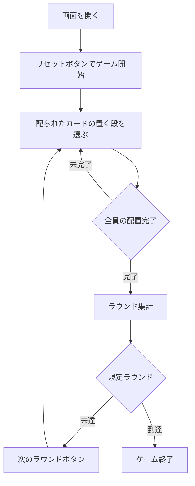

# オープンフェイス・チャイニーズポーカー（Web版）遊び方

## ゲーム概要

オープンフェイス・チャイニーズポーカー（Open Face Chinese Poker / OFC）は、CPU を相手に 2〜4 人で対戦する、ソリティアとポーカーを融合させたゲームです。標準52枚デッキを使い、配られたカードをトップ（3枚）・ミドル（5枚）・ボトム（5枚）の3段に置いていきます。一度置いたカードは動かせません。規定ラウンド終了時に累計得点が最も高いプレイヤーが勝者です。

## 起動方法

```sh
go run ./cmd/trumpcards web  # CLI経由でWebサーバーを起動
go run ./cmd/server          # 直接Webサーバーを起動
```

ブラウザで `http://localhost:8080` にアクセスし、ナビゲーションバーから「オープンフェイス・チャイニーズポーカー」を選択します。
ナビバーのJA/ENボタンで日本語・英語を切り替えられます。

## ルール

### 基本の流れ

1. **配置**: カードは1枚ずつ配られます。配られたカードの下に表示される「トップに置く」「ミドルに置く」「ボトムに置く」ボタンで、置く段を選びます。
2. **段の強さ**: 3段はトップからボトムへ向かって強さが弱くならない順（非減少）に並べる必要があります。強さ順を崩すと「ファウル」となり、そのラウンドは得点なしになります。
3. **得点**: ラウンド終了時に段ごとに他プレイヤーと比較し、勝った段の数とロイヤリティ（ボーナス点）を得点化します。
4. **ファンタジーランド**: トップに高い役（クイーンのペア以上）を作るとファンタジーランドに到達します。

### ゲーム終了

規定ラウンド数を消化すると終了し、累計得点が最も高いプレイヤーが勝者です。

## ゲームの流れ



## 画面の操作方法

### 配置フェーズ

- 画面上部に、これから置くカードが表示されます。
- カードの下の「トップに置く」「ミドルに置く」「ボトムに置く」ボタンで段を選びます。一度置いたカードは動かせません。

### ラウンド終了

- 各プレイヤーのラウンド得点・ロイヤリティ・ファウル・ファンタジーランドの状況が表示されます。
- 「次のラウンドへ」ボタンで次のラウンドを開始します。

### 画面構成

```
┌────────────────────────────────────────────┐
│  ラウンド / 累計得点                          │
│  配られたカード                               │
│   [トップに置く] [ミドルに置く] [ボトムに置く] │
│  ┌── あなた ──────────┐ ┌── CPU 1 ──────┐  │
│  │ トップ（3枚）        │ │ トップ（3枚）   │  │
│  │ ミドル（5枚）        │ │ ミドル（5枚）   │  │
│  │ ボトム（5枚）        │ │ ボトム（5枚）   │  │
│  └────────────────────┘ └───────────────┘  │
│  ┌── フッター ──────────────────────────┐    │
│  │  次のラウンドへ / リセット             │    │
│  └──────────────────────────────────────┘    │
└────────────────────────────────────────────┘
```

## 遊び方のコツ

- ボトムから強い役を作り、トップが最も弱くなるよう逆算して置いていくとファウルを避けやすくなります。
- 高得点を狙ってトップにペアを作りすぎると、ミドル・ボトムが弱くなりファウルしやすい点に注意しましょう。
