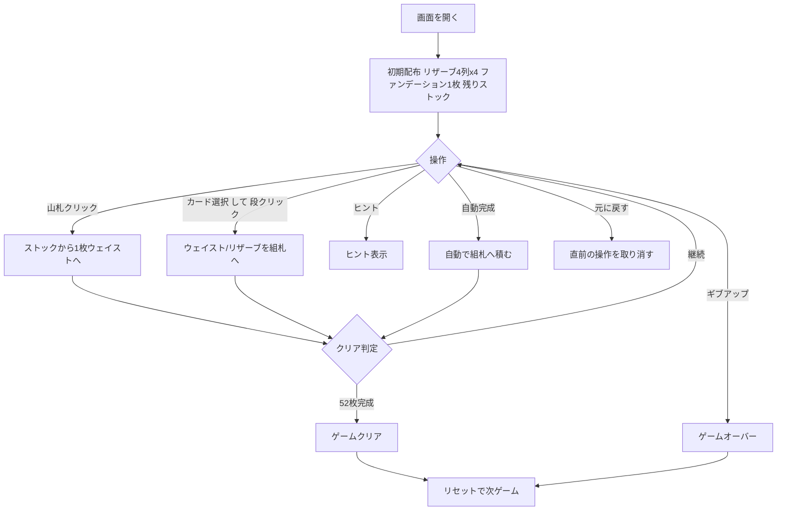

# オズモシス（Web版）遊び方

## ゲーム概要

オズモシス（Osmosis、別名 Treasure Trove）は1人用ソリティア。4列×4枚のリザーブ、縦4段のファンデーション、ストックとウェイストを使う。連番を作る従来のソリティアとは異なり、「上の段に置かれたランクが下の段に浸透していく」独特のルールを持つ。52枚すべてをファンデーションに積み上げれば勝利。

## 起動方法

```sh
go run ./cmd/trumpcards web        # CLI経由でWebサーバーを起動
go run ./cmd/server                # 直接Webサーバーを起動
```

ブラウザで `http://localhost:8080` にアクセスし、ナビゲーションバーから「オズモシス」を選択します。
ナビバーのJA/ENボタンで日本語・英語を切り替えられます。

## ルール

### レイアウト

- **ファンデーション**: 縦4段。開始時に1枚が置かれ、その値が「ベースランク」となる
- **リザーブ**: 4列、それぞれ4枚。各列のトップ1枚のみ場に出せる
- **ストック / ウェイスト**: 残りのカード。1枚ずつめくる

### 移動ルール

- 各段は1スート専用
- **1段目（最上段）**: その段のスートのカードを順不同で積める
- **2段目以降**: 置こうとするランクのカードが、すぐ上の段に既に存在する場合のみ置ける（浸透）
- 空いている下段に最初のカードを置くには、そのカードがベースランクで、スートが他段で未使用、かつすぐ上の段が開始済みである必要がある
- ストックが尽きたらリサイクル可能

### ゲーム終了

- 4段すべてが13枚（合計52枚）積まれれば **ゲームクリア**
- ギブアップでゲームオーバー

## ゲームの流れ



## 画面の操作方法

### プレイフェーズ

1. **山札クリック**: ストックから1枚ウェイストへめくる
2. **ウェイスト / リザーブのトップカードをクリック**: 移動元として選択（枠が強調表示）
3. **ファンデーションの段をクリック**: 選択中のカードをその段へ移動
4. **ヒント**: 次の一手を提示
5. **自動完成**: 移動可能なカードを自動的にファンデーションへ積む
6. **元に戻す**: 直前の操作を取り消す
7. **ギブアップ**: 現在のゲームを終了
8. **リセット**: 新しいゲームを開始

## 画面構成

```
┌────────────────────────────────────────────┐
│  ファンデーション 段0                         │
│  ファンデーション 段1                         │
│  ファンデーション 段2                         │
│  ファンデーション 段3                         │
│                                            │
│  リザーブ 列0  列1  列2  列3                 │
│                                            │
│  ストック  ウェイスト                        │
│                                            │
│  [引く] [ヒント] [自動完成] [元に戻す]         │
│  [ギブアップ] [リセット]                      │
└────────────────────────────────────────────┘
```

- **ファンデーション**: 上部。縦4段の組札。カード選択後にクリックで積む
- **リザーブ**: 中央。4列でトップのみ選択可能
- **ストック / ウェイスト**: 下部。山札をクリックしてウェイストにめくる
- **操作ボタン**: 下部フッター

## 遊び方のコツ

- まず1段目を進めて、下段に浸透できるランクを増やす
- 同じランクが複数スートで揃うと、下段が連鎖的に開く
- リザーブのトップで詰まったらストックを回して別の手を探す
- 行き詰まったら「元に戻す」で読み直す
