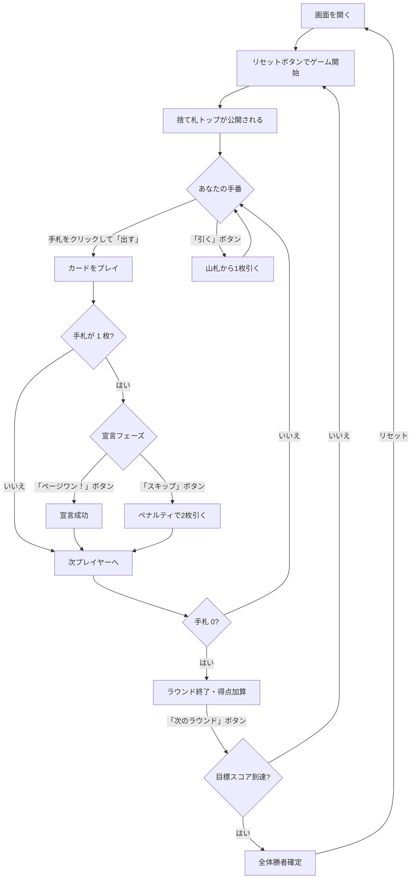

# ページワン（Web版）遊び方

## ゲーム概要

ページワン（Page One）は4人用マッチング系カードゲームです。捨て札トップと同じスートまたは同じ数字のカードを出していき、先に手札を出し切った人が勝者です。手札が残り1枚になったら「ページワン！」と宣言しないと、ペナルティで山札から2枚引かされます。

## 起動方法

```sh
go run ./cmd/trumpcards web   # CLI経由でWebサーバーを起動
go run ./cmd/server           # 直接Webサーバーを起動
```

ブラウザで `http://localhost:8080` にアクセスし、ナビゲーションバーから「ページワン」を選択するか、`/pageone` に直接アクセスしてください。
ナビバーのJA/ENボタンで日本語・英語を切り替えられます。

## ルール

- プレイ人数: 4人（あなた + CPU 3人）
- デッキ: ジョーカー抜き52枚
- 初期配布: 各プレイヤー 5枚
- 捨て札トップと **同じスート** または **同じ数字** のカードのみ出せる
- 出せるカードがない場合は山札から1枚引く
- 手札が残り1枚になったら「ページワン！」宣言が必須（忘れるとペナルティで2枚引く）
- 先に手札を出し切ったプレイヤーが、他プレイヤーの残り手札合計点を獲得
- 目標スコア（デフォルト 200点）に到達したプレイヤーが全体の勝者

### スコアリング

- A = 1点
- 2〜10 = 数字と同じ点数
- J / Q / K = 各10点

## ゲームの流れ



## 画面の操作方法

### 通常プレイフェーズ

1. 出したいカードを手札からクリックして選択
2. 「出す」ボタンで選択したカードをプレイ（捨て札と同じスートか数字のみ可）
3. 出せるカードがない / 出したくない場合は「引く」ボタンで山札から1枚引く

### 宣言フェーズ

カードを出して手札が残り1枚になると、宣言フェーズが表示されます。

- **「ページワン！」ボタン**: 正しく宣言して次のプレイヤーへ
- **「スキップ（ペナルティ）」ボタン**: 宣言を放棄して山札から2枚引く

### ラウンド終了

誰かが手札を出し切るとラウンドが終了し、「次のラウンド」ボタンが表示されます。

## 画面構成

```
┌──────────────────────────────────────────────┐
│  NavBar                          [JA|EN]     │
├──────────────────────────────────────────────┤
│  Round 1 / Target 200    Deck: 27            │
├───────────────────────┬──────────────────────┤
│  捨て札トップ          │  CPU1  hand:4 score:0│
│   ┌──┐                │  CPU2  hand:5 score:0│
│   │♠7│                │  CPU3  hand:5 score:0│
│   └──┘                │                      │
│                       │  [スコア表]          │
│  メッセージ / 棋譜    │                      │
├───────────────────────┴──────────────────────┤
│  Your hand: [♠3][♥7][♦Q][♣9][♦7]             │
│  [出す] [引く]                               │
└──────────────────────────────────────────────┘
```

## 設定

- **CPU 難易度**: Easy / Normal / Hard
  - Easy は宣言を忘れることがあります（25%）
- **目標スコア**: 100 / 200 / 300 / 500 点

## 遊び方のコツ

- 高得点カード（J/Q/K や 10）は早めに処理し、他プレイヤーに勝たれた時の失点を抑える
- 手札が 2 枚になった時点で「次に出せるカード」を 1 枚は残しておくと、宣言後のスキップ待ちリスクを減らせる
- 山札残りが少ないときは、CPU の手札枚数から残りスートを逆算すると有利
