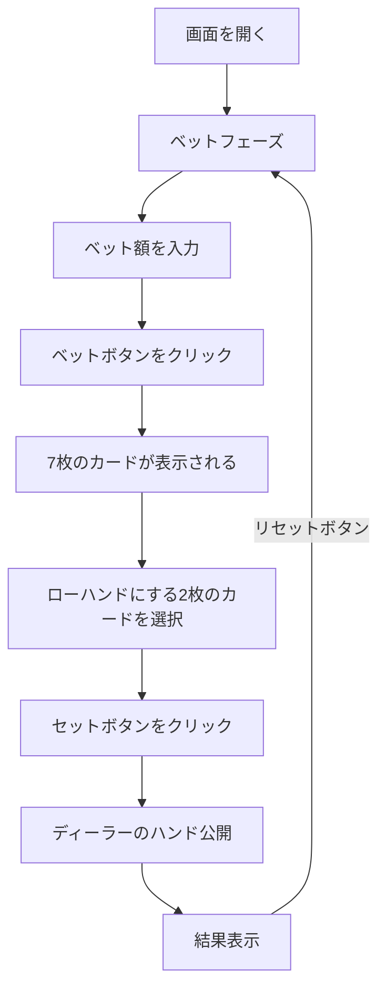

# パイゴウポーカー（Web版）遊び方

## ゲーム概要

カジノの人気カードゲームです。7枚のカードを5枚のハイハンドと2枚のローハンドに分けてディーラーと勝負します。

## 起動方法

```sh
go run ./cmd/cli web        # CLI経由でWebサーバーを起動
go run ./cmd/server         # 直接Webサーバーを起動
```

ブラウザで `http://localhost:8080` にアクセスし、ナビゲーションバーから「パイゴウポーカー」を選択します。
ナビバーのJA/ENボタンで日本語・英語を切り替えられます。

## ルール

### 基本ルール

- 52枚のトランプ + ジョーカー1枚（計53枚）を使用
- プレイヤーとディーラーにそれぞれ7枚ずつ配る
- プレイヤーは7枚を5枚のハイハンド（高い手）と2枚のローハンド（低い手）に分ける
- ハイハンドはローハンドより強くなければならない
- ディーラーは「ハウスウェイ」に従って自動的にハンドを設定

### ジョーカーの使い方

- エースとして使用可能
- ストレート、フラッシュ、ストレートフラッシュを完成させるために使用可能

### 手札ランキング

**ハイハンド（5枚）**: 通常のポーカーハンドランキング

| ランク | 説明 |
|--------|------|
| ファイブオブアカインド | 同じランク4枚 + ジョーカー |
| ロイヤルフラッシュ | 同じスートのA-K-Q-J-10 |
| ストレートフラッシュ | 同じスートの連続5枚 |
| フォーオブアカインド | 同じランク4枚 |
| フルハウス | スリーオブアカインド + ペア |
| フラッシュ | 同じスートの5枚 |
| ストレート | 連続する5枚 |
| スリーオブアカインド | 同じランク3枚 |
| ツーペア | 2組のペア |
| ワンペア | 1組のペア |
| ハイカード | 上記以外 |

**ローハンド（2枚）**: ペア > ハイカード

### 勝敗判定と配当

| 条件 | 結果 |
|------|------|
| 両方勝ち | プレイヤー勝利（1:1 − 5%コミッション） |
| 両方負け | プレイヤー敗北（ベット没収） |
| 1勝1敗 | プッシュ（引き分け、ベット返却） |
| タイ（コピーハンド） | ディーラーの勝ち |

## ゲームの流れ



## 画面の操作方法

### ベットフェーズ

1. **ベット額**: 数値入力欄でベット額を設定（10刻み、最低10、最大は所持チップ数）
2. **「ベット」ボタン**: クリックでベットを確定し、7枚のカードが配られる

### セットフェーズ

1. プレイヤーの7枚のカードが表示されます
2. ローハンドに置く2枚のカードをクリックして選択
3. **「セット」ボタン**: 選択した2枚をローハンドとして確定
4. 残りの5枚が自動的にハイハンドになります

### 結果フェーズ

1. プレイヤーとディーラーのハイハンド・ローハンドが表示されます
2. 各ハンドの比較結果が表示されます
3. 結果メッセージと配当（コミッション込み）が表示されます
4. **「リセット」ボタン**: 新しいラウンドを開始
5. **「棋譜を見る」ボタン**: アクションログを表示

### キーボードショートカット

ゲーム中、以下のキーボードショートカットが使用できます。

| キー | アクション | 有効条件 |
|------|-----------|---------|
| `b` | ベット | ベットフェーズのみ |
| `s` | セット | セットフェーズのみ |
| `r` | リセット | 結果フェーズのみ |

※ テキスト入力欄にフォーカスがある場合、ショートカットは無効になります。

## 画面構成

```
┌────────────────────────────────────────────┐
│           チップ: 1000                      │
├────────────────────────────────────────────┤
│  プレイヤーの勝ち！                         │
│                                            │
│  あなたのハイハンド: ロイヤルストレート       │
│  [♠A] [♥K] [♦Q] [♣J] [♠10]              │
│                                            │
│  あなたのローハンド: ハイカード              │
│  [♥7] [♦3]                                │
│                                            │
│  ディーラーのハイハンド: フラッシュ           │
│  [♣K] [♣Q] [♣J] [♣10] [♣9]             │
│                                            │
│  ディーラーのローハンド: ハイカード           │
│  [♠8] [♦5]                                │
│                                            │
│  ハイハンド: プレイヤー勝ち                  │
│  ローハンド: プレイヤー勝ち                  │
│  配当: 200  コミッション: 5                  │
├────────────────────────────────────────────┤
│  [リセット] [棋譜を見る]                     │
└────────────────────────────────────────────┘
```

## 遊び方のコツ

- ハイハンドとローハンドの両方をバランスよく強くすることが重要です
- ハイハンドに全力を注いでローハンドが弱すぎると、スプリット（引き分け）になりやすいです
- ペアが2組ある場合、1組をローハンドに回すことを検討しましょう
- ジョーカーはエースとして使えるため、ローハンドのペアを作るのに有効です
- コミッション（5%）があるため、勝率50%以上を維持することが重要です
