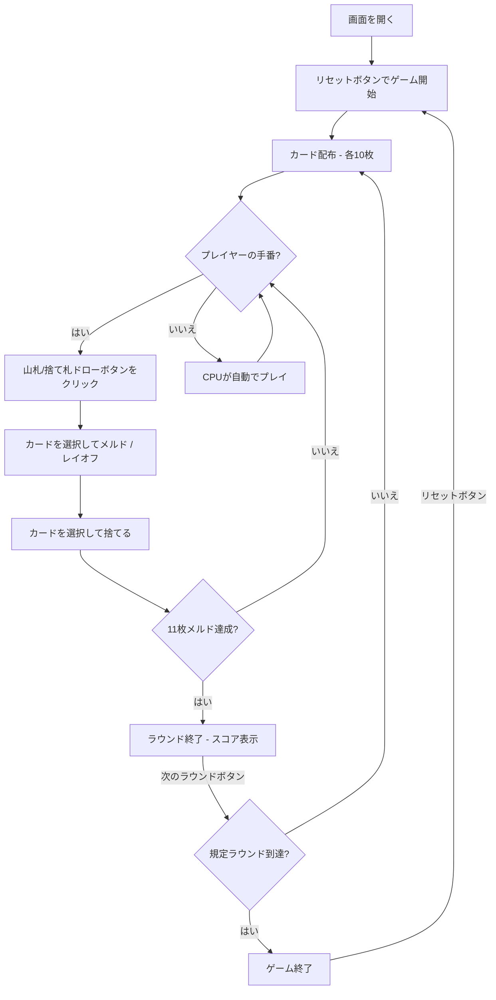

# パングインゲ（Pan）（Web版）遊び方

## ゲーム概要

3〜6人（プレイヤー1人 + CPU 2〜5人）で遊ぶ、メキシコ／アメリカ南西部のサロン由来の大型多デッキラミーです。8組の40枚デッキ（8・9・10を抜いた A,2-7,J,Q,K の40枚 × 8組 = 計320枚）を使い、各プレイヤーに10枚を配ります。手番では山札または捨て札からドローし、セットやロープ（ラン）を場に出して（メルド）、既存のメルドにレイオフし、最後に1枚捨ててターンを終えます。最初に合計11枚をメルドしたプレイヤーが「パン」を宣言して勝利します。

## 起動方法

```sh
go run ./cmd/trumpcards web  # CLI経由でWebサーバーを起動
go run ./cmd/server          # 直接Webサーバーを起動
```

ブラウザで `http://localhost:8080` にアクセスし、ナビゲーションバーから「パングインゲ」を選択します。
ナビバーのJA/ENボタンで日本語・英語を切り替えられます。

## ルール

### 基本ルール

- 8デッキ（各40枚、8・9・10なし、計320枚）を使用、3〜6人プレイ
- 各プレイヤーに10枚ずつ配り、1枚を表向きにして捨て札の山を開始、残りは山札（ストック）
- 手番ではまず山札または捨て札の山からカードを1枚ドローする
- その後、メルドやレイオフを行い、最後に1枚捨ててターンを終える
- 合計11枚をメルドしたプレイヤーが「パン」を宣言して勝利

### メルド（セットとロープ）

- **セット**: 同ランク3枚以上
- **ロープ（ラン）**: 同スート3枚以上の連続。8・9・10がないため 7 の次は J として扱う
- メルドは3枚以上で場に出す。既存のメルドには1枚ずつレイオフできる

### チップ

- 条件を満たすメルドを出すと、他プレイヤーから自動的にチップが支払われる
- 各プレイヤーのチップ残高がスコアテーブルに表示される
- 3・5・7 のセットは「バジェ（valle）」でチップ条件のひとつ。場のメルドと手札のメルド候補の両方に `★バジェ` バッジが付く

### ゲーム終了

- 誰かが「パン」（11枚メルド）に達するとラウンド終了。規定ラウンド消化時点で勝敗を決める

### CPU難易度

- **Easy**: ランダムに近いプレイ
- **Normal**: 基本的なメルド戦略（デフォルト）
- **Hard**: 戦略的なプレイ

## ゲームの流れ



## 画面の操作方法

### ドローフェーズ

1. **「山札から引く」** ボタンでストックから1枚引く
2. **「捨て札から引く」** ボタンで捨て札の山のトップカードを引く

### プレイフェーズ

1. 手札のカードをクリックして選択（メルドは3枚以上、レイオフ／捨ては1枚）
2. 3枚以上選んで **「メルド」** ボタンで場に出す
3. 1枚だけ選んで、場のメルド横の **「レイオフ」** ボタンでそのメルドに足す
4. **「捨てる」** ボタンで選択したカードを捨ててターン終了

### ラウンド終了

1. **「次のラウンド」** ボタンで次のラウンドに進む

## 画面構成

```
┌────────────────────────────────────────────┐
│  ▶ 設定 (クリックで展開)                   │
│    プレイヤー数:  [4▼]                      │
│    CPU難易度:     [Normal▼]                │
│    ラウンド数:    [3▼]                      │
├────────────────────────────────────────────┤
│  捨て札: ♥7        場のメルド一覧           │
├────────────────────────────────────────────┤
│              CPU エリア                     │
│  CPU 1: 10枚 | チップ: 50 | メルド: 0       │
├────────────────────────────────────────────┤
│  ラウンド 1/3 | 山札: 250枚 | 上がり: 11枚  │
├────────────────────────────────────────────┤
│         フッター: あなたの手札              │
│  [♠3][♠4][♠5]...                           │
│  [メルド] [捨てる] [リセット]               │
└────────────────────────────────────────────┘
```

- **設定パネル（▶ 設定）**: プレイヤー数（3〜6）、CPU難易度、ラウンド数。次のリセット時に適用
- **場のメルド**: 各プレイヤーが場に出したメルド。手札を1枚選ぶと「レイオフ」ボタンが表示される
- **CPUエリア**: 各CPUの手札枚数・チップ・メルド数（ラウンド／ゲーム終了時に手札を公開）
- **スコアテーブル**: 各プレイヤーのチップ、ラウンドスコア、累積スコア
- **フッター（あなたの手札）**: クリックで選択（緑枠 + 上に浮き上がる）

## 遊び方のコツ

- 早めにセットやロープを場に出して11枚メルドを目指しましょう
- 8・9・10がないため、ロープでは 7 と J が連続する点に注意
- 条件を満たすメルドはチップ収入になります
- レイオフを使うと既存のメルドに素早く枚数を足せます
