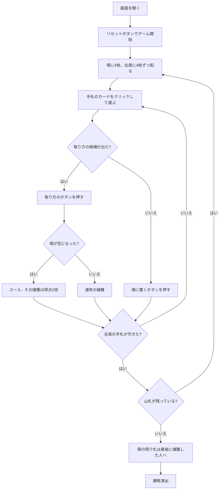

# パスール（Web版）遊び方

## ゲーム概要

イランで広く遊ばれている**フィッシング系**のカードゲーム。**手札1枚と場の数札の合計が11**になる組み合わせを取ります。**J・Q・Kは合計に使わず、場の同ランク札だけ**を取れます。取った結果**場が空になると「スール」**で、その捕獲の札は得点が2倍。山札を配り切った時点で得点の高い人の勝ちです。2〜4人で遊べます。

## 起動方法

```sh
go run ./cmd/trumpcards web  # CLI経由でWebサーバーを起動
go run ./cmd/server          # 直接Webサーバーを起動
```

ブラウザで `http://localhost:8080` にアクセスし、ナビゲーションバーから「パスール」を選択します。
ナビバーのJA/ENボタンで日本語・英語を切り替えられます。

## ルール

- **52枚**、**2〜4人**（既定4人）。**まず場に4枚**置き、全員に**4枚ずつ**配ります。場の4枚を先に引くので、残り48枚は2人・3人・4人のどれでも割り切れます
- 全員の手札が尽きたら**配り足し**、山札が尽きたら終了
- **捕獲は合計11**: 出した数札と場の数札の合計がちょうど11になる組み合わせを取ります（A=1、10=10）。**手札1枚だけでは取れません**
- **J・Q・Kは合計に使いません。** 場の**同ランク**の札だけを取れます
- **取れる組み合わせがあるときは必ず取ります。** 場に置くことはできません
- **場が空になると「スール」**。その捕獲で取った札は**得点が2倍**になります
- 終了時に**場に残った札は、最後に捕獲した人**のもの
- 得点は クラブ1枚1点 / 2♣ はさらに+1（計2点）/ 10♦ が3点 / A 1枚1点。**スールを除けば1デッキちょうど21点**

## ゲームの流れ



## 画面の操作方法

| 操作 | 説明 |
|------|------|
| 手札のカードをクリック | その札を選ぶ（**取れる札には緑の枠**、選んだ札には黄色の枠が付きます） |
| 取り方のボタン | 選んだ札で取る場札の組み合わせ。**サーバが受理する候補だけが並びます** |
| 場に置くボタン | 選んだ札を場に置く。**取れる組み合わせがあるときは表示されません** |
| 選び直すボタン | 札の選択を解除する |
| ヒントボタン | 出すべき札と取り方を提示する |
| ギブアップボタン | 投了する |
| リセットボタン | 確認ダイアログのうえで最初からやり直す |
| CLI トグル | 同じゲームをコマンド入力で操作するモードに切り替える |

**取り方の候補はサーバが計算したものです。** 合計11になる組み合わせをページ側で作り直すことはしないので、押せるボタンは必ず受理されます。

## 画面構成

```
┌────────────────────────────────────────────┐
│  配布 1 パック目        山札 残り32枚        │
├────────────────────────────────────────────┤
│ 合計11で取る。J・Q・Kは同ランクのみ         │
├────────────────────────────────────────────┤
│              場のカード                     │
├────────────────────────────────────────────┤
│  あなた: 捕獲0枚 / スール0 / 得点0          │
│  CPU1: 捕獲0枚 / スール0 / 得点0            │
│  CPU2 [最後に捕獲]: 捕獲6枚 / スール1 / 得点4│
│  CPU3: 捕獲0枚 / スール0 / 得点0            │
├────────────────────────────────────────────┤
│  あなたの手札（取れる札に緑の枠）           │
├────────────────────────────────────────────┤
│  取り方: [♠7 を取る] [♥4, ♣3 を取る] [選び直す] │
└────────────────────────────────────────────┘
```

- **上部**: 何パック目か、山札の残り
- **規則帯**: このゲームの捕獲規則そのもの。**合計11と絵札の扱い**を常に出します
- **場**: 取る対象。ここが空になるとスールです
- **席の行**: 捕獲枚数 / スール回数 / 現時点の得点。**`[最後に捕獲]`** の席が、終了時に場の残りを受け取ります
- **手札**: 取れる札に緑の枠。押すと下に取り方の候補が出ます
- **取り方**: サーバが送った候補だけ。取れる札を選んだときは「場に置く」が出ません

## 遊び方のコツ

- **クラブを数える。** 13枚あるクラブが得点の主軸で、1枚1点
- **2♣ と 10♦ は別格。** 2♣ は2点、10♦ は3点
- **場に絵札を置かない。** 絵札は同ランクでしか取れないので長く残り、スールが遠のきます
- **スールは倍。** 場が1〜2枚のときは、空にできないか必ず確認します
- **終盤は最後の捕獲を狙う。** 場の残りは最後に取った人のものです
- **取れるときは取るしかない。** 点にならない札で取らされる場面もあるので、手札の並びは先に読んでおきます
