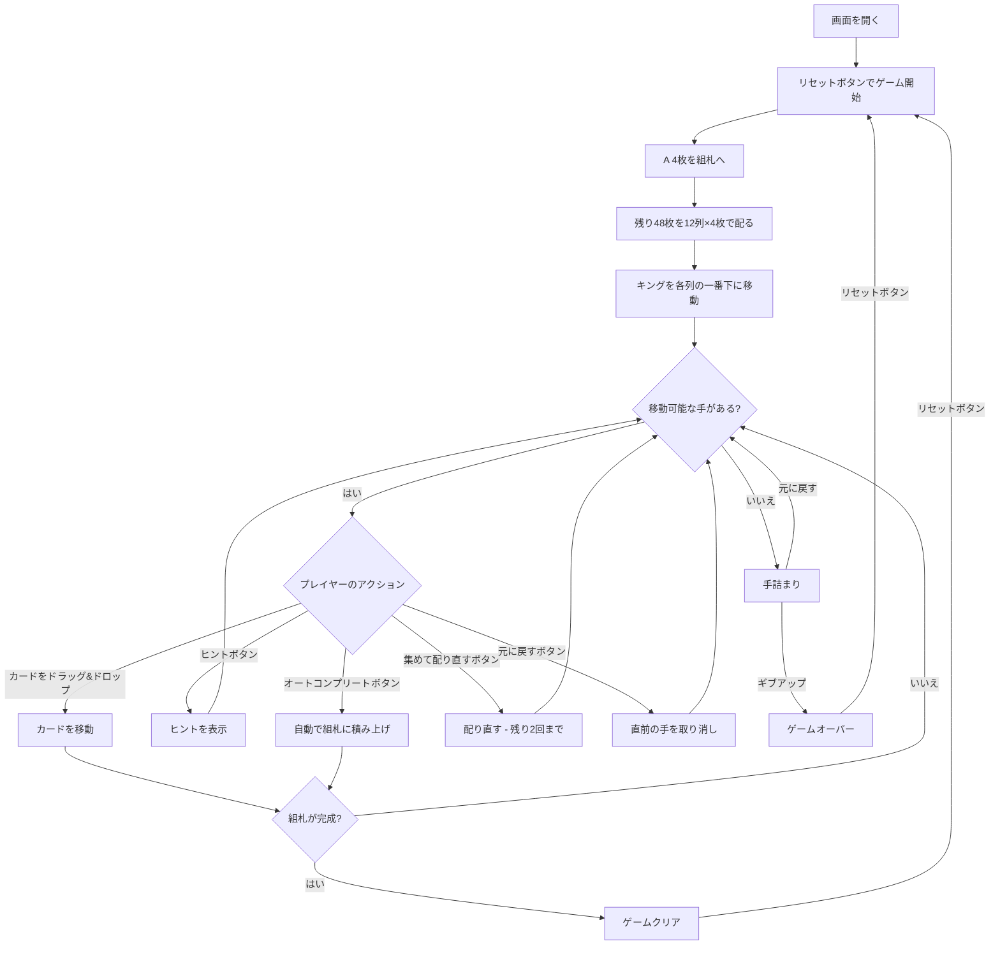

# パーシビアランス（Web版）遊び方

## ゲーム概要

1人用のソリティアカードゲームで、**ベーカーズ・ダズンの派生**です。1デッキ（52枚）から **A 4枚を先に抜いて組札に置き**、残り48枚を **12列のタブロー（各4枚）** に配ります。配られた時点で全てのカードが表向きで、ストックやウェイストはありません。組札にA→Kまでスート別に積み上げればクリアです。

ベーカーズ・ダズンとの違いは4点。**タブローは同スート降順**（本家はスート不問）、**同スート降順の並びは一括で動かせる**（本家は1枚ずつ）、**A は最初から組札に乗っている**、そして**行き詰まったら2回まで配り直せる**。

## 起動方法

```sh
go run ./cmd/trumpcards web  # CLI経由でWebサーバーを起動
go run ./cmd/server          # 直接Webサーバーを起動
```

ブラウザで `http://localhost:8080` にアクセスし、ナビゲーションバーから「パーシビアランス」を選択します。
ナビバーのJA/ENボタンで日本語・英語を切り替えられます。

## ルール

### 基本ルール

- 1デッキ（52枚、ジョーカーなし）を使用
- **A 4枚は配る前に組札へ置く**。残り48枚を **12列**に各4枚ずつ表向きで配る
- 配り時、各列のキング（K）は自動的に列の一番下（最初に配られた位置）へ移動する
- 4つの組札（ファンデーション）はスート別にA→Kの順に積み上げる（Aは最初から乗っている）
- タブローは**同スートでランクが1つ下**のカードにだけ重ねる（例: ♠5の上に置けるのは♠4だけ）
- **同スート降順に並んでいる部分は、まとめて動かせる**（並びが崩れていれば1枚も動かない）
- **空の列にはカードを置けない**
- 行き詰まったら**「集めて配り直す」で残り札を配り直せる（最大2回）**

### 配り直し（リディール）

- 末尾の列から順に手前の列へ重ね（列11を列10の上、それを列9の上…）、**シャッフルせずに**先頭から4枚ずつ配り直す
- したがって**配り直した並びは直前の盤から一意に決まる**。集める前にどう並べておくかがそのまま次の盤になる
- **最大2回**。残り回数はヘッダーに出て、0 になるとボタンは押せなくなる

### ゲームクリア

- 4つの組札すべてにA→Kまで13枚ずつ積み上げるとゲームクリア

### ゲームオーバー

- これ以上移動可能な手がない場合は手詰まり（オートコンプリートやアンドゥで打開可能）

## ゲームの流れ



## 画面の操作方法

### カードを移動する

1. 移動元のカード（タブロー列の最上段）をクリックまたはドラッグして選択します
2. 移動先のカード（またはエリア）をクリックまたはドロップして移動を確定します
3. **同スートで**ランクが1つ下のカードにのみ重ねられます（スート違いは受け付けません）
4. 同スート降順に並んでいる部分は、**その並びの一番下のカードを直接クリック／ドラッグ**すれば、まとめて移動します。並びの開始位置になっていないカードは選べません

### アンドゥ（元に戻す）

**「元に戻す」** ボタンまたは `z` キーで直前の操作を取り消せます。何度でも元に戻せます。

### ヒント・オートコンプリート

1. **「ヒント」** ボタンをクリックすると、次に可能な手を提案します
2. **「オートコンプリート」** ボタンをクリックすると、組札に安全に移動できるカードを自動で移動します

### 集めて配り直す

**「集めて配り直す」** ボタンで、卓に残る札を集めて配り直します。**最大2回**で、残り0回になるとボタンは押せなくなります。手詰まりのあいだは点滅して場所を知らせます。**シャッフルはしない**ので、集める直前の並びが次の盤をそのまま決めます。

### キーボードショートカット

ゲーム中、以下のキーボードショートカットが使用できます。

| キー | アクション | 有効条件 |
|------|-----------|---------|
| `z` | 元に戻す（アンドゥ） | プレイ中 |
| `h` | ヒント | プレイ中 |
| `a` | オートコンプリート | プレイ中 |
| `g` | ギブアップ | プレイ中 |

※ テキスト入力欄にフォーカスがある場合、ショートカットは無効になります。

## 画面構成

```
┌────────────────────────────────────────────┐
│              ゲーム情報                     │
│  手数: 5   残り再配り: 2回                  │
├────────────────────────────────────────────┤
│              組札エリア                     │
│  [♠A] [♣A] [♥A] [♦A]                       │
├────────────────────────────────────────────┤
│              タブロー (12列)               │
│ [1] [2] [3] [4] [5] [6] [7] [8] [9] [10] [11] [12] │
│ ♠K  ♠K  ...                                │
│ ♠5  ♥3  ...                                │
│ ♥Q  ♦9  ...                                │
│ ♣8  ♥7  ...                                │
├────────────────────────────────────────────┤
│  [元に戻す] [集めて配り直す] [ヒント]        │
│  [オートコンプリート] [ギブアップ] [リセット]│
└────────────────────────────────────────────┘
```

- **組札エリア**: 4つのスート別の組札。**開始時点で各スートのAが乗っています**
- **タブロー**: **12列**のカード列（すべて表向き、最大4枚→任意の枚数）
  - 最上段カード: クリックで選択・移動
  - 同スート降順の並びは、下のカードを選べばまとめて動きます
- **ボタン**:
  - 「元に戻す」: 直前の操作を取り消す
  - 「集めて配り直す」: 残り札を集めて配り直す（最大2回、残り0で無効）
  - 「ヒント」: 次の一手を提案
  - 「オートコンプリート」: 自動で組札へ移動
  - 「ギブアップ」: 現在のゲームを終了
  - 「リセット」: 新しいゲームを開始

## 遊び方のコツ

- すべてのカードが表向きなので、先を見越した計画が重要です
- Aは最初から乗っているので、**早めに2を掘り出す**のが最初の目標です
- **同スートでしか重ねられない**ので、ベーカーズ・ダズンの感覚で探すと行き先を見つけられません。逆に、並びを一括で動かせるぶん深い列も崩せます
- **配り直しはシャッフルしない。**集める直前の並びが次の盤をそのまま決めるので、詰んだと思ったら「どう並べてから集めるか」を考える余地があります
- キングは初期配置で必ず列の底に来るため、その上のカードから順に動かす計画を立てます
- 空の列ができても**カードを置けない**ため、無闇に列を空にする必要はありません
- ヒントボタンで詰まった時のアドバイスを得られます
- 手詰まりになったら「元に戻す」で戻ってリトライしましょう
