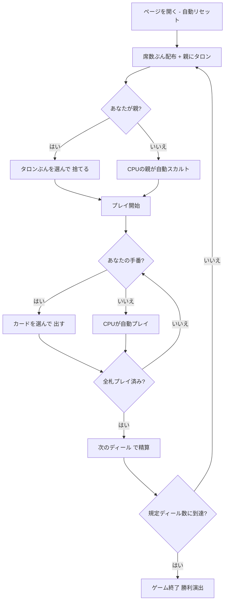

# ピエモンテ・タロッコ（Web版）遊び方

## ゲーム概要

Tarocco Piemontese（ピエモンテ・タロッコ）はイタリア・ピエモンテ州の**78枚タロッキ・トリックテイキング**です。あなたは**席0**として3〜4人卓（既定は4人）でCPUと対戦します。親（ディーラー）が余剰札（タロン）を拾って同じ枚数を伏せて捨てる「**スカルト**」を行い、残り札でトリックを戦います。

同じデッキの [スカルト](scarto.md) との違いは、**人数と配り**（4人卓＝19枚＋タロン2枚 / 3人卓＝25枚＋タロン3枚）と、**点の数え方**（3枚組ごとに2点を引く古典イタリア式、デッキ全体で78点）です。

## 起動方法

```sh
go run ./cmd/trumpcards web         # CLI経由でWebサーバーを起動
go run ./cmd/trumpcards web --open  # サーバー起動 + ブラウザを開く
go run ./cmd/server                 # 直接Webサーバーを起動
```

ブラウザで `http://localhost:8080` にアクセスし、ナビゲーションバーから「ピエモンテ・タロッコ」を選択します。
ナビバーのJA/ENボタンで日本語・英語を切り替えられます。

## ルール

### デッキと配布

- **デッキ**: 78枚（4スート×14枚＝1〜10・V・C・D・R、切り札1〜21、マット）。
- **プレイヤー**: 3〜4人（あなた = 席0、残りがCPU）。設定で切り替えられます。
- **配布**: 4人卓は各19枚＋タロン2枚、3人卓は各25枚＋タロン3枚。タロンは親に配られます。

### スカルト（親の捨て札）

親はタロンぶんの札を選んで伏せて捨てます。捨てた札は**親の獲得札**に数えます。**オヌール（切り札1・切り札21・マット）とコート札は捨てられません** ── 捨てられない札には理由がツールチップで出ます。あなたが親のときは手札から選んで「**捨てる**」ボタンで確定し、CPUが親のときは自動で行われます。

### フォロー義務とカードの強さ

- リードスートを持っていれば**必ず従います**。持っていなければ**切り札を出す義務**があり、すでに切り札が出ていれば**可能な限り上位の切り札**で応じます。
- **マット（Matto）はいつでも出せ**、トリックに取られず自分の獲得札に残ります。
- 最も高い切り札、なければリードスートの最も高い札がトリックを取ります。

### 得点（3枚組で数える）

| 札 | 値 |
|----|----|
| オヌール（切り札1・切り札21・マット） | 5 |
| R（Roi） | 5 |
| D（Dame） | 4 |
| C（Cavalier） | 3 |
| V（Valet） | 2 |
| その他 | 1 |

獲得札を3枚ずつの組にして、**組ごとに2を引きます**。デッキ全体でちょうど**78点**です。獲得枚数は3の倍数とは限らないので、画面には `26 1/3` のように**1/3単位の端数まで**出ます。

### 精算と勝利条件

- ディール得点は**ゼロサム**（`変動 = 席数 × 自分のカード点 − 卓の合計`）で、合計は常に0です。
- 規定ディール数（既定 **4**）を終えた時点で、累計得点が最上位の席が勝者です。同点は引き分け。

## ゲームの流れ



## 画面の操作方法

- **スカルト**: 捨てられる札だけがハイライトされます。**タロンぶん**（4人卓なら2枚、3人卓なら3枚）を選ぶとボタンが押せるようになります。選択中の枚数はボタンにも出ます。
- **プレイ**: 出せる札がハイライトされるので、選んで「出す」します。
- **トリック／ディール進行**: 「次のトリック」でトリック結果を確認、「次のディール」で精算して次へ進みます。
- **設定**: 席数（3 / 4）、CPU難易度、マッチのディール数、ヒントの ON/OFF を切り替えられます。

## 画面構成

- **ヘッダー**: ゲーム名・フェーズ表示（スカルト / プレイ / …）・CLI 切り替え
- **情報サイドバー**: 各席の累計得点・親バッジ・獲得トリック数・カード点（1/3単位）・ディール結果
- **中央**: 現在のトリック
- **フッター**: あなたの手札（出せる札／捨てられる札がハイライト）・アクションボタン

ディール終了時のボックスには、**卓のカード点合計（78点）と換算式**が出ます。「獲得 26 1/3 点 → 変動 +11」のように並ぶので、増減がどこから来たのか検算できます。

## 遊び方のコツ

- **オヌールを守る**: 切り札1（Bagatto）は最弱の切り札なのに5点あります。取られやすいので温存しましょう。
- **マットは保険**: フォロー義務を免れる唯一の札で、取られません。苦しいトリックを1つ回避できます。
- **スカルトで弱いスートを消す**: そのスートがリードされたときに切り札を切れるようになります。
- **点は3枚組で動く**: 1枚の高得点札より、コート札を絡めた組をいくつ作れるかが効きます。
