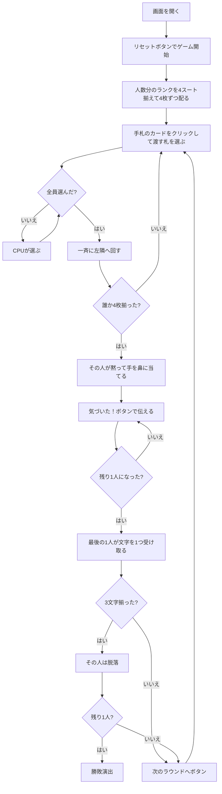

# ピッグ（Web版）遊び方

## ゲーム概要

アメリカ・イギリスの子供向け定番パーティゲーム（ドンキーとも）。**同じランク4枚を揃えた人は、声を出さず黙って手を鼻に当てます。** 他の人はそれに気づいて真似るだけ——**取り合うものは何もありません**。最後まで気づかなかった1人が P・I・G の文字を1つ受け取り、3文字揃うと脱落します。3〜6人で遊べます。

## 起動方法

```sh
go run ./cmd/trumpcards web  # CLI経由でWebサーバーを起動
go run ./cmd/server          # 直接Webサーバーを起動
```

ブラウザで `http://localhost:8080` にアクセスし、ナビゲーションバーから「ピッグ」を選択します。
ナビバーのJA/ENボタンで日本語・英語を切り替えられます。

## ルール

- **人数と同じ種類のランクを4スート揃えて使います**: 3人 A・K・Q の12枚 / 4人 A〜J の16枚 / 5人 20枚 / 6人 24枚
- 各自に4枚ずつ配ると、ちょうど使い切ります。標準52枚の部分集合なので特別なカードは要りません
- **全員が同時に1枚ずつ左隣へ回します。** 渡すのと受け取るのが同時なので、**手札はずっと4枚のまま**です
- 全員が渡す札を選ぶまで、札は動きません
- 同じランク4枚が揃った人は、**声を出さず黙って手を鼻に当てます**
- 他の人はそれに気づいて真似るだけ。**最後まで気づかなかった1人**が P・I・G の文字を1つ受け取ります
- **3文字揃うと脱落。** 最後まで残った1人の勝ち

## ゲームの流れ



## 画面の操作方法

| 操作 | 説明 |
|------|------|
| 手札のカードをクリック | そのカードを左隣へ渡す（渡せるときは緑の枠が付きます） |
| 気づいた！ボタン | 合図に気づいたと伝える。**合図が出ているときだけ表示されます** |
| 次のラウンドへボタン | ラウンド終了の結果を読んだあとに押す |
| 人数（設定） | 3〜6人。リセットすると反映され、デッキ枚数も変わります |
| CPUの反応（設定） | 合図に気づく速さ。速いほど、あなたが最後になりやすくなります |
| ヒントボタン | 渡すべき札、または合図に気づくべきことを提示する |
| ギブアップボタン | 投了する |
| リセットボタン | 確認ダイアログのうえで最初からやり直す |
| CLI トグル | 同じゲームをコマンド入力で操作するモードに切り替える |

**渡す札を選んだあとは手札が押せなくなります。** 全員が選ぶまで札が動かないためです。

## 画面構成

```
┌────────────────────────────────────────────┐
│ ラウンド 3     デッキ 16枚     パス 5回     │
├────────────────────────────────────────────┤
│ 4枚揃えた人は黙って手を鼻に当てる。          │
│ 気づくのが最後だった1人が文字をもらう        │
├────────────────────────────────────────────┤
│ 誰かが手を鼻に当てました！（合図中のみ）     │
├────────────────────────────────────────────┤
│  あなた: 手札4枚 / 文字[P]                  │
│  CPU1 [選択済み]: 手札4枚 / 文字[-]         │
│  CPU2 [2番目に気づいた]: 手札4枚 / 文字[PI] │
│  CPU3 [脱落]: 手札0枚 / 文字[PIG]           │
├────────────────────────────────────────────┤
│  あなたの手札（渡せるときに緑の枠）          │
├────────────────────────────────────────────┤
│  [気づいた！] [次のラウンドへ] [リセット]    │
└────────────────────────────────────────────┘
```

- **上部**: ラウンド数、デッキ枚数、このラウンドで何回回したか
- **規則帯**: このゲームの勝利条件そのもの。**取り合うものが何もない**ことを常に出します
- **合図の帯**: 誰かが手を鼻に当てた瞬間だけ出ます。**盤面には絶対に痕跡が残らない**ので、これが唯一の手がかりです
- **席の行**: 手札の枚数と溜まった文字。**文字がそのまま残機**なので、得点表示はありません
- **`[選択済み]` / `[N番目に気づいた]` / `[脱落]`**: いずれも盤面に痕跡が残らないので明示します
- **下部**: 自分の手札。**同じランクが隣り合うように並ぶ**ので、揃いかけが一目で分かります

**あなたが脱落しても盤面は続きます。** そのときは「脱落しました」と画面に出したうえで、残りのCPUが決着するまで進みます。

## 遊び方のコツ

- **揃えることに得はありません。** 4枚集めても点は入らず、合図を出す権利が来るだけです
- **他人の手元より、他人の様子を見る。** 勝敗を決めるのは合図に気づく速さです
- **バラバラのときは何を捨てても大差ありません。** 全部1枚ずつなら、どれを回しても揃いやすさは変わりません
- **CPUの反応を「遅い」にすると練習しやすくなります。** 慣れたら「速い」で、気づくのが最後にならないよう競ってください
- **ラウンド終了は必ず読んでから進みます。** 誰が文字をもらったかは、次の配りで消えてしまうためです
