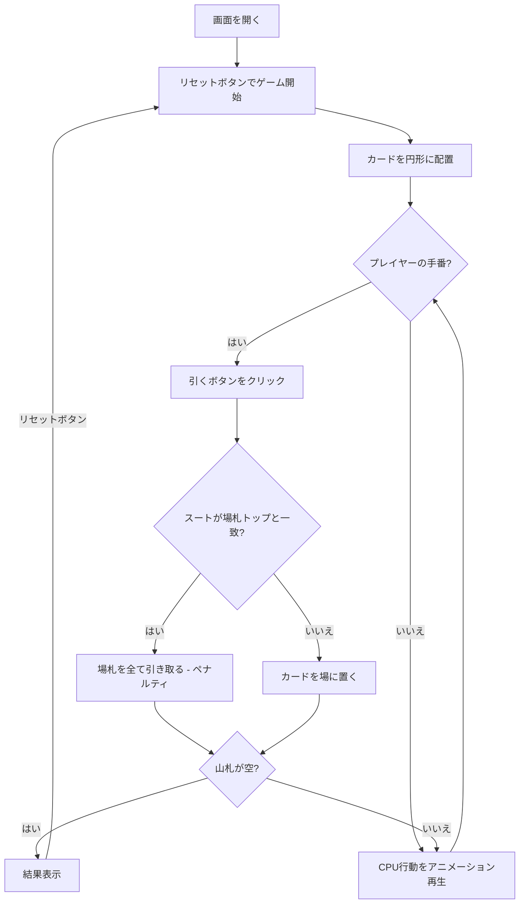

# ぶたのしっぽ（Web版）遊び方

## ゲーム概要

4人（プレイヤー1人 + CPU 3人）で遊ぶマッチング系カードゲームです。52枚のカードを裏向きに円形に並べ、順番に1枚ずつめくって中央の場に出します。出したカードのスートが場の一番上と一致すると、場のカードを全て引き取るペナルティを受けます。円形の山札がなくなった時点で最も多くカードを持っているプレイヤーの負けです。

## 起動方法

```sh
go run ./cmd/trumpcards web     # CLI経由でWebサーバーを起動
go run ./cmd/server             # 直接Webサーバーを起動
```

ブラウザで `http://localhost:8080` にアクセスし、ナビゲーションバーから「Pig's Tail」を選択します。
ナビバーのJA/ENボタンで日本語・英語を切り替えられます。

## ルール

### 基本ルール

- 52枚のトランプ（ジョーカーなし）を使用
- カードを裏向きに円形の山札として配置
- プレイヤーが順番に山札から1枚引き、中央の場札の上に表向きで置く
- 出したカードのスートが場札の一番上のカードと同じスートの場合、場札を全て引き取る（ペナルティ）
- 場札が空の場合はペナルティなし

### ゲーム終了

- 円形の山札が全てなくなったらゲーム終了
- 手札が最も多いプレイヤーの負け、最も少ないプレイヤーの勝ち

## ゲームの流れ



## 画面の操作方法

### プレイフェーズ

プレイヤーの手番では「引く」ボタンをクリックして山札から1枚カードを引きます。

### 結果表示

- スートが一致した場合、ペナルティの演出が表示されます
- ゲーム終了時、各プレイヤーの手札枚数と勝敗が表示されます

### CPUの手番

CPUの行動は自動で進行し、各アクションがアニメーション再生されます。

### キーボードショートカット

| キー | アクション | 有効条件 |
|------|-----------|---------|

※ テキスト入力欄にフォーカスがある場合、ショートカットは無効になります。

## 画面構成

```
┌────────────────────────────────────────────┐
│            CPU プレイヤーエリア             │
│ ┌──────────┐ ┌──────────┐ ┌──────────┐   │
│ │ CPU 1    │ │ CPU 2    │ │ CPU 3    │   │
│ │ 2枚      │ │ 4枚      │ │ 1枚      │   │
│ └──────────┘ └──────────┘ └──────────┘   │
├────────────────────────────────────────────┤
│       山札: 40枚    場札: [♥7]            │
├────────────────────────────────────────────┤
│ [引く] [リセット] [設定]                   │
├────────────────────────────────────────────┤
│       プレイヤー: 3枚                      │
└────────────────────────────────────────────┘
```

- **CPUプレイヤーエリア**: 各CPUの手札（ペナルティカード）枚数を表示
- **山札**: 円形の山札の残り枚数を表示
- **場札**: 中央の場札のトップカードを表示
- **引くボタン**: プレイヤーの手番で山札から1枚引く
- **プレイヤーエリア**: プレイヤーの手札枚数を表示

## 遊び方のコツ

- このゲームは完全な運ゲームです。戦略的な要素はありません
- 場札のスートとペナルティの演出を楽しみましょう
- アクションログで過去のアクションを振り返ることができます
