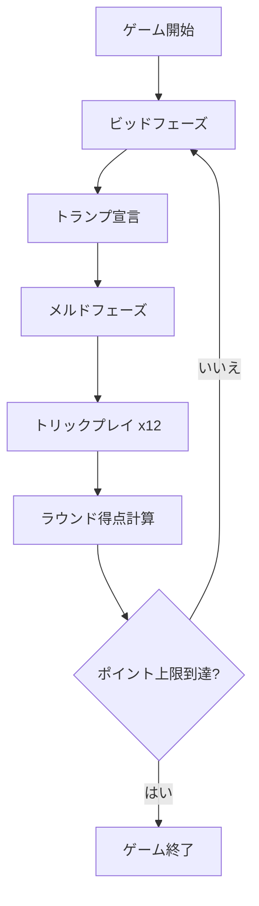

# ピノクル（Web版）遊び方

## ゲーム概要

4人2チーム（チーム0+2 vs チーム1+3）のトリックテイキング＋メルドゲーム。48枚の専用デッキ（各スート9,10,J,Q,K,Aが2枚ずつ）を使用。ビッド、メルド（役の宣言）、トリックの3つのフェーズで構成され、先にポイント上限（デフォルト1500）に到達したチームが勝利。

## 起動方法

```sh
go run ./cmd/trumpcards web        # CLI経由でWebサーバーを起動
go run ./cmd/server                # 直接Webサーバーを起動
```

ブラウザで `http://localhost:8080` にアクセスし、ナビゲーションバーから「ピノクル」を選択します。
ナビバーのJA/ENボタンで日本語・英語を切り替えられます。

## ルール

### デッキ

各スート（スペード、クラブ、ハート、ダイヤ）の9, 10, J, Q, K, Aが2枚ずつ、計48枚。

### カードランク

A > 10 > K > Q > J > 9（10がKより強い）

### カードポイント

A=11, 10=10, K=4, Q=3, J=2, 9=0。最終トリックボーナス=10点。

### ビッドフェーズ

ディーラーの左隣から順にビッド。最低ビッド20。パスするか、現在の最高ビッドより高くビッド。最高ビッダーがトランプスートを宣言。

### メルドフェーズ

全プレイヤーが手札のメルド（役）を公開。「メルド確認」ボタンでプレイフェーズへ進む。

### メルド一覧

| メルド | ポイント | 構成 |
|--------|----------|------|
| ディクス | 10 | トランプの9 |
| コモンマリッジ | 20 | 非トランプのK-Q |
| ロイヤルマリッジ | 40 | トランプのK-Q |
| ピノクル | 40 | J♦ + Q♠ |
| ジャックアラウンド | 40 | 各スートのJ |
| クイーンアラウンド | 60 | 各スートのQ |
| キングアラウンド | 80 | 各スートのK |
| エースアラウンド | 100 | 各スートのA |
| ラン | 150 | トランプのA-10-K-Q-J |
| ダブルピノクル | 300 | 2組のJ♦ + Q♠ |
| ダブルラン | 1500 | トランプのA-10-K-Q-J 2組 |

### トリックフェーズ

12トリック。リードスートに従う義務、リードスートがなければトランプを出す義務、可能なら勝てるカードを出す義務がある。プレイ可能なカードのみ選択可能。

### 得点計算

- ビッドチーム: メルド＋トリックポイントの合計がビッド以上なら加算、未満ならビッド額を失う
- ディフェンダーチーム: 常に得点を加算
- トリックを1つも取れなかったチームのメルドは没収

## ゲームの流れ



## 画面の操作方法

### ビッドフェーズ

- 数値入力欄にビッド額を入力して「ビッド」ボタンをクリック
- 「パス」ボタンでビッドをスキップ

### トランプ宣言フェーズ

- スートボタン（♠ ♣ ♥ ♦）をクリックしてトランプスートを宣言

### メルドフェーズ

- 各プレイヤーのメルドが表示される
- 「メルド確認」ボタンでプレイフェーズへ進む

### プレイフェーズ

- プレイ可能なカードが強調表示される
- カードをクリックしてプレイ

### 設定

- CPU難易度: Easy / Normal / Hard
- ポイント上限: 500 / 1000 / 1500 / 2000 / 3000

## 画面構成

```
┌────────────────────────────────────────────┐
│  フェーズ表示  ラウンド  スコア (Team0/2, 1/3) │
│                                            │
│  CPU1 (手札裏)                              │
│  CPU0 (手札裏)         CPU2 (手札裏)         │
│                                            │
│  場のトリック / メルド表示エリア              │
│                                            │
│  あなた: [♠A] [♠A] [♠10] ... (手札表)        │
│                                            │
│  [ビッド入力] [ビッド] [パス]                 │
│  [スート宣言♠♣♥♦] [メルド確認] [リセット]    │
└────────────────────────────────────────────┘
```

- **ヘッダー**: 現在のフェーズ、ラウンド数、両チームのスコア
- **CPUエリア**: 3人のCPUの手札（裏向き）を配置
- **中央エリア**: トリック中は場のカード、メルドフェーズでは各プレイヤーのメルドを表示
- **自分の手札**: 下部に表示、プレイ可能なカードが強調
- **操作パネル**: フェーズに応じてボタンが切り替わる
