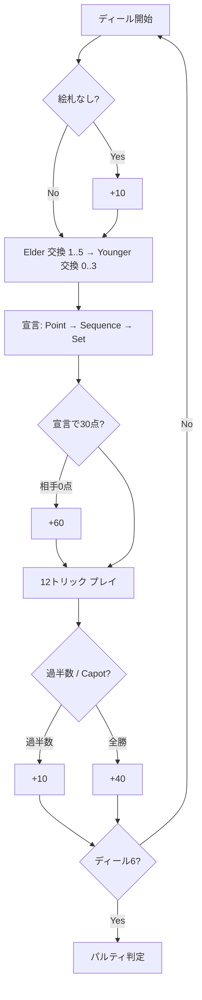

# ピケ（Web版）遊び方

## ゲーム概要

Piquetは2人用の古典的トリックテイキングカードゲーム。32枚デッキ（7〜A）を使い、12枚ずつ配って残り8枚をタロン（山札）として、交換・宣言・トリックの三段階で勝負する。6ディール終了時の通算スコアが高い側が勝者となり、敗者が100点未満ならルビコン（合計加算）が適用される。

## 起動方法

```sh
go run ./cmd/trumpcards web  # CLI経由でWebサーバーを起動
go run ./cmd/server          # 直接Webサーバーを起動
```

ブラウザで `http://localhost:8080` を開き、ナビバーから「Piquet」を選択する。

## ルール

### 役の基本

- **Point**: 同一スートの最大枚数。同枚数のときはピップ合計（A=11, K=Q=J=10, 10=10, 9..=その値）で勝敗を決める。スコア = 枚数。
- **Sequence**: 同一スート連続3枚以上の連続。同長なら最上位カードで決める。Tierce=3点, Quart=4点, Quint=15点, Sixième=16点, Septième=17点, Huitième=18点。
- **Set**: 10以上の同位札3枚（Trio=3点）または4枚（Quatorze=14点）。同種類数なら高位ランクが勝つ。勝者は自分の持つ全てのセットを合算する。
- **Carte blanche**: 配札直後に絵札（J/Q/K）が一切なければ +10。

### ボーナス

- **Repique**: 宣言だけで30点に達した瞬間、相手が0点なら +60。
- **Pique**: Elder のみ。宣言＋プレイで30点に達した瞬間、相手が0点なら +30。
- **Cards**: 過半数（7トリック以上）獲得で +10。
- **Capot**: 全12トリック獲得で +40（Cards の代わり）。

### パルティ（試合）

- 6ディールで1パルティ。
- 通算スコアが高い側が勝者。引き分けは引き分け扱い。
- 通常: 勝者のスコアに `100 + (winner - loser)` を加算。
- ルビコン: 敗者 < 100 のとき、勝者のスコアに `100 + winner + loser` を加算。

## ゲームの流れ



## 画面の操作方法

### 交換フェーズ

1. 自分が Elder の場合、捨てたいカードを **手札からタップ** して選択（黄色の枠で強調）。
2. 「Elder 交換」ボタンを押すと、選択枚数（1〜5）に応じてタロンの上位5枚から補充。
3. 自分が Younger の場合は0〜3枚を選択し、「Younger 交換」ボタンを押す（0枚=パス）。
4. CPU 側は自動で交換する。

### 宣言フェーズ

- 「次の宣言: Point/Sequence/Set」ボタンで1ステップずつ比較を進める。
- 比較は自動（honest auto-compare）。Elder と Younger 双方の最強の宣言が比較され、勝者にスコアが付与される。タイは無得点。

### プレイフェーズ

- 自分の手番では **手札のカードをタップ** してプレイ。
- フォロースート可能なら必ずリードスートを出す（自動バリデーション）。
- 12トリック終了でラウンド終了。

### ラウンド/パルティ終了

- 「次のディール」ボタンで次ラウンドへ進む。
- 6ディール完了でパルティ終了。勝者ボーナスとルビコン判定が表示される。

## ヒント

- ヘッダーの「ヒント」ボタンで CPU 視点の推奨手が表示される（最弱カード等）。

## アクションログ

- ヘッダーの「棋譜」ボタンで全アクション履歴を確認できる。

## 画面構成

上から順に、ページのコンポーネント構成そのままの並びです。

```
┌──────────────────────────────────────────────────┐
│  ピケ                                            │
│  ディール 1 / 6                                  │
├──────────────────────────────────────────────────┤
│  Younger (CPU)  手札:12  トリック:0  通算:0      │
├──────────────────────────────────────────────────┤
│  宣言一覧（Point / Sequence / Set）              │
│  Point    あなた 5 ── 獲得                       │
│  Sequence quart  ── 引き分け                     │
├──────────────────────────────────────────────────┤
│  トリック表示                                    │
├──────────────────────────────────────────────────┤
│  Elder (あなた)  手札:12  トリック:0  通算:0     │
│  [♦9][♠A][♥K][♣7][♣9][♦10][♥10][♣Q] ...         │
├──────────────────────────────────────────────────┤
│  メッセージ / ヒント / 棋譜 / [リセット]         │
└──────────────────────────────────────────────────┘
```

- **ディール n / 6**: パルティは 6 ディールで終わります
- **Elder / Younger**: 2人用。**Elder が先手**で、交換枚数も宣言の優先も Elder が先です
- **宣言一覧**: Point（最多スート）→ Sequence（3枚以上の連番）→ Set（同ランク3〜4枚）の順に自動比較し、獲得・引き分けを表示します
- **カルト・ブランシュ**: 配られた手札に絵札が1枚も無いと +10。該当時のみ表示されます
- **トリック表示**: 12トリックの進行
- **メッセージ / ヒント**: 直前の操作の結果と、ヒントボタンを押したときの推奨手
- **設定 / 棋譜**: 難易度などの設定と、これまでの手の履歴（折りたたみ式）
- **リセット**: 新しいゲームを開始します
