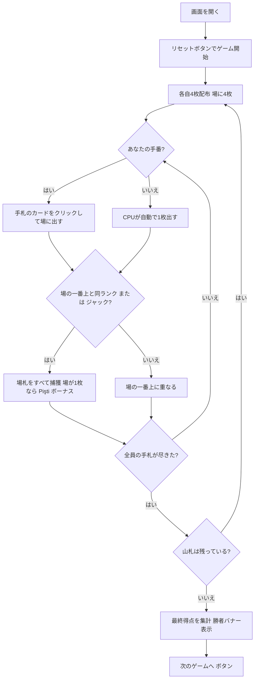

# ピシュティ（Web版）遊び方

## ゲーム概要

Pişti（ピシュティ）はトルコ生まれの2〜4人用**捕獲（フィッシング）系カードゲーム**です。52枚デッキを使い、各自4枚ずつ配って中央の場に1枚ずつカードを出していきます。場の一番上のカードと**同じランク**を出すか、**ジャック**（どんな札も捕獲できるワイルド）を出すと、場札をすべて捕獲できます。場に1枚しかない札を捕獲すると「**Pişti（ピシュティ）**」となりボーナスが入ります。手札が尽きるたびに山札から4枚ずつ配り直し、山札がなくなるまで続けます。最終得点が最も高いプレイヤーの勝利です。

## 起動方法

```sh
go run ./cmd/trumpcards web  # CLI経由でWebサーバーを起動
go run ./cmd/server          # 直接Webサーバーを起動
```

ブラウザで `http://localhost:8080` にアクセスし、ナビゲーションバーから「ピシュティ」を選択します。
ナビバーのJA/ENボタンで日本語・英語を切り替えられます。

## ルール

### デッキと配布

- **デッキ**: 52枚（標準デッキ）
- **プレイヤー**: 2〜4人（あなた + CPU、デフォルト4人）
- **配布**: 各プレイヤーに4枚ずつ。さらに場の中央に4枚を置きます。
- 手札が全員尽きたら、山札から4枚ずつ配り直します。

### カードを出す・捕獲する

- 自分の番になると、フッターの手札からカードをクリックして場に出します。
- 出したカードが**場の一番上のカードと同じランク**なら、場札をすべて捕獲します。
- **ジャック**はワイルドで、いつでも場札をすべて捕獲できます。
- 捕獲できなかった場合、出したカードは場の一番上に重なります。

### Pişti（ピシュティ）ボーナス

- 場に**1枚だけ**の札を捕獲すると「**Pişti**」となり **+10点**。
- ジャックを**単独のジャック**に重ねて捕獲すると **+20点**。

### 最終得点

| 項目 | 得点 |
|------|------|
| 最多捕獲枚数 | +3 |
| エース各1枚 | +1 |
| 2♣ | +2 |
| 10♦ | +3 |
| ジャック各1枚 | +1 |
| Pişti ボーナス | +10 / +20（上記） |

- 総得点が最も高いプレイヤーの勝利です。

### CPU難易度

- **Easy（0）**: ランダムな合法手を選びます。
- **Normal（1）**: 捕獲できる手を優先します。
- **Hard（2）**: Pişti や高得点札を狙います。

## ゲームの流れ



## 画面の操作方法

### プレイフェーズ

- あなたの番になると、フッターの手札カードがクリックできるようになります。
- カードをクリックすると、そのカードを場に出します。条件を満たせば場札を捕獲します。

### ゲーム終了・結果

- 山札がなくなり全員の手札が尽きると、最終得点が集計され、勝者バナーが表示されます。
- 「**次のゲームへ**」ボタンで新しいゲームを始められます。

### キーボードショートカット

| キー | アクション | 有効条件 |
|------|-----------|---------|
| （なし） | マウス／タップ操作のみ | — |

## 画面構成

```
┌────────────────────────────────────────────┐
│  ピシュティ        [フェーズ] [CLI切替]     │
├────────────────────────────────────────────┤
│  山札: 36枚                                 │
│                                            │
│  プレイヤー                                 │
│   あなた  捕獲0枚                           │
│   CPU 1  捕獲0枚                            │
│   CPU 2  捕獲0枚                            │
│   CPU 3  捕獲0枚                            │
│                                            │
│  場 — 1枚                                   │
│   [♣7]                                     │
├────────────────────────────────────────────┤
│  あなたの手札                               │
│   [♠5] [♥J] [♦A] [♣9]                      │
│  あなたの番です — 手札を1枚選んで出してください│
│  [リセット]                                 │
└────────────────────────────────────────────┘
```

- **上部バー**: ゲーム名・現在のフェーズ・CLIモード切替。
- **情報行**: 山札の残り枚数。
- **プレイヤー一覧**: 各プレイヤーの捕獲枚数・Pişti ボーナス・手番の状態。
- **場**: 中央の場の一番上のカードと場札の枚数。
- **フッター**: あなたの手札（クリックで出す）・次のゲームへ／リセットの各ボタン。

## 遊び方のコツ

- **ジャックは切り札**: ジャックはいつでも場札を一掃できます。場札がたまったタイミングで使うと効果的です。
- **Pişti を狙う**: 場が1枚のときに同ランクで捕獲すると+10点。積極的に狙いましょう。
- **高得点札を意識**: 2♣・10♦・エース・ジャックは終盤の得点源です。
- **難易度で調整**: Hard のCPUは Pişti を狙ってきます。慣れないうちは Easy で練習しましょう。
