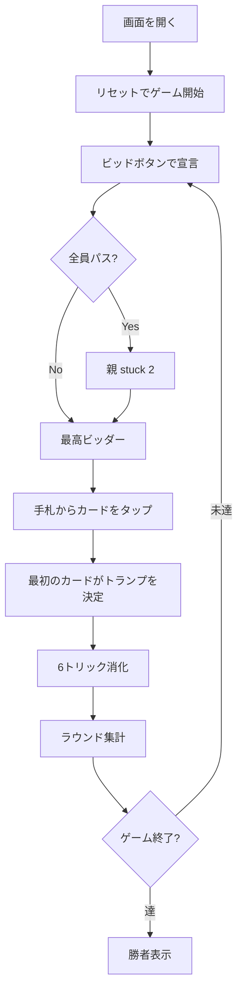

# ピッチ（Web版）遊び方

## ゲーム概要

Pitch (別名: Setback / Auction Pitch) は4人 (人間1 + CPU3) のシングルハンド トリックテイキングゲームです。
6枚のカードを使い、High / Low / Jack / Game の4つのポイントを競ってビッドします。
最初に PointLimit (デフォルト 7) に到達したプレイヤーが勝利します。

## 起動方法

```sh
go run ./cmd/trumpcards web  # CLI経由でWebサーバーを起動
go run ./cmd/server          # 直接Webサーバーを起動
```

ブラウザで `http://localhost:8080` にアクセスし、ナビゲーションバーから「ピッチ」を選択します。
ナビバーのJA/ENボタンで日本語・英語を切り替えられます。

## ルール

### 基本ルール

- 4人プレイ (人間 1 + CPU 3)、52枚デッキから6枚ずつ配り、24枚使用
- 親はラウンドごとに左回りでローテーション
- 親の左隣 (eldest hand) からビッド開始

### ビッド

- 各プレイヤーは順番に **pass / 2 / 3 / 4** のいずれかを宣言
- 非ゼロのビッドは現在の最高ビッドを上回る必要がある
- 全員パスの場合は親が **stuck** で 2 を強制ビッド

### プレイ

- ビッド勝者がリードし、最初に出されたカードのスートが切り札になる
- フォロー時は **リードスートに従う** か **トランプ (切り札) を出す** 必要がある
- リードスートを持っていなければ任意のカードをプレイ可

### 得点 (1ラウンド最大4点)

| 得点 | 内容 |
|------|------|
| **High** | 配られた中で最強のトランプを取った者に +1 |
| **Low** | プレイされた最弱のトランプを取った者に +1 |
| **Jack** | トランプの J を取った者に +1 (出た場合のみ) |
| **Game** | ピップ合計 (A=4, K=3, Q=2, J=1, 10=10) が単独最大の者に +1 (同点なし) |

### Set Back

- ビッダーが宣言数未達なら累積スコアが **-ビッド数**
- 達成すれば獲得ポイントが累積に加算

### ゲーム終了

- PointLimit (デフォルト 7) に到達したプレイヤーが勝利

## ゲームの流れ



## 画面の操作方法

### ビッドフェーズ

- ビッドボタン (0/2/3/4) をタップして宣言する
- パスは 0 を選択

### プレイフェーズ

- 手札のカードをタップで選択 → プレイボタンで出す
- リードスートに従えない場合のみオフスートのカードが選択可能

### ラウンド終了

- 「次のラウンド」ボタンで集計後、次ラウンドへ

### 設定パネル

- CPU難易度 (Easy / Normal / Hard)
- 目標スコア (PointLimit)

## 画面構成

| エリア | 内容 |
|--------|------|
| ヘッダー | ラウンド / トリック / 親 / ビッド / トランプ |
| トリックエリア | 現在のトリックに出されたカード |
| 手札エリア | あなたのカード (インデックス付き) |
| プレイヤーパネル | 各プレイヤーのビッド・トリック数・スコア |
| アクションログ | 各プレイの履歴 (展開可能) |

## 遊び方のコツ

- A・K のトランプを多く持つときは強気にビッド
- J of trump を持っているなら Jack ポイントを狙う
- Low の最弱トランプは温存しても結局取られやすい — タイミング重視
- Game ポイントは 10・A の取り合い、引き分けでは誰にも入らない
- 不利になったら **パス** で被害を抑える
