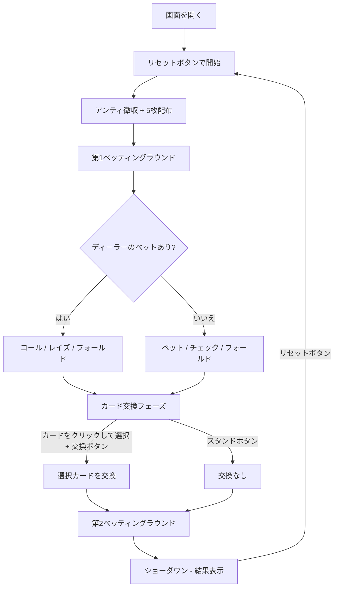

# ポーカー（5カードドロー・Web版）遊び方

## ゲーム概要

プレイヤーとディーラー（CPU）が1対1で対戦する5カードドローポーカーです。2回のベッティングラウンドと1回のカード交換を経て、より強い役を持つ方が勝ちです。

## 起動方法

```sh
go run ./cmd/cli web        # CLI経由でWebサーバーを起動
go run ./cmd/server         # 直接Webサーバーを起動
```

ブラウザで `http://localhost:8080` にアクセスし、ナビゲーションバーから「Poker」を選択します。

## ルール

### 役の強さ（弱い順）

| 順位 | 役名 | 説明 |
|------|------|------|
| 0 | ハイカード | 役なし |
| 1 | ワンペア | 同じ数字2枚 |
| 2 | ツーペア | ペアが2組 |
| 3 | スリーカード | 同じ数字3枚 |
| 4 | ストレート | 連続する5枚 |
| 5 | フラッシュ | 同じスート5枚 |
| 6 | フルハウス | スリーカード + ワンペア |
| 7 | フォーカード | 同じ数字4枚 |
| 8 | ストレートフラッシュ | 同スート連続5枚 |
| 9 | ロイヤルフラッシュ | 10-J-Q-K-A の同スート |

### チップシステム

- 初期チップ: 1000
- アンティ（参加費）: 10（各ラウンド開始時に自動徴収）
- 最低ベット: 10

## ゲームの流れ



## 画面の操作方法

### 第1ベッティングラウンド（DEAL フェーズ）

画面上部にポット、プレイヤーチップ、ディーラーチップが表示されます。

**ディーラーがベット済みの場合:**
- **「コール」** ボタン: ディーラーと同額を支払う
- **「レイズ」** ボタン + 金額入力: 上乗せ額を入力してレイズ
- **「フォールド」** ボタン: 降りる（ポットをディーラーに渡す）

**ディーラーがベットしていない場合:**
- **「ベット」** ボタン + 金額入力: ベット額を入力
- **「チェック」** ボタン: ベットせずに次へ進む
- **「フォールド」** ボタン: 降りる

### カード交換フェーズ（EXCHANGE フェーズ）

1. 交換したいカードをクリックして選択します（黄色の枠で強調され、カードが持ち上がり「交換」ラベルが表示されます）
2. 再度クリックで選択解除できます
3. **「交換」** ボタンをクリックして選択したカードを交換
4. 交換しない場合は **「スタンド」** ボタンをクリック

### 第2ベッティングラウンド（SECOND_BET フェーズ）

第1ラウンドと同じ操作です。

### 結果フェーズ（END）

- ディーラーの手札が全て表向きになります
- 各プレイヤーの役名がバッジで表示されます（例: 「One Pair」「Flush」）
- 勝敗メッセージが表示されます
- **「リセット」** ボタンで次のゲームへ

## 画面構成

```
┌────────────────────────────────────────────┐
│ Pot: 40 | Player: 980 | Dealer: 980       │
│                     Dealer Bet: 10         │
├────────────────────────────────────────────┤
│            ディーラーエリア                 │
│   [裏] [裏] [裏] [裏] [裏]                │
│          (ENDフェーズで表向き)              │
│           [役名バッジ]                     │
├────────────────────────────────────────────┤
│            プレイヤーエリア                 │
│   [♠3] [♥7] [♦2] [♣9] [♥K]              │
│           [役名バッジ]                     │
├────────────────────────────────────────────┤
│ [コール] [レイズ: [___]] [フォールド]      │
│       [交換] [スタンド] [リセット]         │
└────────────────────────────────────────────┘
```

- ディーラーのカードはショーダウンまで裏向き（CardBack で表示）
- プレイヤーのカードは常に表向き
- 交換フェーズで選択中のカードは黄色枠 + 上方シフト + 「交換」ラベル
