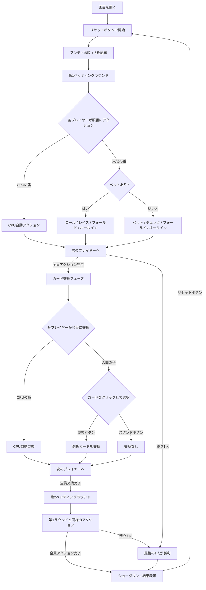

# ポーカー（Web版）遊び方

## ゲーム概要

プレイヤーと1〜3人のCPU（設定可能）がテーブルで対戦する5カードドローポーカーです。4種のプレイスタイル（Conservative / Balanced / Aggressive / Bluffer）を持つCPU AI、オプションのジョーカーワイルドカード（0〜2枚）に対応しています。2回のベッティングラウンドと1回のカード交換を経て、最も強い役を持つプレイヤーが勝利します。

## 起動方法

```sh
go run ./cmd/trumpcards web  # CLI経由でWebサーバーを起動
go run ./cmd/server          # 直接Webサーバーを起動
```

ブラウザで `http://localhost:8080` にアクセスし、ナビゲーションバーから「Poker」を選択します。
ナビバーのJA/ENボタンで日本語・英語を切り替えられます。

## ルール

### 役の強さ（弱い順）

| 順位 | 役名 | 説明 |
|------|------|------|
| 0 | ハイカード | 役なし |
| 1 | ワンペア | 同じ数字2枚 |
| 2 | ツーペア | ペアが2組 |
| 3 | スリーカード | 同じ数字3枚 |
| 4 | ストレート | 連続する5枚（A-2-3-4-5 や 10-J-Q-K-A を含む） |
| 5 | フラッシュ | 同じスート5枚 |
| 6 | フルハウス | スリーカード + ワンペア |
| 7 | フォーカード | 同じ数字4枚 |
| 8 | ストレートフラッシュ | 同スート連続5枚 |
| 9 | ロイヤルフラッシュ | 10-J-Q-K-A の同スート |
| 10 | ファイブカード | 同じ数字5枚（ジョーカー使用時のみ成立） |

### チップシステム

- 初期チップ: 1000
- アンティ（参加費）: 10（各ラウンド開始時に全プレイヤーから自動徴収）
- 最低ベット: 10

### マルチプレイヤー

- プレイヤー1人 + CPU 1〜3人（Web版ではリセット時に設定可能）
- ディーラーはラウンドごとに時計回りで交代します
- アクション順はディーラーの左隣から時計回りです

### ジョーカー

- Web版ではリセット時に0〜2枚を設定可能
- ジョーカーはワイルドカードとして任意のカードの代わりになります
- ジョーカーが含まれる場合のみ、ファイブカード（同じ数字5枚）が成立します

### CPU プレイスタイル

| スタイル | 特徴 |
|----------|------|
| Conservative | 保守的。強い手でのみベットし、ブラフ率が低い |
| Balanced | バランス型。標準的なベット判断とブラフ率 |
| Aggressive | 攻撃的。高額ベットとレイズを多用する |
| Bluffer | ブラフ重視。弱い手でも積極的にベット・レイズする |

CPU はプレイスタイルに基づいてベット額、レイズ額、フォールド判断、ブラフ頻度を自動決定します。交換フェーズでは、フラッシュドロー・ストレートドロー等を考慮した戦略的な交換を行います。

## ゲームの流れ



## 画面の操作方法

### 情報バー（画面上部）

画面上部の暗色バーに以下の情報が表示されます。

- **ポット**: 場に出ているチップ合計
- **ディーラー**: 現在のディーラー位置（Player N）
- **ジョーカー**: ジョーカー枚数（1枚以上の場合のみ表示）
- **Lowball**: 2-7 ローボールモードが有効な場合にインジケーターが表示されます

### CPUプレイヤーエリア（スクロール領域）

各CPUプレイヤーの情報が表示されます。

- **CPU N (スタイル名)**: CPUプレイヤー番号とプレイスタイル名（Conservative / Balanced / Aggressive / Bluffer）
- **チップ**: 所持チップ数
- **ベット**: 現ラウンドのベット額（ベット時のみ表示）
- **[フォールド]**: フォールド済みのプレイヤー（赤色バッジ）
- **[オールイン]**: オールイン済みのプレイヤー（黄色バッジ）
- **交換: N枚**: カード交換枚数（第2ベッティングラウンド以降、フォールドしていない場合に表示）
- **役名バッジ**: ショーダウン時にフォールドしていないプレイヤーの役名を表示（黄色背景）
- **カード**: ショーダウンまでは裏向き（CardBack）、END フェーズでフォールドしていない場合は表向き

### CPU行動ログ

CPUが実行したベッティングアクションの記録が暗色パネルに表示されます。

```
CPU行動:
  Player 1: ベット (10)
  Player 2: コール (10)
  Player 3: フォールド
```

### CPU交換ログ

CPUのカード交換枚数の記録が暗色パネルに表示されます。

```
CPU交換:
  Player 1: 2枚交換
  Player 2: 3枚交換
```

### 結果表示

ショーダウン（END フェーズ）時に暗色パネルで各プレイヤーの結果を表示します。

```
結果:
  あなた: Two Pair  +60チップ
  CPU 1: One Pair
  CPU 2: High Card
```

### プレイヤーエリア（固定フッター）

画面下部の固定エリアに人間プレイヤーの情報とコントロールが表示されます。

#### 手札表示

- 人間プレイヤーの手札は常に表向きで表示されます
- チップ数、ベット額、状態バッジ（フォールド / オールイン）が表示されます
- ショーダウン時には役名バッジも表示されます

#### メッセージバー

勝敗メッセージやエラーメッセージが中央に表示されます。

#### 第1ベッティングラウンド / 第2ベッティングラウンド

自分の番で、かつフォールド・オールインしていない場合にベッティングコントロールが表示されます。

**ベット済みの場合（他プレイヤーのベットがある場合）:**
- **「コール」** ボタン: 直前のベットと同額を支払う
- **「レイズ」** ボタン + 金額入力: 上乗せ額を入力してレイズ
- **「フォールド」** ボタン: 降りる
- **「オールイン」** ボタン: 全チップを賭ける

**未ベットの場合:**
- **「ベット」** ボタン + 金額入力: ベット額を入力
- **「チェック」** ボタン: ベットせずに次へ進む
- **「フォールド」** ボタン: 降りる
- **「オールイン」** ボタン: 全チップを賭ける

金額入力フィールドには最低レイズ額がデフォルト値として表示されます。

#### カード交換フェーズ（EXCHANGE フェーズ）

自分の番でカード交換操作が可能になります。

1. 交換したいカードをクリックして選択します（黄色の枠で強調され、カードが持ち上がり「交換」ラベルが表示されます）
2. 再度クリックで選択解除できます
3. カードを選択すると、**ドローオッズパネル**が自動表示され、交換後に各役が成立する確率をリアルタイムで確認できます
4. **「交換」** ボタンをクリックして選択したカードを交換
5. 交換しない場合は **「スタンド」** ボタンをクリック

ガイドメッセージ「交換したいカードをクリックして選択し、「交換」または「スタンド」を押してください。」が表示されます。

#### ドローオッズパネル

カード交換フェーズで1枚以上のカードを選択すると、「ドローオッズ」パネルが交換ボタンの上に表示されます。各役名と成立確率（%）がリアルタイムで更新されます。確率が0%の役は非表示になります。

```
ドローオッズ:
  One Pair    42.3%
  Two Pair    10.5%
  Flush        4.2%
```

- 選択カードを変更するたびに300msのデバウンス後にサーバーへ問い合わせます
- 全カードの選択を解除するとパネルは非表示になります
- 交換またはスタンド実行後にパネルは自動的にクリアされます

#### 結果フェーズ（END）

- 全CPUプレイヤーの手札が表向きになります（フォールドしたCPUは裏向きのまま）
- 各プレイヤーの役名がバッジで表示されます（例: 「One Pair」「Flush」「Five of a Kind」）
- 勝敗メッセージが表示されます
- **「リセット」** ボタンで次のゲームへ

#### ローボールモード

リセットボタンの横にある **「Lowball」チェックボックス** で 2-7 ローボールモードを切り替えられます。有効にすると最も弱い手が勝利するルールになります（Ace は常に 14、ストレートとフラッシュはカウントされ不利、最強の手は 2-3-4-5-7 オフスート）。モードが有効な場合、情報バーにインジケーターが表示されます。

### キーボードショートカット

ゲーム中、以下のキーボードショートカットが使用できます。

| キー | アクション | 有効条件 |
|------|-----------|---------|
| `1`〜`9`, `0` | カード選択/解除（1=1枚目, ..., 9=9枚目, 0=10枚目） | 交換フェーズ |
| `Enter` | 交換実行 | 交換フェーズ |
| `Escape` | 選択クリア | 交換フェーズ |

※ テキスト入力欄にフォーカスがある場合、ショートカットは無効になります。

## 画面構成

```
┌─────────────────────────────────────────────────────┐
│ ポット: 40 | ディーラー: Player 0 | ジョーカー: 2   │
├─────────────────────────────────────────────────────┤
│  CPU 1 (Balanced)  チップ:980  ベット:10            │
│  [裏] [裏] [裏] [裏] [裏]                          │
│                                                     │
│  CPU 2 (Aggressive)  チップ:970  ベット:20          │
│  [裏] [裏] [裏] [裏] [裏]                          │
│                                                     │
│  CPU 3 (Bluffer)  チップ:990  [フォールド]          │
│  [裏] [裏] [裏] [裏] [裏]                          │
│                                                     │
│  ┌───────────────────────────────────┐              │
│  │ CPU行動:                          │              │
│  │   Player 1: ベット (10)           │              │
│  │   Player 2: レイズ (20)           │              │
│  │   Player 3: フォールド            │              │
│  └───────────────────────────────────┘              │
│                                                     │
│  ┌───────────────────────────────────┐              │
│  │ CPU交換:                          │              │
│  │   Player 1: 2枚交換               │              │
│  │   Player 2: 3枚交換               │              │
│  └───────────────────────────────────┘              │
│                                                     │
│  ┌───────────────────────────────────┐              │
│  │ 結果:                             │  (ENDのみ)   │
│  │   あなた: Two Pair  +60チップ      │              │
│  │   CPU 1: One Pair                 │              │
│  │   CPU 2: High Card                │              │
│  └───────────────────────────────────┘              │
├─────────────────────────────────────────────────────┤
│  あなたの手札  チップ:960  ベット:20                 │
│  [♠3] [♥7] [♦2] [♣9] [♥K]                        │
│        ↑交換                                        │
│                                                     │
│  ┌────────────────────────────────┐                 │
│  │     You are the winner.        │                 │
│  └────────────────────────────────┘                 │
│                                                     │
│  ベット額: [___]                                     │
│  [コール] [レイズ] [フォールド] [オールイン]         │
│  ┌──────────────────────────────┐                     │
│  │ ドローオッズ:                │  (交換フェーズのみ) │
│  │   One Pair    42.3%         │                     │
│  │   Two Pair    10.5%         │                     │
│  └──────────────────────────────┘                     │
│  [交換] [スタンド]                                   │
│  [リセット]                                          │
└─────────────────────────────────────────────────────┘
```

- 上部: 情報バー（ポット、ディーラー、ジョーカー枚数）
- 中央スクロール領域: CPUプレイヤーカード + CPU行動ログ + CPU交換ログ + 結果表示
- 下部固定フッター: 人間プレイヤーの手札 + メッセージ + 操作ボタン
- CPUのカードはショーダウンまで裏向き（CardBack で表示）
- プレイヤーのカードは常に表向き
- 交換フェーズで選択中のカードは黄色枠 + 上方シフト + 「交換」ラベル
- ベッティングコントロールは自分の番でのみ表示
- 交換コントロールは交換フェーズで自分の番のときのみ表示

## Web API 設定

Web版ではリセットコマンド実行時にJSON リクエストで CPU 人数とジョーカー枚数を設定できます。

```json
{
  "command": "reset",
  "sessionId": "...",
  "cpuCount": 2,
  "jokerCount": 1,
  "isLowball": true
}
```

| パラメータ | 型 | 範囲 | デフォルト | 説明 |
|------------|------|------|------------|------|
| `cpuCount` | int | 1〜3 | 3 | CPU プレイヤー人数 |
| `jokerCount` | int | 0〜2 | 0 | ジョーカー枚数 |
| `bettingLimit` | int | 0〜2 | 0 | ベッティングリミット（0=Fixed, 1=PotLimit, 2=NoLimit） |
| `isLowball` | bool | — | false | 2-7 ローボールモード（最弱の手が勝利） |
| `cpuMetaAI` | bool | — | false | メタAI有効化（CPUが人間のブラフ率・フォールド率・思考時間を学習して戦略を適応） |
| `humanPlayMs` | int | — | — | 人間のアクションにかかった時間（ミリ秒）。メタAI有効時に送信 |

### レスポンスのベッティングリミット関連フィールド

| フィールド | 型 | 説明 |
|------------|------|------|
| `bettingLimit` | int | 現在のベッティングリミット（0=Fixed, 1=PotLimit, 2=NoLimit） |
| `raiseCount` | int | 現在のベッティングラウンドでのレイズ回数 |
| `maxBetAmount` | int | 現在のベッティングリミットに基づく最大ベット額 |
| `isLowball` | bool | 2-7 ローボールモードが有効かどうか |
