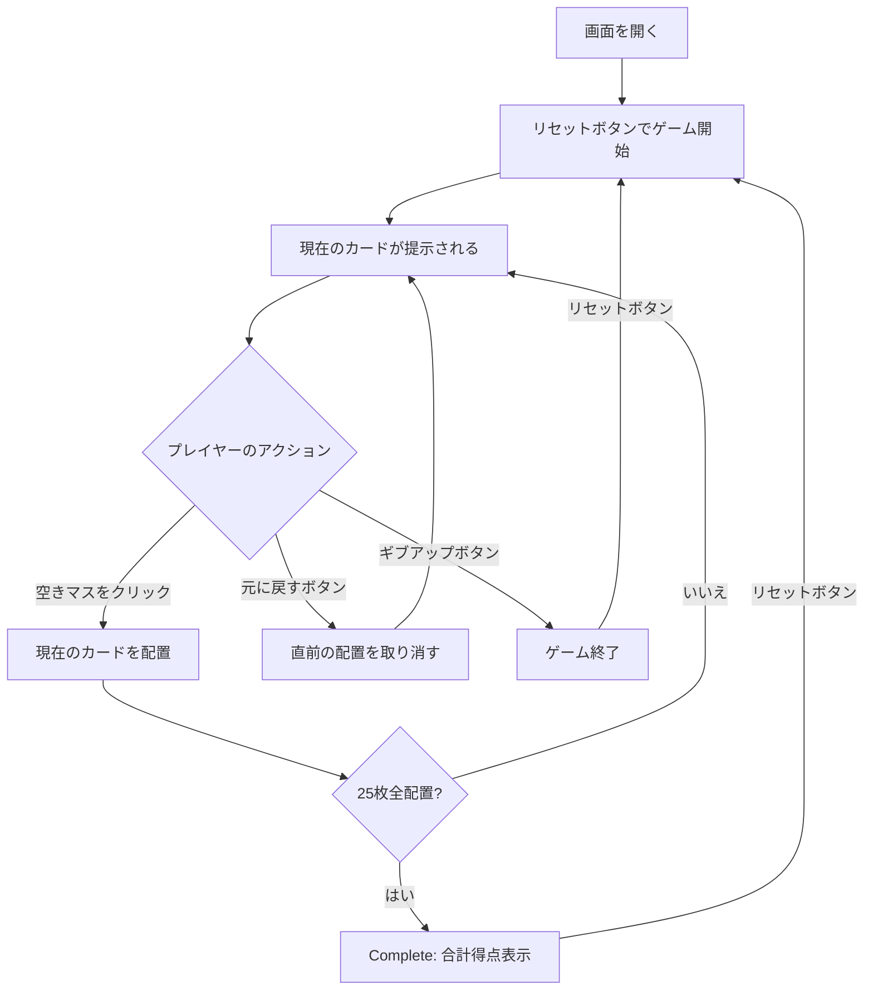

# ポーカー・スクエア（Web版）遊び方

## ゲーム概要

1人用のソリティア・パズルです。52枚のシャッフル済みデッキから1枚ずつカードが配られ、5x5のグリッド（25マス）に配置します。配置後のカードは動かせません。全25マスが埋まると、5つの行と5つの列がそれぞれポーカーの手役となり、合計10個の役の得点の合計がファイナルスコアとなります。

## 起動方法

```sh
go run ./cmd/trumpcards web     # CLI経由でWebサーバーを起動
go run ./cmd/server              # 直接Webサーバーを起動
```

ブラウザで `http://localhost:8080` にアクセスし、ナビゲーションバーから「ポーカー・スクエア」を選択します。
ナビバーのJA/ENボタンで日本語・英語を切り替えられます。

## ルール

### 基本ルール

- 52枚のトランプ（ジョーカーなし）を使用
- 5x5 = 25マスのグリッドに1枚ずつカードを配置する
- 画面上部に「現在のカード（current card）」が表示される
- グリッド上の空きマスをクリックして現在のカードを配置する
- 一度配置したカードは動かせない（ただし直前の手は「元に戻す」で取り消し可能）
- 25枚すべてを配置するとゲーム終了

### 得点（アメリカン採点法）

ゲーム終了時、5つの行と5つの列の計10個のポーカーハンドを評価し、以下の表で加点します。

| 役 | 得点 |
|----|------|
| Royal Flush（ロイヤルフラッシュ） | 100 |
| Straight Flush（ストレートフラッシュ） | 75 |
| Four of a Kind（フォーカード） | 50 |
| Full House（フルハウス） | 25 |
| Flush（フラッシュ） | 20 |
| Straight（ストレート） | 15 |
| Three of a Kind（スリーカード） | 10 |
| Two Pair（ツーペア） | 5 |
| One Pair（ワンペア） | 2 |
| High Card（ハイカード） | 0 |

### ゲーム終了

- 25枚すべてを配置し終えると Complete フェーズに移行し、合計得点が画面に表示されます。
- 「ギブアップ」ボタンで任意のタイミングで終了できます。

## ゲームの流れ



## 画面の操作方法

### カードを配置する

1. 画面上部に表示された「現在のカード」を確認します。
2. 5x5 グリッドの任意の空きマスをクリックすると、そのマスにカードが配置されます。
3. 配置済みのマスはクリックしても変更できません。

### 元に戻す

**「元に戻す」** ボタンで直前の配置を取り消し、そのカードを再度「現在のカード」として引き戻せます。

### ギブアップ / リセット

- **「ギブアップ」**: 現在のゲームを途中終了します。
- **「リセット」**: 新しいゲームを開始します（デッキを再シャッフル）。

### CLIモード

画面右上の CLI トグルを有効にするとコマンド入力モードで遊べます。利用可能なコマンドは CUI 版と同じです（`p <row> <col>` / `u` / `g` / `r` / `l`）。

## 画面構成

```
┌────────────────────────────────────────────┐
│              ゲーム情報                     │
│  配置数: 0 / 25   合計得点: 0              │
├────────────────────────────────────────────┤
│ 現在のカード: [♥10]                        │
├────────────────────────────────────────────┤
│                 グリッド (5x5)              │
│        col0  col1  col2  col3  col4  │ 行  │
│  row0 [   ] [   ] [   ] [   ] [   ] │  -  │
│  row1 [   ] [   ] [   ] [   ] [   ] │  -  │
│  row2 [   ] [   ] [   ] [   ] [   ] │  -  │
│  row3 [   ] [   ] [   ] [   ] [   ] │  -  │
│  row4 [   ] [   ] [   ] [   ] [   ] │  -  │
│   列   -    -    -    -    -              │
├────────────────────────────────────────────┤
│   [元に戻す] [ギブアップ] [リセット]       │
└────────────────────────────────────────────┘
```

- **現在のカード**: 次に配置するカードを表示
- **グリッド**: 5x5 の配置エリア。空きマスをクリックすると配置
- **行スコアバッジ**: 各行の右端に、その行の現在の手役得点を表示
- **列スコアバッジ**: 各列の下端に、その列の現在の手役得点を表示
- **合計得点**: 10ハンドの合計スコア
- **ボタン**: 「元に戻す」「ギブアップ」「リセット」

## 遊び方のコツ

- 序盤はスートを分散させすぎず、フラッシュが狙える行・列をいくつか意識しましょう
- ストレートを狙う行・列を早めに決め、同じランクが重ならないようにします
- 中央付近のマスは行と列の両方に影響するため、強力な役を作りやすい反面、失敗すると両方の得点を落とします
- 高ランクのペア（10・J・Q・K・A）は行か列のどちらで活かすかを決めてから配置しましょう
- 「元に戻す」を活用して、別の配置パターンを比較しましょう
