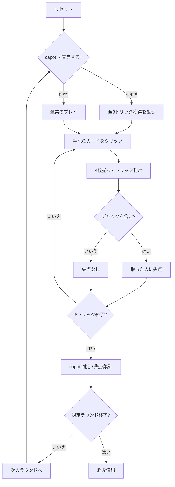

# ポリニャック（Web版）遊び方

## ゲーム概要

フランス発祥の**回避型**トリックテイキング。別名「Quatre Valets（4人のジャック）」。4人（あなた＋CPU3人）で、ピケット32枚を使って8トリックを戦う。**失点するのはジャック4枚だけ**で、なかでも**スペードのジャック（＝Polignac）は2倍の重さ**を持つ。全トリック獲得を狙う「capot」宣言もある。

## 起動方法

```sh
go run ./cmd/trumpcards web  # CLI経由でWebサーバーを起動
go run ./cmd/server          # 直接Webサーバーを起動
```

ブラウザで `http://localhost:8080` にアクセスし、ナビゲーションバーから「ポリニャック」を選択します。
ナビバーのJA/ENボタンで日本語・英語を切り替えられます。

## ルール

- **ピケット32枚**（A・7・8・9・10・J・Q・K × 4スート）を4人に**8枚ずつ**
- **切り札なし。** リードのスートの最強札がトリックを取る（A > K > Q > J > 10 > 9 > 8 > 7）
- **リードのスートを持っていれば必ず出す**（フォロー義務）
- 失点は**ジャックだけ**: ♠J は **2点**、他の3枚は各 **1点**。1ラウンドで必ず5点動く
- 失点は札を出した人ではなく、**トリックを取った人**に付く
- **capot 宣言**（配り直後）: **全8トリック**獲得を狙う。成功なら他全員に5失点＋自分のジャック失点は帳消し、失敗なら自分に5失点＋ジャック失点
- 既定4ラウンド（1〜12で変更可）。**合計失点が最も少ないプレイヤーが勝ち**

## ゲームの流れ



## 画面の操作方法

| 操作 | 説明 |
|------|------|
| capot 宣言ボタン | 全8トリック獲得を宣言する（配り直後のみ） |
| 宣言せず進むボタン | capot を宣言せずにプレイへ進む |
| 手札のカードをクリック | そのカードを出す（出せる札だけ押せます） |
| 次のラウンドへボタン | ラウンド終了後、次のラウンドを配る |
| ヒントボタン | 打つべき札と、その狙いを提示する |
| ギブアップボタン | 投了する |
| リセットボタン | 確認ダイアログのうえで最初からやり直す |
| CLI トグル | 同じゲームをコマンド入力で操作するモードに切り替える |

## 画面構成

- **上部**: ラウンド数、トリック数、フェーズ表示
- **失点ルール帯**: 「ジャックのみ失点、♠J は2倍」の明示。盤面からは読み取れない情報です
- **capot 警告帯**: 誰かが capot を宣言しているときだけ表示。獲得トリック数も出ます
- **中央上**: 各プレイヤーの累計失点と、このラウンドの失点。**そのラウンドで取ったジャックの内訳**（`♠J` は赤太字、他は素）も並びます
- **中央**: 現在のトリック
- **下部**: 自分の手札。**フォロー義務を満たす札だけ**に印が付きます

## 遊び方のコツ

- **♠J が最大の地雷。** 1枚で2点、1ラウンドの失点の4割
- **♠J は早く手放す。** ただし自分が取ってしまう場面で出しては意味がありません
- **スペードのA・K・Qが危険。** ♠J が出ているトリックを取ってしまいます
- **ジャックの無いトリックが処分どき。** 安全なうちに高い札を捨てる
- **capot は本当に強い手のときだけ。** 失敗すると5失点＋ジャック失点で一気に最下位です
- **誰かが capot を宣言したら全員で潰す。** **1トリック取れば崩れ**、宣言者が5失点します
