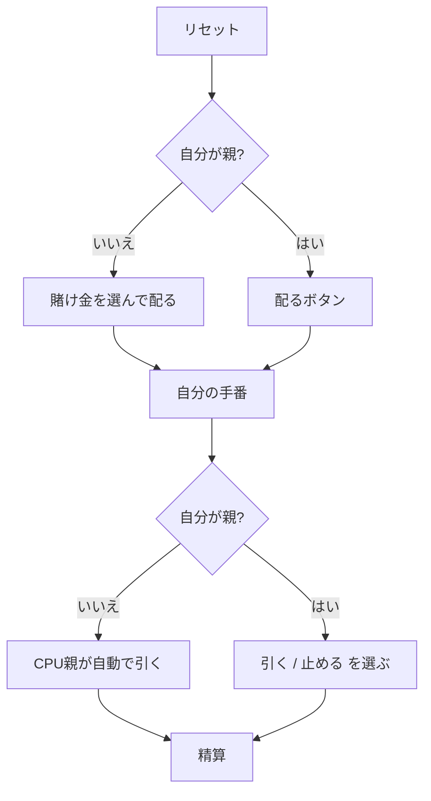

# ポンツーン（Web版）遊び方

## ゲーム概要

52 枚 1 組の英国式ブラックジャック。人間 1 人 + CPU 2 人の 3 席で、1 席が **親（バンカー）** を務めます。**親を含む全員が 2 枚とも裏向き**で受け取るのが最大の特徴です。

## 起動方法

1. `go run ./cmd/trumpcards web` でサーバーを起動する
2. ブラウザで `http://localhost:8080` を開く
3. ゲーム一覧または左サイドバーから「ポンツーン」を選ぶ

## ルール

- **手の格**: ポンツーン（A + 10 点札の **2 枚**）> ファイブカード・トリック（**ちょうど 5 枚**で 21 以下）> 点数。上位 2 つは **2 倍**配当
- **Stick は合計 15 以上でのみ**宣言できる
- **Buy は一度 Twist したら打てない**。上乗せ額は元の賭け金の 1〜2 倍
- **Split はランクが同じ**ときだけ。Q と J は両方 10 点だが分けられない
- 5 枚に達したらそれ以上引けない
- **同点は親の勝ち**。親のファイブカード・トリックはポンツーン以外に 2 倍で勝つ
- **ポンツーンを出したプレイヤーが次局の親**になる（スプリットした手は対象外）

## ゲームの流れ

## 画面の操作方法

| 操作 | 説明 |
|------|------|
| 賭け金ボタン | 額を選んでベットし、その局を配る |
| 配るボタン | 自分が親の局を配る（賭け金は選ばない） |
| スティック | 打ち止め。**15 未満のときは押せない** |
| ツイスト | 1 枚引く。賭け金は増えない |
| バイ | 賭け金を足して 1 枚引く。**ツイスト後は押せない** |
| スプリット | 同ランク 2 枚を分ける。**押せるときだけ表示される** |
| 引く / 止める | 自分が親のとき、最後に引き止めを決める |
| 次の局へ | 精算後に次の局を始める |
| CLI トグル | 同じゲームをコマンド入力で操作するモードに切り替える |

キーボードショートカット: `s` スティック / `t` ツイスト / `b` バイ / `p` スプリット / `r` 次の局。

## 画面構成

- **上部**: フェーズ、チップ残高、親が誰か
- **中央上段**: 親の手（局が終わるまで伏せ札。**サーバーが中身を送らない**ので、通信を覗いても読めない）
- **中央**: 各席の手。自分の手番には印がつき、合計と格が併記される
- **下部**: 打てる宣言のボタン、結果表示、アクションログ、設定

## 遊び方のコツ

- **14 以下では止まれない。** 12〜14 が最も苦しい
- **Buy は最初の 1 枚に。** 一度ツイストすると二度と買えない
- **4 枚で 15〜16 は引く。** もう 1 枚でファイブカード・トリックの目がある
- **同点は親の勝ち。** 迷ったらもう一段上を狙う
- **ポンツーンは配当だけでなく親の座も取る**
