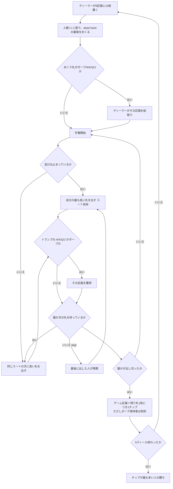

# ポープ・ジョーン (Pope Joan) — Web マニュアル

## ゲーム概要

18〜19 世紀イギリスで広まったストップス系ゲームの祖型。**51 枚**（標準 52 枚から **♦8 を抜く**）と、**8 区画の専用盤**を使います。

出典: [Wikipedia: Pope Joan](https://en.wikipedia.org/wiki/Pope_Joan_(card_game))

## 起動方法

1. `go run ./cmd/trumpcards web` でサーバーを起動します
2. ブラウザで `http://localhost:8080` を開きます
3. ゲーム一覧から **ポープ・ジョーン** を選ぶか、`/popejoan` へ直接アクセスします

## ルール

### なぜ ♦8 を抜くのか

**♦7 の次の札が存在しなくなる**ためです。並びは必ずそこで止まります。この 1 枚の欠落がゲーム全体の仕掛けになっています。

### 盤の 8 区画

| 区画 | 取る条件 |
|---|---|
| **A / K / Q / J** | **トランプの**その札を出したとき |
| **ポープ** | **♦9** を出したとき（トランプが何であっても） |
| **マトリモニー** | **同じ人が**トランプの K と Q を両方出したとき |
| **イントリーグ** | **同じ人が**トランプの Q と J を両方出したとき |
| **ゲーム** | 先に手札を出し切った人 |

**ランクが合っているだけでは取れません。**トランプでなければ 1 チップも入りません（ポープだけが例外）。

### ディーラーが盤に置く（dressing the board）

**プレイヤーが配分するのではありません。**毎ディール、ディーラーが決まった内訳で置きます。

| 区画 | 枚数 |
|---|---|
| ポープ | **6** |
| マトリモニー | **2** |
| イントリーグ | **2** |
| A / K / Q / J / ゲーム | **各 1** |

合計 **15** 枚です。

### 配り方とめくり札

**プレイヤー数より 1 つ多く配ります。**余った 1 人分が「dead hand」で、誰も使いません。その dead hand に配られた**最後の 1 枚を表向きにし、そのスートがトランプ**になります。

**そのめくり札がポープ・A・K・Q・J なら、ディーラーがその区画を即座に総取りします。**ポープ区画には 6 枚積まれているので、これが決まると大きく動きます。

### 手番

- **並びが止まっているとき**: **自分の最も低い札**を出して始めます。**スートは自由**です
- **並びの途中**: **同じスートの次に高い札**を出します
- 誰も次の札を持っていなければ「**stop**」。**最後に札を出した人**が、また好きな札から始めます

stop は ♦7 のあとだけでなく、**K を出したとき**にも起きます（K より高い札が無いため）。

### 精算

先に手札を出し切った人が**ゲーム区画**を取り、さらに**他家から残り札 1 枚につき 1 チップ**を受け取ります。

ただし **ポープ（♦9）を手札に抱えている人は免除**されます。6 枚積まれた区画を取り逃した代償が、この免除で釣り合っています。

**取られなかった区画は次のディールへ持ち越されます。**ディーラーがまた 15 枚足すので、条件の厳しい区画は膨らんでいきます。

5 ディール戦い、チップが最も多い人の勝ちです。

## ゲームの流れ

## 操作

| 操作 | 説明 |
|------|------|
| 手札のカードをクリック | 出す 1 枚を選びます |
| **出す** ボタン | 選択中の 1 枚を出します |
| **次のディール** ボタン | 精算を読んだあと、次のディールへ進みます |
| **ヒント** トグル | 推奨する手をハイライトします |
| **CLI** トグル | ターミナル風の操作に切り替えます |

## 画面構成

- **ヘッダー**: ディール数、めくり札
- **ルール表示**: 常時表示します。「区画はトランプでしか払わない」と「♦8 が無いので ♦7 で必ず止まる」が最も誤解されやすい 2 点です
- **盤**: 8 区画とそれぞれのチップ。**取られなかった区画は持ち越される**ので、数字が膨らんでいる区画が狙いどころです
- **獲得の記録**: 誰がどの区画を取ったか。めくり札での即取りはその旨が付きます
- **場に出た札**: 並びの経過。止まっているときは好きな札から始められます
- **プレイヤー**: チップ、手札枚数、**ポープを持っているか**（支払いを免除されます）
- **手札**: 自分の手札。CPU の手札は裏向きで枚数のみ
- **アクションログ**: 進行を後から追えます

## 遊び方のコツ

- **ポープ区画は 6 枚から始まります。**取られずに数ディール回ると一撃で取り返せる額になります
- **♦9（ポープ）を抱えるのは悪くありません。**区画は取れませんが、出し切られたときの支払いを免除されます
- **トランプでない絵札は区画を払いません。**めくり札のスートを見てから、自分が何を狙えるか数えてください
- **低い札から出す。**高い札を抱えると並びが自分で止まらず、手札が減りません
- 逆に、**K を持っていると自分で止められます。**stop を出した人が次を始めるので、主導権を握れます
