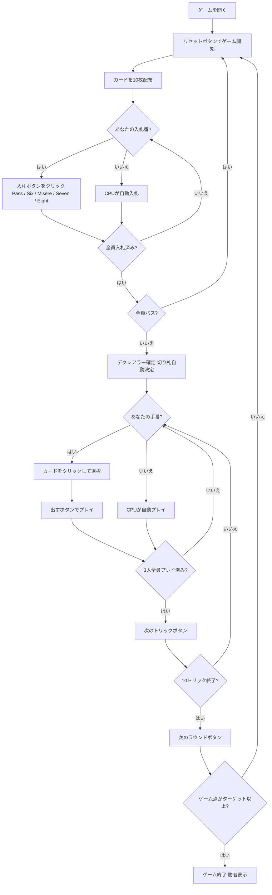

# プレフェランス（Web版）遊び方

## ゲーム概要

Préférence（プレフェランス）は中欧・東欧で広く親しまれているトリックテイキングゲームです。32枚デッキを3人でプレイします。各ラウンドの最初に**入札フェーズ**があり、最高入札者が**デクレアラー**（宣言者）として1人で2人の**ディフェンダー**と対戦します。デクレアラーがコントラクトを達成すればそのコントラクトの価値分のゲーム点を獲得し、失敗すれば**各**ディフェンダーが同じ点数を獲得します。先にターゲット（デフォルト**30**点）に達したプレイヤーがマッチ勝利です。あなたは席0としてプレイします。

## 起動方法

```sh
go run ./cmd/trumpcards web         # CLI経由でWebサーバーを起動
go run ./cmd/trumpcards web --open  # サーバー起動 + ブラウザを開く
go run ./cmd/server                 # 直接Webサーバーを起動
```

ブラウザで `http://localhost:8080` にアクセスし、ナビゲーションバーから「プレフェランス」を選択します。
ナビバーのJA/ENボタンで日本語・英語を切り替えられます。

## ルール

### デッキと配布

- **デッキ**: 32枚（7,8,9,10,J,Q,K,A × 4スート）
- **プレイヤー**: 3人（あなた = 席0、CPU1〜2）
- **配布**: 各プレイヤー10枚、計10トリック
- **カードの強さ（高い順）**: A > K > Q > J > 10 > 9 > 8 > 7

### 入札フェーズ

ディーラーの左隣から時計回りに、各プレイヤーが1回だけ入札します。

| コントラクト | 値 | 内容 |
|--------------|-----|------|
| **Pass（パス）** | — | 入札をパスする |
| **Six（シックス）** | 6 | 単独で6トリック以上取ることを宣言 |
| **Misère（ミゼール）** | 10 | 単独で0トリックを取ることを宣言（切り札なし） |
| **Seven（セブン）** | 7 | 単独で7トリック以上取ることを宣言 |
| **Eight（エイト）** | 8 | 単独で8トリック以上（全10中）取ることを宣言 |

- 先の入札より高いコントラクトのみ選択できます（Pass < Six < Misère < Seven < Eight）。
- 全員がパスした場合はそのラウンドは無効となり、再配布されます。
- 最高入札者が**デクレアラー**となり、他の2人が**ディフェンダー**として対戦します。
- 伝統的な2枚タロン（ウィドウ）の交換は省略されており、配られた10枚のみでプレイします。

### 切り札

- **Six / Seven / Eight**: デクレアラーの手札で最も枚数の多いスートが自動的に切り札スートになります（簡易実装）。
- **Misère**: 切り札はありません。

### トリック・テイキング

- **スートフォロー義務**: リードされたスートのカードを持っている場合は必ず出さなければなりません。
- 持っていない場合は任意のカードを出せます（切り札でも他スートでも可）。
- **トリックの勝者**:
  - 切り札スートのカードが場にあれば、最も強い切り札カードが勝ちます。
  - 切り札がなければ、リードスートの最も強いカードが勝ちます。
- トリックの勝者が次のトリックをリードします。

### 勝利条件

| 結果 | 得点 |
|------|------|
| デクレアラーがコントラクト達成 | デクレアラーがコントラクト値（Six=6, Seven=7, Eight=8, Misère=10）を獲得 |
| デクレアラーがコントラクト失敗 | **各**ディフェンダーがコントラクト値を獲得 |

**マッチ勝利**: 先にターゲット（デフォルト **30** ゲーム点）に達したプレイヤーが勝利。

> **簡略化について**: 伝統的なプレフェランスのタロン交換・プールペナルティ方式の代わりに、シンプルな累積ポイント制を採用しています。

## ゲームの流れ



## 画面の操作方法

### BIDフェーズ（入札フェーズ）

あなたの入札番になると、手札の下に入札ボタンが表示されます。

- **「Pass」ボタン**: 入札をパスします。
- **「Six」ボタン**: Six（6トリック以上）を宣言します。先行入札がSix以上の場合はグレーアウトして選択できません。
- **「Misère」ボタン**: Misère（0トリック）を宣言します。先行入札がMisère以上の場合は選択できません。
- **「Seven」ボタン**: Seven（7トリック以上）を宣言します。先行入札がSeven以上の場合は選択できません。
- **「Eight」ボタン**: Eight（8トリック以上）を宣言します。先行入札がEight以上の場合は選択できません。

### PLAYフェーズ（トリックフェーズ）

- あなたの手番のとき、手札のカードをクリックして選択します。
- **「出す」ボタン**: 選択したカードをプレイします。スートフォロー義務に従う必要があります（義務に反するカードは選択できません）。
- **「次のトリック」ボタン**: トリックが解決したら次へ進みます。
- **「次のラウンド」ボタン**: 10トリック終了後にスコアを集計して次のラウンドへ進みます。

### キーボードショートカット

| キー | アクション | 有効条件 |
|------|-----------|---------|

## 画面構成

```
┌─────────────────────────────────────────────────────┐
│  Préférence (プレフェランス) [JA/EN] [CLI]           │
├─────────────────────────────────────────────────────┤
│  ラウンド: 1  トリック: 0  フェーズ: BID             │
│  切り札: -  デクレアラー: -  コントラクト: -         │
│  ゲーム点: あなた=0  CPU1=0  CPU2=0                  │
├──────────┬──────────────────────────────────────────┤
│  CPU1    │                                           │
│  (役割)  │     現在のトリック表示エリア               │
│  CPU2    │     （各プレイヤーの出したカード）          │
│  (役割)  │                                           │
├──────────┼──────────────────────────────────────────┤
│  入札状況│  メッセージ / 結果表示                    │
│  CPU1=?  │  ラウンド結果・スコア情報                  │
│  CPU2=?  │                                           │
├──────────┴──────────────────────────────────────────┤
│  あなたの手札（クリックで選択）                       │
│  [A♥][K♥][Q♠][J♦][10♣][9♠][8♥][7♦][K♣][Q♦]      │
│  [Pass] [Six] [Misère] [Seven] [Eight]  ← BIDフェーズ│
│  [出す] [次のトリック] [次のラウンド]   ← PLAYフェーズ│
└─────────────────────────────────────────────────────┘
```

- **ヘッダー**: ゲーム名・フェーズ表示・言語切り替えトグル・CLI切り替えトグル。
- **ラウンド／トリック表示**: 現在のラウンド番号・トリック番号・フェーズ・切り札スート・デクレアラーとコントラクト表示。
- **ゲーム点**: 各プレイヤーの累積ゲーム点をリアルタイムで表示。
- **プレイヤー表示エリア（左）**: CPU各プレイヤーの手札枚数・役割（デクレアラー or ディフェンダー）を表示。
- **入札状況（左）**: 各プレイヤーの入札内容（入札フェーズ中）。
- **トリック表示エリア（中央）**: 場に出ているカードと出したプレイヤー名。
- **切り札の自動決定メモ**: 契約が決まると宣言者行の下に「切り札は宣言者の最長スートから自動で決まります」と表示されます（Misère は切り札が無いので出ません）。
- **メッセージボックス**: フェーズ・ラウンド結果（トリック数・ゲーム点）・勝敗の案内。
- **フッター（手札エリア）**: あなたの手札と操作ボタン（BIDフェーズは入札ボタン5種、PLAYフェーズは出す／次のトリック／次のラウンド）。

## 遊び方のコツ

- **入札の判断**: Six（6トリック以上）は手札のA・K・Qが十分にあれば検討できます。Seven・Eightは強いカードが手厚い場合のみ宣言しましょう。Misère（10点）はリスクが高い代わりにリターンも大きく、手札が弱いカードで揃っているときが狙い目です。
- **デクレアラーは切り札を引き出せ**: Six / Seven / Eight では、デクレアラーの最長スートが切り札になります。序盤に切り札リードを繰り返してディフェンダーの切り札を消費させると、後半の高得点スートで安全にトリックを取れます。
- **ディフェンダーは2人で連携して阻止**: Solo Whist より少ない2人ですが、互いに協力します。デクレアラーが強いスートでリードしてきたら、片方が低いカードを捨ててもう片方の高いカードが勝てるようにサポートしましょう。
- **Misèreはボイドを活用**: Misèreのデクレアラーは切り札なしで0トリックを目指します。手札の強いカードを早めに捨てられるよう、ボイド（そのスートを持たない）状態を意図的に作ることが重要です。ディフェンダーはデクレアラーが強いカードを捨てられないよう、そのスートをリードし続けましょう。
- **コントラクト価値を意識**: Eight（8トリック以上）の失敗は各ディフェンダーが8点（合計16点）を獲得します。確実でなければ Seven に留めましょう。
- **グレーアウトボタンを確認**: 入札フェーズで既に高いコントラクトが出ている場合、それ以下のボタンはグレーアウトされます。残りの選択肢を確認してから入札しましょう。
- **32枚デッキの特性**: 7が最弱のカードですが、上位カードが少ないため、Jや10でもトリックを取りやすくなっています。A・K・Qの価値が52枚デッキより高くなりがちです。
- **得点管理**: ゲーム点は累積制で誰が勝っても常に変動します。上位者がデクレアラーになりやすい状況では、ディフェンダーに回るチャンスを活かして複数人で点数を分散させましょう。
