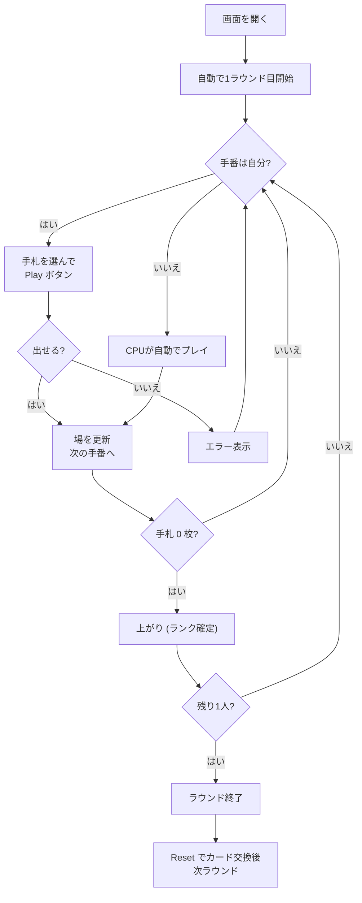

# President / プレジデント（Web版）遊び方

## ゲーム概要

プレジデント（別名: スカム、キャピタリズム）は 4 人対戦のゴーイングアウト系カードゲームです。手札を早く出し切った順に **大統領 → 副大統領 → 副スカム → スカム** の肩書きが付きます。大富豪の欧米版に相当しますが、ジョーカー不使用でスート縛りがなく、カード交換ルールが簡略化されています。

## 起動方法

```sh
go run ./cmd/trumpcards web    # CLI経由でWebサーバーを起動
go run ./cmd/server            # 直接Webサーバーを起動
```

ブラウザで `http://localhost:8080` にアクセスし、ナビゲーションバーから「プレジデント」を選択します。
ナビバーのJA/ENボタンで日本語・英語を切り替えられます。

## ルール

### 基本ルール

- デッキは **ジョーカー抜き 52 枚**、4 人で **13 枚ずつ** 配る
- カード強さ: `3 < 4 < 5 < ... < J < Q < K < A < 2`（**2 が最強**）
- 初回ラウンドは **♣3 保持者** から開始。2 回目以降は前ラウンドのスカムから開始
- プレイ単位は **シングル／ペア／スリーカード／フォーカード** の同値グループのみ（階段やスート縛りなし）
- 場のカードと**同じ枚数**で**より強い**カードを出す
- 出せない（出したくない）ときは **パス**

### 革命（Revolution）

- 4 枚出し（フォーカード）で **革命発動** → 強さ順が逆転（2 が最弱、3 が最強）
- もう一度フォーカードが出ると革命は解除

### カード交換

- ラウンド開始時、前回の順位に応じてカードを交換する：
  - **Scum → President**: 最強カード 2 枚
  - **President → Scum**: 最弱カード 2 枚
  - **Vice Scum → Vice President**: 最強カード 1 枚
  - **Vice President → Vice Scum**: 最弱カード 1 枚

### パス即場流れ（デフォルト有効）

- プレイヤーがパスすると **即座に場がクリア** されます。オフにすると「全員パスで場流れ」の大富豪スタイルになります。

### CPU 難易度

- **Easy**: 常に最弱の合法手を出す
- **Normal**: 場がクリアなら最大グループを選び、場があれば最弱合法手（デフォルト）
- **Hard**: 残り手札が少なくなると強いカードを優先的に使う

## ゲームの流れ



## 画面の操作方法

### プレイフェーズ

1. 手札のカードをクリックして選択（複数選択可）
2. **Play** ボタンで場に出す
3. 出せない／出したくないときは **Pass** ボタン
4. 場のカードを観察してタイミングを計る（革命時は色が変わる）

### 設定パネル

- **CPU難易度**: Easy / Normal / Hard
- **革命**: 4 枚出しで強さ逆転を有効化
- **カード交換**: ラウンド開始時の交換を有効化
- **パス即場流れ**: パスで即座に場をクリア（オフで大富豪式）

### キーボードショートカット

| キー | アクション | 有効条件 |
|------|-----------|---------|
| クリック | カード選択 / 解除 | 自分の手番中 |

## 画面構成

```
┌────────────────────────────────────────────┐
│  NavBar (President / JA|EN / Tutorial)    │
├────────────────────────────────────────────┤
│  [CPU 1]  [CPU 2]  [CPU 3]                 │
│                                            │
│  ┌──────────────────────────────┐          │
│  │        場の カード            │          │
│  └──────────────────────────────┘          │
│                                            │
│  [ メッセージ / 革命バナー ]                │
│                                            │
│  手札: [♠3][♥5][♦5][...]                  │
├────────────────────────────────────────────┤
│  設定: CPU難易度 / 革命 / 交換 / 即場流れ   │
├────────────────────────────────────────────┤
│  [ Play ] [ Pass ] [ Reset ] [ ActionLog ] │
└────────────────────────────────────────────┘
```

## 遊び方のコツ

- **2 を温存する**: 2 は最強。終盤の大逆転に取っておく
- **革命を狙う**: 弱いカード（3, 4）が多いときはフォーカードで革命を起こすと一気に有利に
- **カード交換で序盤決まる**: スカムからは強いカードが流れてくるので積極的にフォーカードを作る
- **パス即場流れ**モードでは、早くパスしてターンを引き戻す戦略も有効
