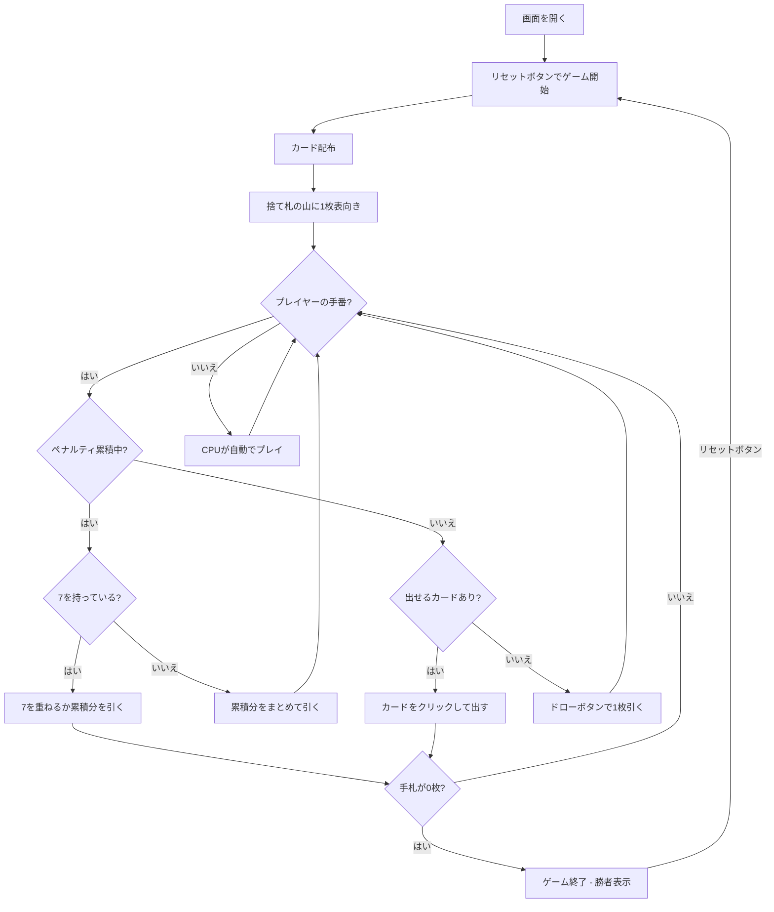

# プルシー（Web版）遊び方

## ゲーム概要

4人（プレイヤー1人 + CPU 3人）で遊ぶチェコ発祥のクレイジーエイト系カードゲームです。32枚のデッキを使い、捨て札のトップカードとスートまたはランクが一致するカードを出していきます。先に手札を全て出し切ったプレイヤーが即座に勝者となります（得点・ラウンドはありません）。

## 起動方法

```sh
go run ./cmd/trumpcards web  # CLI経由でWebサーバーを起動
go run ./cmd/server          # 直接Webサーバーを起動
```

ブラウザで `http://localhost:8080` にアクセスし、ナビゲーションバーから「プルシー」を選択します。
ナビバーのJA/ENボタンで日本語・英語を切り替えられます。

## ルール

### 基本ルール

- 32枚のデッキを使用（各スートの A・7・8・9・10・J・Q・K）、4人プレイ
- 各プレイヤーに数枚ずつ配り、1枚を表向きにして捨て札の山を開始、残りは山札
- 捨て札の山のトップカードと **スートまたはランク** が一致するカードを出す（ワイルドカードは無し）
- 出せるカードがなければ山札から1枚ドロー
- 山札が空になったら捨て札（トップを除く）をリサイクルして山札にする

### 特殊カード

- **7**: 次のプレイヤーは2枚引く。7を重ねて出すとペナルティが累積する（重ね掛け）。ペナルティが累積している間は、7を出すか、累積分をまとめて引くかのどちらかのみ可能
- **A（エース）**: 次のプレイヤーをスキップ
- **Under（ジャック / 11）**: 次のプレイヤーをスキップ

### ゲーム終了

- 先に手札を全て出し切ったプレイヤーが勝者（得点計算は無し）

### CPU難易度

- **Easy**: ランダムにカードを出す
- **Normal**: 基本的な戦略（デフォルト）
- **Hard**: 戦略的なプレイ

## ゲームの流れ



## 画面の操作方法

### カードのプレイ（プレイフェーズ）

1. 手札のカードをクリックして選択します（出せるカードのみ緑枠でハイライト）。**スクリーンリーダーでは各カードの読み上げに「出せます／出せません」が付きます**（7ペナルティ中は「7しか出せません」と理由も読み上げられます）
2. **「出す」** ボタンをクリックしてカードを場に出します
3. 出せるカードがなければ **「引く」** ボタンで山札から1枚引きます

### ペナルティ表示

- 7のペナルティが累積している間は、捨て札の下に「ペナルティ: N枚 — 7を重ねるか引く」が表示されます

## 画面構成

```
┌────────────────────────────────────────────┐
│  ▶ 設定 (クリックで展開)                   │
│    CPU難易度:  [Normal▼]                   │
├────────────────────────────────────────────┤
│           CPU プレイヤーエリア              │
│ ┌──────────┐ ┌──────────┐ ┌──────────┐    │
│ │ CPU 1    │ │ CPU 2    │ │ CPU 3    │    │
│ │ 5枚      │ │ 4枚      │ │ 6枚      │    │
│ └──────────┘ └──────────┘ └──────────┘    │
├────────────────────────────────────────────┤
│              ゲーム情報                     │
│  山札: 18枚                                 │
│  捨て札: ♥9                                 │
│  ペナルティ: 2枚 — 7を重ねるか引く          │
├────────────────────────────────────────────┤
│         フッター: あなたの手札              │
│  [♠A][♣8][♥Q][♦10][♠7]                  │
│  [出す] [引く] [リセット]                   │
└────────────────────────────────────────────┘
```

- **設定パネル（▶ 設定）**: 「CPU難易度」セレクト（Easy / Normal / Hard）。次のリセット時に適用
- **CPU プレイヤーエリア**: 各 CPU の手札枚数。手番の CPU は金色枠
- **ゲーム情報**: 山札残り枚数、捨て札トップ、ペナルティ累積（あれば）
- **フッター（あなたの手札）**: クリックで選択（緑枠 + 上に浮き上がる）。出せるカードのみハイライト

## 遊び方のコツ

- 7はペナルティの重ね掛けで相手に負担を押し付ける強力なカード。タイミングを見極めましょう
- A と Under（J）で相手の手番を飛ばし、テンポを握りましょう
- 出しにくいスートに切り替えると、相手をドローに追い込めます
