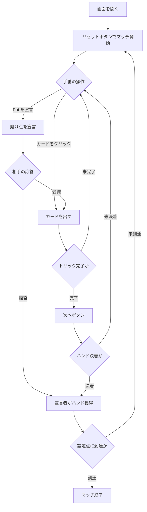

# プット（Web版）遊び方

## ゲーム概要

Put（プット）はイングランドの古い 2 人対戦（あなた vs CPU）ギャンブル系トリックテイキングです。南米のトゥルコ（Truco）はこのゲームの子孫にあたります。52 枚の標準デッキで 3 枚配り、3 トリックの 2 トリック先取でそのハンドに勝利します。プレイ中いつでも「Put」を宣言して賭け点を倍にできる度胸試しが魅力で、設定点（既定 15 点）に先に到達したプレイヤーがマッチに勝利します。

## 起動方法

```sh
go run ./cmd/trumpcards web  # CLI経由でWebサーバーを起動
go run ./cmd/server          # 直接Webサーバーを起動
```

ブラウザで `http://localhost:8080` にアクセスし、ナビゲーションバーから「プット」を選択します。
ナビバーのJA/ENボタンで日本語・英語を切り替えられます。

## ルール

### カードの強さ

**3 が最強で 4 が最弱**、スートは一切関係しません。

```
3 > 2 > A > K > Q > J > 10 > 9 > 8 > 7 > 6 > 5 > 4
```

普段のトランプと違い、**3 と 2 がエースより強い**のがこのゲームの癖です。同じ額面のカード同士は引き分けのトリックになります。

### ハンドの勝敗

2 トリック先取でハンドに勝利（マストフォローなし）。引き分けが絡む場合は、1 トリック目引き分けなら 2 トリック目の勝者、1 トリック目勝利＋2 トリック目引き分けなら 1 トリック目の勝者、全引き分けなら親（非ディーラー）が勝ちます。

### Put（賭け点の釣り上げ）

「Put を宣言」ボタンで賭け点が倍（1点 → 2点）になります。相手は**受諾か降参かの二択**で、**引き上げ返す手はありません**（トゥルコは Retruco → Vale Cuatro と 3 段に伸ばせますが、プットは 1 段だけです）。降参されると宣言者が直前の確定点でハンドを獲得します。

### ゲーム終了

ハンドの勝者に賭け点が加算され、設定点（既定 15 点）に先に到達したプレイヤーがマッチに勝利します。

## ゲームの流れ



## 画面の操作方法

### プレイフェーズ

- 手番が回ってきたら、手札のカードをクリックして出します。
- 「Put を宣言」ボタンで賭け点が倍（1点 → 2点）になります。

### 応答フェーズ

- 相手が Put を宣言すると「受諾」「拒否」のボタンが表示されます。**引き上げ返すボタンはありません** —— プットの宣言は 1 段だけです。

### トリック / ハンド終了

- 「次へ」ボタンで次のトリック、または次のハンドへ進みます。

### キーボードショートカット

| キー | アクション | 有効条件 |
|------|-----------|---------|
| （なし） | マウス操作のみ | - |

## 画面構成

```
┌────────────────────────────────────────────┐
│  マッチ得点 — あなた: 0 / CPU: 0 (目標: 15)  │
│  ハンド: 1   トリック: 1   賭け点: 1 (通常)        │
├────────────────────────────────────────────┤
│  現在のトリック（場のカード）                    │
├────────────────────────────────────────────┤
│  あなたの手札（クリックで出す）              │
│  [Put を宣言] [次へ] [リセット]            │
└────────────────────────────────────────────┘
```

## 遊び方のコツ

- 強い手のときは Put を宣言して点を釣り上げ、勝てるハンドで多く得点しましょう。
- 弱い手で宣言されたら、拒否して被害を最小限（1点）に抑える判断も大切です。
- ブラフで強気に宣言し、相手を降ろすのも有効な戦術です。
- マッチは 15 点先取。1 ハンドの賭け点が勝敗を大きく左右します。
