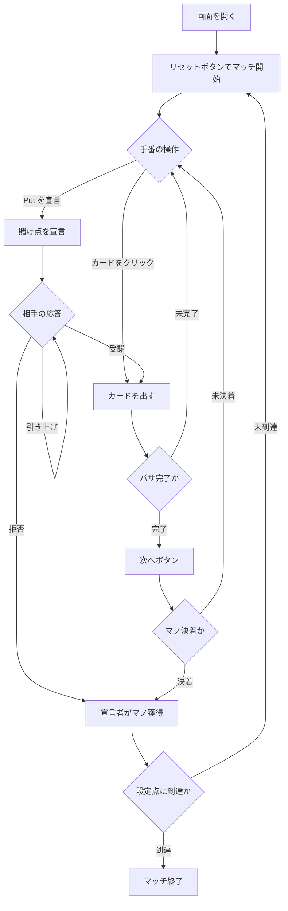

# プット（Web版）遊び方

## ゲーム概要

Put（プット）は南米・スペインで人気の 2 人対戦（あなた vs CPU）トリックテイキング＋ブラフゲームです。40 枚デッキ（8・9・10 を除く）で 3 枚配り、3 バサ（トリック）の 2 バサ先取でそのマノに勝利します。プレイ中に「Put」を宣言して賭け点を釣り上げる心理戦が魅力で、設定点（既定 15 点）に先に到達したプレイヤーがマッチに勝利します。

## 起動方法

```sh
go run ./cmd/trumpcards web  # CLI経由でWebサーバーを起動
go run ./cmd/server          # 直接Webサーバーを起動
```

ブラウザで `http://localhost:8080` にアクセスし、ナビゲーションバーから「プット」を選択します。
ナビバーのJA/ENボタンで日本語・英語を切り替えられます。

## ルール

### カードの強さ（matadores）

強い順に ♠1 > ♣1 > ♠7 > ♦7 > 全ての 3 > 2 > 1（偽エース） > K > Q > J > 7（偽の 7） > 6 > 5 > 4。同じ強さ同士は「パルダ（引き分け）」です。

### マノの勝敗

2 バサ先取でマノに勝利（マストフォローなし）。パルダが絡む場合は、1 バサ目パルダなら 2 バサ目の勝者、1 バサ目勝利＋2 バサ目パルダなら 1 バサ目の勝者、全パルダなら親（非ディーラー）が勝ちます。

### Put（賭け点の釣り上げ）

「Put を宣言」ボタンで賭け点を引き上げます。相手は受諾（Quiero, 2点）・拒否（No Quiero）・さらに引き上げ（Reput 3点 → Vale Cuatro 4点）を選択します。拒否されると宣言者が直前の確定点でマノを獲得します。

### ゲーム終了

マノの勝者に賭け点が加算され、設定点（既定 15 点）に先に到達したプレイヤーがマッチに勝利します。

## ゲームの流れ



## 画面の操作方法

### プレイフェーズ

- 手番が回ってきたら、手札のカードをクリックして出します。
- 「Put を宣言」ボタンで賭け点を引き上げられます。

### 応答フェーズ

- 相手が Put を宣言すると「受諾」「拒否」「引き上げ」のボタンが表示されます。

### バサ / マノ終了

- 「次へ」ボタンで次のバサ、または次のマノへ進みます。

### キーボードショートカット

| キー | アクション | 有効条件 |
|------|-----------|---------|
| （なし） | マウス操作のみ | - |

## 画面構成

```
┌────────────────────────────────────────────┐
│  マッチ得点 — あなた: 0 / CPU: 0 (目標: 15)  │
│  マノ: 1   バサ: 1   賭け点: 1 (通常)        │
├────────────────────────────────────────────┤
│  現在のバサ（場のカード）                    │
├────────────────────────────────────────────┤
│  あなたの手札（クリックで出す）              │
│  [Put を宣言] [次へ] [リセット]            │
└────────────────────────────────────────────┘
```

## 遊び方のコツ

- 強い手のときは Put を宣言して点を釣り上げ、勝てるマノで多く得点しましょう。
- 弱い手で宣言されたら、拒否して被害を最小限（1点）に抑える判断も大切です。
- ブラフで強気に宣言し、相手を降ろすのも有効な戦術です。
- マッチは 15 点先取。1 マノの賭け点が勝敗を大きく左右します。
