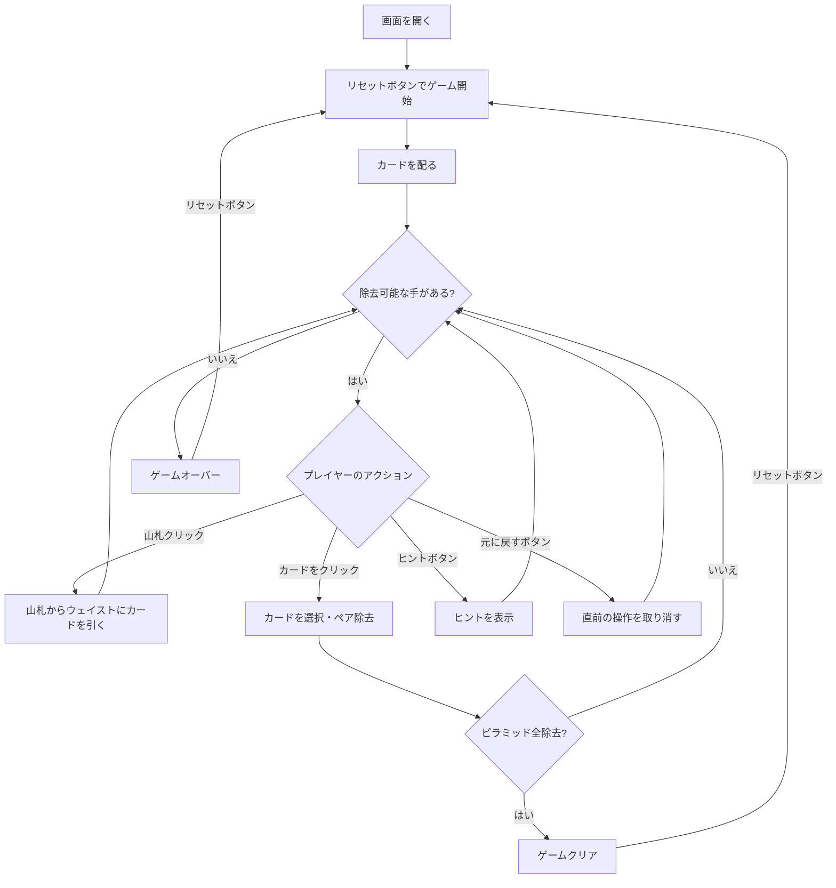

# ピラミッド（Web版）遊び方

## ゲーム概要

1人用のソリティアカードゲームです。52枚のカードを使い、7段のピラミッド型に並べたカードから、合計13になるペアを見つけて除去していきます。ピラミッドのカードをすべて除去すればクリアです。

## 起動方法

```sh
go run ./cmd/trumpcards web     # CLI経由でWebサーバーを起動
go run ./cmd/server              # 直接Webサーバーを起動
```

ブラウザで `http://localhost:8080` にアクセスし、ナビゲーションバーから「ピラミッド」を選択します。
ナビバーのJA/ENボタンで日本語・英語を切り替えられます。

## ルール

### 基本ルール

- 52枚のトランプ（ジョーカーなし）を使用
- 7段のピラミッドに28枚を表向きで配る（段iにはi+1枚）
- 残りの24枚は山札（ストック）に裏向きで置く
- 「露出カード」（下の段の左右両方のカードが除去済み）のみ選択可能
- 最下段（7段目）のカードは常に露出状態

### カードの値

| カード | 値 |
|--------|-----|
| A | 1 |
| 2〜10 | 数字通り |
| J | 11 |
| Q | 12 |
| K | 13 |

### 除去ルール

- 露出カード2枚の合計が13になるペアを除去できる
- K（値13）は単独で除去できる
- 山札からウェイストに引いたカードとピラミッドの露出カードでペアを作れる
- ウェイストのトップがKの場合、単独で除去できる

### ゲームクリア

- ピラミッドの28枚すべてを除去するとゲームクリア

### ゲームオーバー

- これ以上除去可能な手がない場合はゲームオーバー

### 手詰まり検出

- ヒントが存在せず、かつ山札が空の場合に「手詰まりです」とメッセージが表示されます
- 手詰まり状態では「元に戻す」またはギブアップを選択できます

## ゲームの流れ



## 画面の操作方法

### カードを除去する

1. 露出カードをクリックして選択します（ハイライト表示）
2. もう1枚の露出カードをクリックしてペア除去します（合計13になる必要あり）
3. Kをクリックすると単独で除去されます
4. ウェイストのトップカードもクリックで選択でき、ピラミッドのカードとペアにできます

### 山札を引く

1. 山札エリアをクリックしてカードをウェイストに引きます
2. 山札が空になると引けなくなります

### アンドゥ（元に戻す）

**「元に戻す」** ボタンまたは `z` キーで直前の操作を取り消せます。何度でも元に戻せます。

### ヒント

**「ヒント」** ボタンをクリックすると、次に可能な手を提案します。

### キーボードショートカット

ゲーム中、以下のキーボードショートカットが使用できます。

| キー | アクション | 有効条件 |
|------|-----------|---------|
| `d` | カードを引く（ドロー） | プレイ中 |
| `z` | 元に戻す（アンドゥ） | プレイ中 |
| `h` | ヒント | プレイ中 |
| `g` | ギブアップ | プレイ中 |

※ テキスト入力欄にフォーカスがある場合、ショートカットは無効になります。

## 画面構成

```
┌────────────────────────────────────────────┐
│              ゲーム情報                     │
│  手数: 0                                   │
├────────────────────────────────────────────┤
│           ピラミッドエリア                  │
│              [♠A]                          │
│            [♥5] [♦8]                      │
│          [♣3] [♠10] [♥2]                 │
│        [♦7] [♣6] [♠4] [♥9]              │
│      [♦Q] [♣J] [♠2] [♥3] [♦K]           │
│    [♣9] [♠7] [♥6] [♦4] [♣8] [♠5]        │
│  [♥Q] [♦A] [♣10] [♠3] [♥7] [♦6] [♣4]   │
├────────────────────────────────────────────┤
│  山札・ウェイストエリア                    │
│  [山札: 24枚] [ウェイスト: --]            │
├────────────────────────────────────────────┤
│  [引く] [元に戻す] [ヒント]               │
│  [ギブアップ] [リセット]                  │
└────────────────────────────────────────────┘
```

- **ピラミッドエリア**: 7段のピラミッド型にカードを表示
  - 露出カード: クリックで選択可能（明るく表示）
  - 非露出カード: クリック不可（暗く表示）
  - 除去済み: 空白表示
- **山札エリア**: クリックでカードをウェイストに引く（残りカード数表示）
- **ウェイストエリア**: 引いたカードが表示される
- **ボタン**:
  - 「引く」: 山札からカードを引く
  - 「元に戻す」: 直前の操作を取り消す
  - 「ヒント」: 次の一手を提案
  - 「ギブアップ」: 現在のゲームを終了
  - 「リセット」: 新しいゲームを開始

## 遊び方のコツ

- まずピラミッドの下段から除去できるペアを探しましょう
- Kが見えたらすぐにクリックして単独除去しましょう
- 上段のカードを露出させるために、下段のカードを優先的に除去します
- 山札を引く前に、ピラミッド内で除去できるペアがないか確認しましょう
- ヒントボタンで詰まった時のアドバイスを得られます
- アンドゥを活用して、異なる戦略を試しましょう
