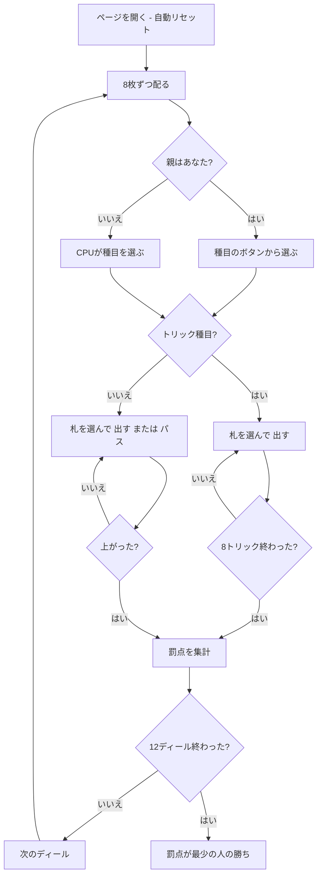

# クオドリベット（Web版）遊び方

## ゲーム概要

クオドリベット（Quodlibet）はオーストリアの学生組合で遊ばれてきた**複合（コンペンディウム）型**のトリックテイキングです。フランスの Barbu、レバノンの Trex と同じ系統で、**性質のまったく違う 12 種目**を順に打ち、通しの成績で勝負します。

**このゲームの点は罰点です。** 12 ディールを終えて**累計が最も少ない人が勝ち**ます。多く取ったほうが勝ちではありません。

32 枚（7・8・9・10・J・Q・K・A）を 4 人に 8 枚ずつ配り、**切り札はありません**。あなたは席 0 で、CPU 3 人と卓を囲みます。

## 起動方法

```sh
go run ./cmd/trumpcards web
# または
go run ./cmd/server
```

ブラウザで `http://localhost:8080` にアクセスし、ナビゲーションバーから「クオドリベット」を選択します。
ナビバーのJA/ENボタンで日本語・英語を切り替えられます。

## ルール

### 12 ディール ＝ 3 つの「輪」× 4 種目

1 ゲームは 12 ディールで、**4 種目ずつの輪が 3 つ**あります。各ディールの親（Bierkönig）は、**その輪でまだ打たれていない種目**から 1 つを選びます。輪をまたいだ選択はできません。親は 1 ディールごとに移ります。

### 第 1 の輪

| 種目 | 罰点 |
|------|------|
| プラス | **取れなかった**トリック 1 つにつき 10 点。1 つも取れなければ 80 ではなく **100 点** |
| マイナス | 取ったトリック 1 つにつき 10 点。8 つ全部なら 80 ではなく **100 点** |
| 悪い隣人 | マイナスと同じ点が、**その人の右隣**に付く |
| アラリック | K♥ で 50 点、Q♦ で 30 点。**同じトリックで両方**取ると 80 ではなく **100 点** |

### 第 2 の輪

| 種目 | 罰点 |
|------|------|
| 1238 | 第 1・2・3 トリックが 10 / 20 / 30 点、最終トリックが 100 点。**間の 4 トリックは無料** |
| 赤なし | ハートを取ると罰点。**低い札のほうが重い** ── 7〜10 が 20 点、J〜A が 10 点。8 枚すべてを同じトリックで取ると **100 点** |
| オーバー／ウンター | Q が 30 点、J が 20 点。**同じトリックで Q と J を両方**取ると **100 点** |
| 賄賂 | トリックを取ると 30 点。そのトリックに**最も弱い札を出した人**にも 20 点。**最も弱い札で取ってしまう**と **100 点** |

### 第 3 の輪

| 種目 | 罰点 |
|------|------|
| 開いたズボン | **自分の手札だけが伏せられます**（他の 3 人のぶんは表で見えます）。トリック 1 つにつき 10 点、全部取ると 100 点 |
| 狩猟 | **全員の手札が表**になります。トリック 1 つにつき 10 点、全部取ると 100 点 |
| 四分 | トリックではありません。**同じスートのちょうど 3 つ上**でしか札を重ねられず、誰も続けられなくなったら重ねを畳んで次の人が好きな札から始めます |
| 小食い | トリックではありません。**J を起点**にした 7 並べです（32 枚デッキは 7 から A なので、起点は 7 ではありません） |

四分と小食いは**早く手札を出し切る**遊びです。最初に上がった人は 0 点、以降は残した手札 1 枚につき 10 点・20 点・30 点と重くなります。出せる札が 1 枚も無いときだけ「パス」ボタンが出ます。

### 札の強さ

A > K > Q > J > 10 > 9 > 8 > 7。切り札は無いので、**台札スートの最強札**を出した人がトリックを取ります。台札スートを持っていれば必ずそれを出します（フォロー義務）。出せる札はフッターでハイライトされます。

### 典拠について

1238 の最終トリックの点は出典で割れます（Wikipedia は「50（または 80）」と自らも揺れており、catsatcards は 100）。この実装は **100** を採っています。どの種目も「破局は 100」で書式が揃っているためです。

## ゲームの流れ



## 画面の操作方法

- **種目を選ぶ**: あなたが親のディールでは、その輪に残っている種目のボタンが並びます。押すとそのディールの種目が決まります。
- **出す**: 手札から札を選び「出す」を押します。**出せる札だけがハイライト**されます。
- **パス**: 四分・小食いで出せる札が 1 枚も無いときだけ出るボタンです。出せる札があるうちは押せません。
- **次のディール**: 罰点が確定したら押して次へ進みます。
- **設定**: CPU難易度、種目の自動選択、ヒントの ON/OFF を切り替えられます。**自動選択**にすると 12 回の種目選択を省けます。

## 画面構成

- **ヘッダー**: ゲーム名・フェーズ表示・**ディール番号と輪**・CLI 切り替え
- **情報サイドバー**: 各席の親バッジ・取ったトリック・**このディールの罰点**と**通算の罰点**、これまでのディール履歴
- **中央**: 現在のトリック（トリック種目）、小食いの場、または四分の重ね
- **フッター**: あなたの手札（出せる札がハイライト）・アクションボタン

## 遊び方のコツ

- **点は少ないほうが良い。** 順位表は昇順です。上に居るほど勝っています。
- **悪い隣人は右隣に流れる。** 自分が取ったトリックの点は右隣が負います。逆に、左隣が取るとあなたが沈みます。
- **赤なしでは低いハートを警戒する。** ♥7 は ♥A の倍の重さです。安く見える札ほど高くつきます。
- **親のときは手札を見て逃げる。** K♥ を抱えているならアラリックを避け、Q や J が多いならオーバー／ウンターを後に回しましょう。
- **四分は 3 つ上しか続かない。** Q・K・A は誰にも重ねられないので、抱えたままだと最後まで残ります。
