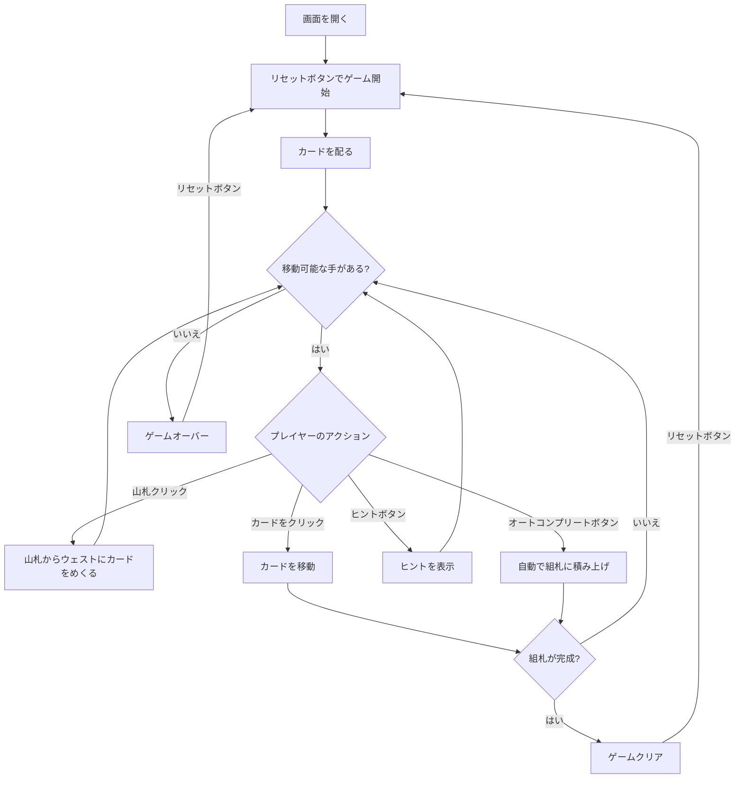

# ランク・アンド・ファイル（Web版）遊び方

## ゲーム概要

1人用のソリティアカードゲームで、**フォーティシーブスの派生**です。2デッキ（104枚）を使い、10列のタブロー、山札、ウェスト、8つの組札で構成されます。組札にA→Kまでスート別に積み上げればクリアです。

フォーティシーブスとの違いは3点。**各列の下3枚は伏せて配る**（本家は40枚すべて表向き）、**タブローは異色降順**（本家は同スート降順）、そして**並びの一部でもまとめて動かせる**（本家は1枚ずつ）。

## 起動方法

```sh
go run ./cmd/trumpcards web  # CLI経由でWebサーバーを起動
go run ./cmd/server          # 直接Webサーバーを起動
```

ブラウザで `http://localhost:8080` にアクセスし、ナビゲーションバーから「ランク・アンド・ファイル」を選択します。
ナビバーのJA/ENボタンで日本語・英語を切り替えられます。

## ルール

### 基本ルール

- 2デッキ（104枚、ジョーカーなし）を使用
- 10列のタブローに各4枚ずつ配る（計40枚）。**下3枚は伏せ、最上段だけ表向き**
- 残りの64枚は山札（ストック）に裏向きで置く
- 8つの組札（ファンデーション）はスート別にA→Kの順に積み上げる
- タブローでは**異色で降順**に重ねる（例: ♠6の上に♥5または♦5。♠5は不可）
- **異色降順に並んでいる部分は、その一部でもまとめて動かせる**（並びが崩れていれば1枚も動かない）
- **空列にはどのカード（または並び）でも置ける**
- 札が動いて伏せ札が最上段になると、**自動的にめくれます**
- 伏せ札は積み先にならず、組札にも送れません

### ゲームクリア

- 8つの組札すべてにA→Kまで13枚ずつ積み上げるとゲームクリア

### ゲームオーバー

- これ以上移動可能な手がない場合はゲームオーバー

### 山札のルール

- 山札から1枚ずつウェストにめくる
- 山札の再循環はなし — 山札を使い切ったらそれ以上引けない

## ゲームの流れ



## 画面の操作方法

### カードを移動する

1. 移動元のカードをクリックして選択します
2. 移動先のカード（またはエリア）をクリックして移動を確定します
3. **異色降順**の場合のみ移動できます
4. 並びの途中の札を掴めば、そこから上がまとめて動きます（並びが崩れていれば動きません）

### 山札をめくる

1. 山札エリアをクリックしてカードをウェストにめくります（1枚ずつ）
2. 山札が空になった場合、再循環はありません

### アンドゥ（元に戻す）

**「元に戻す」** ボタンまたは `z` キーで直前の操作を取り消せます。何度でも元に戻せます。

### ヒント・オートコンプリート

1. **「ヒント」** ボタンをクリックすると、次に可能な手を提案します
2. **「オートコンプリート」** ボタンをクリックすると、組札に安全に移動できるカードを自動で移動します

### キーボードショートカット

ゲーム中、以下のキーボードショートカットが使用できます。

| キー | アクション | 有効条件 |
|------|-----------|---------|
| `d` | カードをめくる（ドロー） | プレイ中 |
| `z` | 元に戻す（アンドゥ） | プレイ中 |
| `h` | ヒント | プレイ中 |
| `a` | オートコンプリート | プレイ中 |
| `g` | ギブアップ | プレイ中 |

※ テキスト入力欄にフォーカスがある場合、ショートカットは無効になります。

## 画面構成

```
┌────────────────────────────────────────────┐
│              ゲーム情報                     │
│  手数: 15  タイム: 02:15                    │
├────────────────────────────────────────────┤
│  山札・ウェストエリア    組札エリア         │
│  [山札] [♠5]          [♠][♠][♥][♥]       │
│                        [♦][♦][♣][♣]       │
├────────────────────────────────────────────┤
│              タブロー (10列)               │
│ [1]  [2]  [3]  [4]  [5]  [6]  [7]  [8]  [9] [10]│
│  ♠K  ♥Q  ♦A  ♣K  ♠Q  ♥A  ♦K  ♣Q  ♥K  ♠A │
│  ♠10 ♣J  ♣8  ♥10 ♦J  ♠8  ♣10 ♠J  ♦10 ♥J │
│  ♥7  ♠9  ♥4  ♦7  ♣9  ♣4  ♠7  ♥9  ♣7  ♦9 │
│  ♦3  ♦6  ♠2  ♣3  ♥6  ♦2  ♥3  ♣6  ♠3  ♥6 │
├────────────────────────────────────────────┤
│  [引く] [元に戻す] [ヒント] [オートコンプリート]│
│  [ギブアップ] [リセット]                    │
└────────────────────────────────────────────┘
```

- **山札エリア**: クリックでカードをめくる（残りカード数表示）
- **ウェストエリア**: めくられたカードが表示される
- **組札エリア**: 8つのスート別の組札（A→Kの順に積み上げ、2デッキ分）
- **タブロー**: 10列のカード列（**各列の下3枚は伏せ**）
  - 表向きカード: クリックで選択・移動
  - 伏せカード: 上の札が動くと自動的にめくれます
- **ボタン**:
  - 「引く」: 山札からカードをめくる
  - 「元に戻す」: 直前の操作を取り消す
  - 「ヒント」: 次の一手を提案
  - 「オートコンプリート」: 自動で組札へ移動
  - 「ギブアップ」: 現在のゲームを終了
  - 「リセット」: 新しいゲームを開始

## 遊び方のコツ

- **各列3枚が伏せられている**ので、まずは上の札を動かして中身を明かしましょう。何が出るかは分からないぶん、リスクを取る判断が要ります
- Aが出たらすぐに組札へ移動しましょう
- 空いた列を作ることが攻略の鍵です — **どのカードでも置ける枠**なので、深い列を崩す足がかりになります
- **異色降順**でしか重ねられません。同スート降順に見える形（♠6の上の♠5）は置けないので、フォーティシーブスの感覚のまま探すと手を見落とします
- **並びの一部でもまとめて動かせる**ので、上札が行き詰まっていても下から始まる並びが動けることがあります
- 山札は再循環しないため、引くタイミングを見極めましょう
- ヒントボタンで詰まった時のアドバイスを得られます
