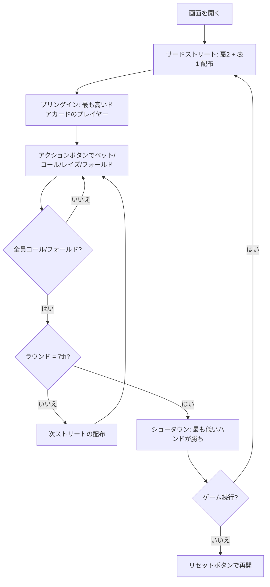

# ラズ（Web版）遊び方

## ゲーム概要

ラズはセブンカード・スタッドのローボール版です。最も低いハンドが勝ちとなります。各プレイヤーに7枚のカードが配られ、最弱の5枚の組み合わせで勝負します。ストレートとフラッシュはカウントされず、エースは常にローとして扱われます。最強のローハンドは A-2-3-4-5（ホイール）です。

## 起動方法

```sh
go run ./cmd/cli web        # CLI経由でWebサーバーを起動
go run ./cmd/server         # 直接Webサーバーを起動
```

ブラウザで `http://localhost:8080` にアクセスし、ナビゲーションバーから「ラズ」を選択します。
ナビバーのJA/ENボタンで日本語・英語を切り替えられます。

## ルール

### 基本ルール

- 52枚のトランプを使用
- コミュニティカードなし — 各プレイヤーに個別にカードが配られる
- 合計7枚（裏向き3枚 + 表向き4枚）から最弱の5枚の組み合わせで勝負
- ストレートとフラッシュはカウントされない
- エースは常にロー（1）として扱われる
- 最強のローハンド: A-2-3-4-5（ホイール）
- ブリングインは最も高いドアカードのプレイヤーが支払う

### ゲームの進行

1. **アンティ**: 全プレイヤーがアンティを支払う
2. **サードストリート**: 裏向き2枚 + 表向き1枚配布。最も高いドアカードのプレイヤーがブリングインを投入
3. **フォースストリート**: 表向き1枚追加。最弱の表向きハンドから開始
4. **フィフスストリート**: 表向き1枚追加。最弱の表向きハンドから開始
5. **シックスストリート**: 表向き1枚追加。最弱の表向きハンドから開始
6. **セブンスストリート**: 裏向き1枚追加。最後のベッティングラウンド
7. **ショーダウン**: 最も低いハンドが勝利

### ベッティングアクション

| アクション | 説明 |
|-----------|------|
| フォールド | 手札を捨ててラウンドから降りる |
| チェック | ベットせずにパスする（未ベット時のみ） |
| コール | 現在のベット額に合わせる |
| ベット | 新たにベットする（未ベット時のみ） |
| レイズ | 現在のベット額を上げる |
| オールイン | 全チップを賭ける |

## ゲームの流れ



## 画面の操作方法

### アクションの実行

自分の手番が来ると、画面下部にアクションボタンが表示されます。

**ベットが出ていない場合:**
- **「ベット」**: ベット額を入力してベットする
- **「チェック」**: パスする

**ベットが出ている場合:**
- **「コール」**: 現在のベット額に合わせる
- **「レイズ」**: ベット額を入力してレイズする

**常に選択可能:**
- **「フォールド」**: 降りる
- **「オールイン」**: 全チップを賭ける

### キーボードショートカット

| キー | アクション | 有効条件 |
|------|-----------|---------|
| `c` | コール | アクションフェーズ（ベットがある場合） |
| `r` | レイズ / ベット | アクションフェーズ |
| `k` | チェック | アクションフェーズ（ベットがない場合） |
| `f` | フォールド | アクションフェーズ |
| `a` | オールイン | アクションフェーズ |

## 画面構成

```
┌──────────────────────────────────────────────┐
│  フェーズ表示 / チュートリアル・マニュアル   │
├──────────────────────────────────────────────┤
│  CPUエリア（表向きドアカード + チップ）      │
│                                              │
│  ポット表示                                   │
│                                              │
│  あなたの手札（裏向き + 表向き）             │
├──────────────────────────────────────────────┤
│  [フォールド][チェック/コール][ベット/レイズ]│
│  [オールイン]          [リセット]            │
└──────────────────────────────────────────────┘
```

- 上部ポット表示で現在のポット額・アンティ・ブリングインを確認できます。
- 自分の裏向きホールカードは自分にのみ見えます。
- CPUのドアカードは全員に公開されます。

## 遊び方のコツ

- サードストリートで3枚ともローカード（8以下）なら積極的に参加しましょう
- 他プレイヤーの表向きカードを観察し、自分が必要なローカードが残っているか確認しましょう
- ペアは手を弱くします。ペアが見えたら注意しましょう
- ホイール（A-2-3-4-5）を狙いつつ、8ロー以下を目指しましょう
- HUD統計を活用して、CPUのプレイスタイルの傾向を把握しましょう
