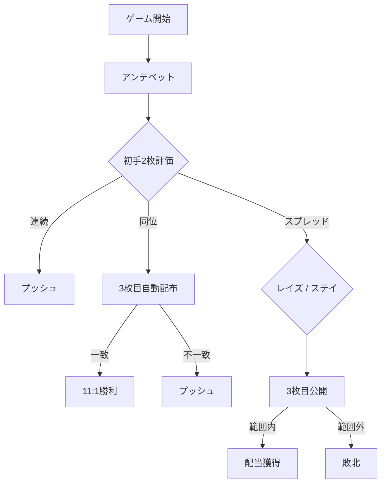

# レッドドッグ（Web版）遊び方

## ゲーム概要

レッドドッグは1人プレイヤー対ディーラーのカジノカードゲームです。最初の2枚のランクの間に3枚目のランクが収まるかどうかを賭けます。

## 起動方法

ナビゲーションメニューから「レッドドッグ」を選択してください。

## ルール

### 基本ルール

1. アンテをベットします。
2. カードを2枚配ります。
3. 結果に応じて以下に分岐します。
   - **連続**: プッシュ。アンテ返却。
   - **同位**: 3枚目を自動的に引き、ランクが一致すれば 11:1、しなければプッシュ。
   - **その他**: スプレッドが表示され、レイズ（最大アンテと同額）またはステイを選択。
4. 3枚目が初手2枚のランクの間に厳密に入れば配当を獲得。

### 配当倍率

| スプレッド | 配当 |
|-----------|------|
| 1 | 5:1 |
| 2 | 4:1 |
| 3 | 2:1 |
| 4 以上 | 1:1 |
| 同位ペア＋3枚目同位 | 11:1 |

## ゲームの流れ

## 画面の操作方法

- **ベット入力**: チップ額を入力して「ベット」ボタンをクリック。
- **レイズ**: スプレッド判断時にレイズ額を入力して「レイズ」をクリック。
- **ステイ**: レイズせずに「ステイ」をクリック。
- **リセット**: 結果フェーズで「リセット」をクリックして新規ゲームへ。

## 画面構成

- **フェーズ表示**: 現在のフェーズとチップ残高
- **初手カード**: 配られた2枚のカード
- **3枚目カード**: 結果フェーズ以降に表示
- **スプレッド表示**: 判断フェーズ時のスプレッド値
- **配当表**: ベットフェーズで参照可能

## 遊び方のコツ

- スプレッドが7以上の場合のみレイズが期待値プラスです。
- スプレッドが小さい場合はステイが安全です。
- ヒントを有効にすると最適な選択肢が表示されます。
