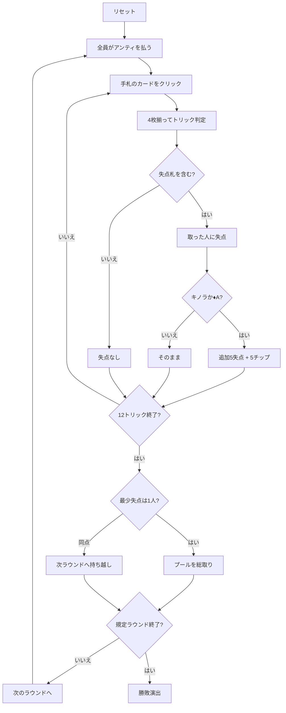

# レヴェルシ（Web版）遊び方

## ゲーム概要

17〜18世紀のフランスで貴族に流行した**回避型**トリックテイキング。4人（あなた＋CPU3人）で、標準52枚から**10を4枚抜いた48枚**を使い、12トリックを戦う。トリックを取ると失点し、**キノラ（♥J）と♦A**は追加の失点に加えて**チップの支払い**まで発生する。毎ラウンド積まれるプールを、**失点の最も少なかった人が総取り**する。

## 起動方法

```sh
go run ./cmd/trumpcards web  # CLI経由でWebサーバーを起動
go run ./cmd/server          # 直接Webサーバーを起動
```

ブラウザで `http://localhost:8080` にアクセスし、ナビゲーションバーから「レヴェルシ」を選択します。
ナビバーのJA/ENボタンで日本語・英語を切り替えられます。

## ルール

- **48枚**（標準52枚から10を4枚抜いたもの）を4人に**12枚ずつ**、12トリック
- **切り札なし。** リードのスートの最強札が取る。フォロー義務あり
- 失点は **A=4 / K=3 / Q=2 / J=1**、その他0。1ラウンド40点
- **キノラ（♥J）と♦A** は追加で **5失点＋5チップ**（取った人が払う）
- ラウンド開始時に全員が**5チップ**をプールへ
- ラウンド終了時、**失点が最も少ない人がプールを総取り**。**同点なら次ラウンドへ持ち越し**
- 規定ラウンド終了時、**チップが最も多い**プレイヤーの勝ち

## ゲームの流れ



## 画面の操作方法

| 操作 | 説明 |
|------|------|
| 手札のカードをクリック | そのカードを出す（出せる札だけ押せます） |
| 次のラウンドへボタン | ラウンド終了後、次のラウンドを配る |
| ヒントボタン | 打つべき札と、その狙いを提示する |
| ギブアップボタン | 投了する |
| リセットボタン | 確認ダイアログのうえで最初からやり直す |
| CLI トグル | 同じゲームをコマンド入力で操作するモードに切り替える |

## 画面構成

- **上部**: ラウンド数、トリック数、フェーズ表示
- **プール表示**: 場に積まれたチップ。印付きの札が取られるたびに増えます
- **失点ルール帯**: A=4 K=3 Q=2 J=1 と、キノラ・♦A の追加分。盤面からは読み取れない情報です
- **中央上**: 各プレイヤーの持ちチップ、このラウンドの失点、取ってしまった印付きの札
- **中央**: 現在のトリック
- **下部**: 自分の手札。**フォロー義務を満たす札だけ**に印が付きます。各カードの右上に**その札を取ったときの失点（0〜4）**が出ます（0 点の札も表示されます）

## 遊び方のコツ

- **キノラ（♥J）と♦Aが二重の地雷。** 失点5に加えてチップまで減ります
- **ハートを迂闊にリードしない。** キノラを自分が取らされます
- **Aを持っているスートは危険。** リードされるとフォロー義務でAを出し、しかも取ってしまいます
- **絵札の無いトリックが処分どき。** 安全なうちにA・K・Qを捨てる
- **狙うのは「最少失点」であって0点ではない。** 40点は必ず誰かが取ります
- **持ち越しラウンドは荒れる。** プールが倍近くになるので、取りにいく価値が出ます
