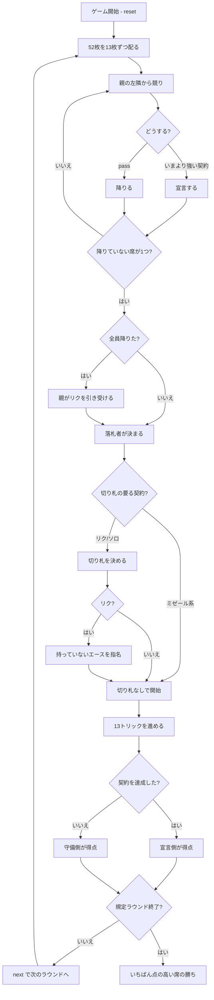

# リッケン（Web版）遊び方

## ゲーム概要

オランダで遊ばれる**競り + 契約トリックテイキング**。標準52枚を4人に13枚ずつ配ります。**種類の違う契約がひとつの梯子に並ぶ**のがこのゲームの形で、「8トリック取る」契約と「1トリックも取らない」契約が同じ競りで competing します。あなたは席0です。

## 起動方法

```sh
go run ./cmd/trumpcards web  # CLI経由でWebサーバーを起動
go run ./cmd/server          # 直接Webサーバーを起動
```

ブラウザで `http://localhost:8080` にアクセスし、ナビゲーションバーから「リッケン」を選択します。
ナビバーのJA/ENボタンで日本語・英語を切り替えられます。

## ルール

### 契約の梯子

親の左隣から順に、**いまより強い契約を宣言するか、降りる（pass）**かを選びます。上へしか積めません。

| 強さ | 契約 | 目標 | 組 |
|------|------|------|----|
| 1 | **リク（Rik）** | 相方と合わせて8トリック | 2対2 |
| 2 | **ミゼール（Misere）** | **1トリックも取らない** | 単独対3人 |
| 3 | **ソロ（Solo）** | 単独で6トリック | 単独対3人 |
| 4 | **オープンミゼール** | 手札を公開して0トリック | 単独対3人 |

**全員が降りたら親がリクを引き受けます。** 流局にすると終わらないためです。

### リクだけが2対2

リクを落とした人は**切り札を決め、自分が持っていないエースを1枚指名**します。その札を持っている人が相方です。**相方は指名された札が場に出るまで伏せられます**——それまで誰と組んでいるか分かりません。

ほかの3つの契約は単独で、残り3人が守ります。**組は席では決まりません。**

### 札の強さとフォロー

エースが最強（A > K > Q > J > 10 > … > 2）。リードのスートを持っていればフォローします。切り札のある契約（リク・ソロ）では、切り札が他のスートに勝ちます。

### 得点はゼロサム

**卓の得点の合計は常に 0** です。誰かが得た点は必ず誰かが失っています。

| 契約 | 守備側1人あたり |
|------|----------------|
| リク | 1 + 目標との差 |
| ソロ | 2 |
| ミゼール | 3 |
| オープンミゼール | 5 |

宣言側は守備側が失った合計を人数比で受け取ります。宣言側は1人か2人、守備側は3人か2人なので、**どちらの組み合わせでも割り切れて端数が出ません**。

規定ラウンド（既定8）を終えた時点で、いちばん点の高い席の勝ちです。

## ゲームの流れ



## 画面の操作方法

| 操作 | 説明 |
|------|------|
| 契約ボタン | リク / ミゼール / ソロ / オープンミゼール を宣言する |
| パス | 競りを降りる |
| 切り札を選ぶ | スペード / クラブ / ハート / ダイヤ から選ぶ（リク・ソロのみ） |
| 手札のカード | 出せる札（強調表示）をクリックして出す |
| 次のラウンド | ラウンド終了後に次を配る |
| ヒント | 宣言すべき契約、または出すべき札を表示する |
| 投了 | ゲームを終了する |
| 棋譜 | このラウンドの経過を表示する |

**いまより弱い契約のボタンは押せません。** 競りは上へしか積めないためです。

## 画面構成

- **契約と切り札**: 落札された契約と切り札。ミゼール系では「なし」になります
- **落札者と獲得トリック**: 目標に届いているかがここで分かります
- **席の並び**: あなたは席0。**宣言側かどうか**が席ごとに表示されます（組は席では決まりません）
- **相方**: リクでは、指名されたエースが場に出るまで伏せられます
- **得点**: 各席の通算。**負にもなります**——合計は必ず 0 です
- **手札**: 出せる札だけが強調されます
- **ラウンド**: いま何ラウンド目か / 規定ラウンド数

## 遊び方のコツ

- **エースが3枚以上、長いスートがあるならソロを狙えます。** 単独6トリックは見た目より重い目標です
- **ミゼールは「弱い手札」で狙う契約。** 低い札ばかりなら、1トリックも取らないほうが簡単です
- **リクの相方は最初は分かりません。** 指名されたエースが出るまで、誰が味方か読み合いになります
- **降りるのも立派な判断。** 契約は達成できないと失点します
- **ゼロサムなので、守備側で勝つのも得点になります。** 常に競り落とす必要はありません
