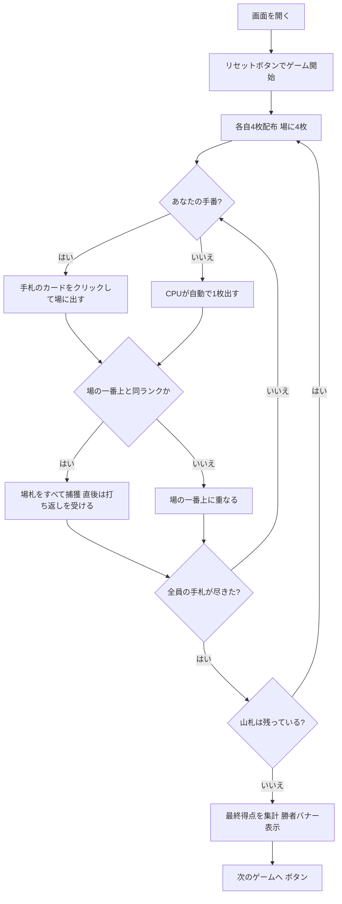

# リスティコントラ（Web版）遊び方

## ゲーム概要

リスティコントラ（Ristikontra）はフィンランドの**捕獲（フィッシング）系カードゲーム**で、**常に2対2の固定チーム戦**です（席0・2 対 席1・3。あなたは席0）。52枚デッキを使い、各自4枚ずつ配って中央の場に1枚ずつカードを出していきます。**切り札はありません。** 場の一番上のカードと**同じランク**を出すと場札をすべて捕獲できます。名前の由来である**打ち返し**（risti-kontra）は、捕獲された直後にその捕獲を成立させたランクを被せると束ごと奪い返せる仕組みで、別のランクが出るまで連鎖します。**チームごとに獲得枚数を合計し、多いチームの勝利**です。

## 起動方法

```sh
go run ./cmd/trumpcards web  # CLI経由でWebサーバーを起動
go run ./cmd/server          # 直接Webサーバーを起動
```

ブラウザで `http://localhost:8080` にアクセスし、ナビゲーションバーから「リスティコントラ」を選択します。
ナビバーのJA/ENボタンで日本語・英語を切り替えられます。

## ルール

### デッキと配布

- **デッキ**: 52枚（標準デッキ）
- **プレイヤー**: **4人固定**（あなた + CPU3人）。席0・2 対 席1・3の2対2で、人数は変更できません
- **配布**: 各プレイヤーに4枚ずつ。さらに場の中央に4枚を置きます。
- 手札が全員尽きたら、山札から4枚ずつ配り直します。

### カードを出す・捕獲する

- 自分の番になると、フッターの手札からカードをクリックして場に出します。
- 出したカードが**場の一番上のカードと同じランク**なら、場札をすべて捕獲します。
- **ジャックはワイルドではありません。** ただの札です。
- 捕獲できなかった場合、出したカードは場の一番上に重なります。

### 打ち返し（リスティコントラ）

- 誰かが捕獲した**直後**に、**その捕獲を成立させたランク**と同じ札を出すと、捕獲した束をそっくり奪えます。
- 奪い返しは連鎖し、同じランクが続く限り束は席から席へ移り続けます。
- **別のランクが出た時点で打ち返しの機会は閉じます。**

### 最終得点

- ゲーム終了時、場に残った札は**最後に捕獲した人のチーム**が獲得します。
- **チームごとに獲得枚数を合計**します（席0＋席2 と 席1＋席3）。
- 枚数の多いチームの勝利です。札ごとの点数はありません。同数なら引き分けです。


- 総得点が最も高いプレイヤーの勝利です。

### CPU難易度

- **Easy（0）**: ランダムな合法手を選びます。
- **Normal（1）**: 捕獲できる手を優先します。
- **Hard（2）**: 捕獲と打ち返しを狙い、価値の低い札から捨てます。

## ゲームの流れ



## 画面の操作方法

### プレイフェーズ

- あなたの番になると、フッターの手札カードがクリックできるようになります。
- カードをクリックすると、そのカードを場に出します。条件を満たせば場札を捕獲します。

### ゲーム終了・結果

- 山札がなくなり全員の手札が尽きると、最終得点が集計され、勝者バナーが表示されます。
- 「**次のゲームへ**」ボタンで新しいゲームを始められます。

### キーボードショートカット

| キー | アクション | 有効条件 |
|------|-----------|---------|
| （なし） | マウス／タップ操作のみ | — |

## 画面構成

```
┌────────────────────────────────────────────┐
│  リスティコントラ        [フェーズ] [CLI切替]     │
├────────────────────────────────────────────┤
│  山札: 36枚                                 │
│                                            │
│  プレイヤー                                 │
│   あなた  捕獲0枚                           │
│   CPU 1  捕獲0枚                            │
│   CPU 2  捕獲0枚                            │
│   CPU 3  捕獲0枚                            │
│                                            │
│  場 — 1枚                                   │
│   [♣7]                                     │
├────────────────────────────────────────────┤
│  あなたの手札                               │
│   [♠5] [♥J] [♦A] [♣9]                      │
│  あなたの番です — 手札を1枚選んで出してください│
│  [リセット]                                 │
└────────────────────────────────────────────┘
```

- **上部バー**: ゲーム名・現在のフェーズ・CLIモード切替。
- **情報行**: 山札の残り枚数。
- **プレイヤー一覧**: 各プレイヤーの捕獲枚数・リスティコントラ ボーナス・手番の状態。
- **場**: 中央の場の一番上のカードと場札の枚数。
- **フッター**: あなたの手札（クリックで出す）・次のゲームへ／リセットの各ボタン。

## 遊び方のコツ

- **打ち返しを読む**: 大きな束を取った直後は、そのランクを持っている相手に奪い返されます。取る価値と奪われる危険を天秤にかけましょう。
- **リスティコントラ を狙う**: 場が1枚のときに同ランクで捕獲すると+10点。積極的に狙いましょう。
- **枚数がすべて**: 札ごとの点数はありません。1枚でも多く取ったチームが勝ちます。
- **難易度で調整**: Hard のCPUは リスティコントラ を狙ってきます。慣れないうちは Easy で練習しましょう。
