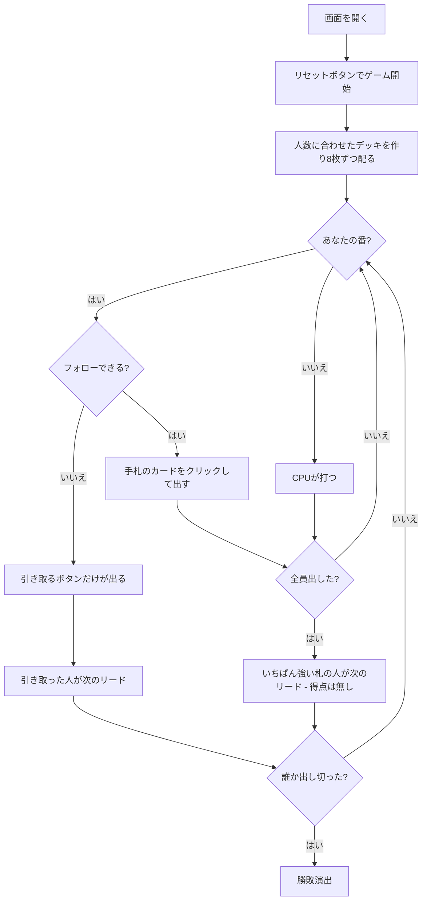

# ローリングストーン（Web版）遊び方

## ゲーム概要

ドイツ・フランス圏の**逆転型トリックゲーム**（アンフレとも）。**トリックを取っても得点にはなりません。** 勝つのは**先に手札を出し切った人**です。フォローできないと、その場のトリックを**全部自分の手札に加えられます**——取るのではなく、増やされるのが罰。4〜6人で遊べます。

## 起動方法

```sh
go run ./cmd/trumpcards web  # CLI経由でWebサーバーを起動
go run ./cmd/server          # 直接Webサーバーを起動
```

ブラウザで `http://localhost:8080` にアクセスし、ナビゲーションバーから「ローリングストーン」を選択します。
ナビバーのJA/ENボタンで日本語・英語を切り替えられます。

## ルール

- **1人8枚固定**で、**デッキのほうを人数に合わせます**: 4人32枚 / 5人40枚 / 6人48枚
- 低いランクを抜いて作るので、**各スートの枚数は必ず同じ**（8 / 10 / 12 ランク）。A は最強として常に残ります
- リードの人が1枚出し、以降は**フォロースート**。切り札はありません
- 全員が出したら、リードのスートでいちばん強い札の人が**次のリード権**を得ます——**得点は入りません**
- **フォローできないと、その場のトリックを全部手札に加えます。** その人が次のリードです
- **先に手札を出し切った人の勝ち**
- 決着しないことがあるので、**500トリック**で打ち切り、**手札のいちばん少ない人**の勝ちとします

## ゲームの流れ



## 画面の操作方法

| 操作 | 説明 |
|------|------|
| 手札のカードをクリック | そのカードを出す（出せる札には緑の枠が付きます） |
| 引き取るボタン | 場札を全部手札に加える。**フォローできないときだけ表示されます** |
| 人数（設定） | 4〜6人。リセットすると反映され、デッキ枚数も変わります |
| ヒントボタン | 出すべき札、または引き取るしかないことを提示する |
| ギブアップボタン | 投了する |
| リセットボタン | 確認ダイアログのうえで最初からやり直す |
| CLI トグル | 同じゲームをコマンド入力で操作するモードに切り替える |

**出せる札が無いときは手札が押せなくなり、引き取るボタンだけが出ます。** サーバが必ず拒否する操作を出さないためです。

## 画面構成

```
┌────────────────────────────────────────────┐
│ トリック 3      デッキ 32枚（場に残り 24枚）│
├────────────────────────────────────────────┤
│ トリックを取っても得点にならない。          │
│ 先に出し切った人が勝ち                      │
├────────────────────────────────────────────┤
│  あなた: 手札6枚 / 引き取り0回              │
│  CPU1 [直前に引き取り]: 手札11枚 / 引き取り1回│
│  CPU2: 手札7枚 / 引き取り0回                │
│  CPU3: 手札8枚 / 引き取り0回                │
├────────────────────────────────────────────┤
│              現在のトリック                 │
├────────────────────────────────────────────┤
│  あなたの手札（出せる札に緑の枠）           │
└────────────────────────────────────────────┘
```

- **上部**: トリック数と、この卓のデッキ枚数・場に残っている枚数
- **規則帯**: このゲームの勝利条件そのもの。**取っても得点にならない**ことを常に出します
- **席の行**: 手札の枚数と引き取り回数。**枚数がそのまま順位**なので、得点表示はありません
- **`[直前に引き取り]` / `[N位で上がり]`**: どちらも盤面に痕跡が残らないので明示します
- **中央**: 現在のトリック
- **下部**: 自分の手札。**フォロー義務を満たす札だけ**に緑の枠が付きます

## 遊び方のコツ

- **強い札は資産ではなく負債。** 取っても得が無いのに、次のリードを押し付けられます
- **短いスートを先に減らす。** 1枚しかないスートを残すと、そこをリードされたとき詰みます
- **長いスートからリードする。** 自分がフォローできる可能性が高く、相手が詰まりやすい
- **引き取りは倍返し。** 8枚が11枚になると、そこから出し切るのは相当きつくなります
- **相手の引き取り回数を見る。** 多い席はスートが偏っています
