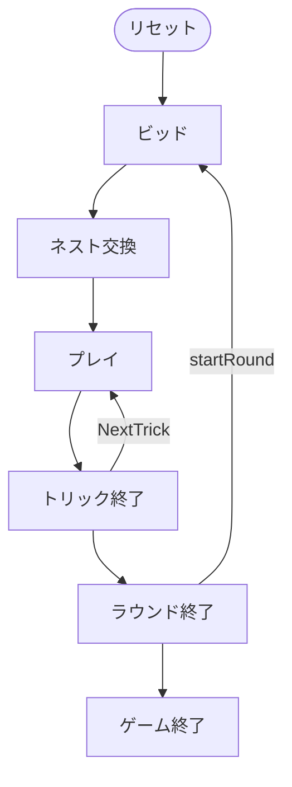

# 四色入札（Web版）遊び方

## ゲーム概要

四色入札はアメリカ生まれの4人チーム制**ポイント・トリックテイキングゲーム**です。標準の52枚トランプではなく、専用の**57枚デッキ**（赤・黄・緑・黒の4色 × 1〜14 と、特別札「ルーク鳥（Rook Bird）」1枚）を使います。あなた（席0）とその対面がチームを組み、2人のCPUチームと対戦します。オークションでノルマ（契約点）を競い、トリックで得点札を奪い合い、先に**500点**へ到達したチームが勝ちます。

> **原作クレジット**: 『Rook（ルーク）』は Parker Brothers が1906年に発売し、現在は Hasbro が発行しているカードゲームです。本実装は非公式・非営利のファン実装であり、権利者とは関係がありません。ルールのみを独自に実装しており、原版のカードデザインやルールブック本文は使用していません。

## 起動方法

```sh
go run ./cmd/trumpcards web         # CLI経由でWebサーバーを起動
go run ./cmd/trumpcards web --open  # サーバー起動 + ブラウザを開く
go run ./cmd/server                 # 直接Webサーバーを起動
```

ブラウザで `http://localhost:8080` にアクセスし、ナビゲーションバーから「四色入札」を選択します。
ナビバーのJA/ENボタンで日本語・英語を切り替えられます。

## ルール

### デッキと配布

- **デッキ**: 57枚。4色（赤・黄・緑・黒）× 1〜14 の56枚 ＋ ルーク鳥1枚。カードは色付きの数字札として描画され、ルーク鳥は 🐦 と "Rook" のラベルで表示されます。
- **プレイヤー**: 4人（あなた = 席0、対面がパートナー。残り2人はCPUの相手チーム）。2チームに分かれます。
- **配布**: 各プレイヤー13枚。残り5枚は**ネスト（Nest／widow）**として場に伏せられます。

### ビッド（オークション）

各プレイヤーは順番に、**70点から120点まで5点刻み**で契約点をビッドするか、パスします。直前の最高ビッドより高い点数でなければビッドできません。最後まで下りなかったプレイヤーが**落札者（デクレアラー）**となります。

Web ではフッターのプルダウンからビッド点を選び、**「ビッド」**ボタンで宣言します。下りるときは**「パス」**ボタンを押します。

### ネスト交換と切り札色の宣言

落札者は5枚のネストを手札に加えて**18枚**になります。ここから不要な**5枚を捨て**（手札から5枚を選択）、**切り札色（赤・黄・緑・黒のいずれか）を宣言**します。Web では手札から5枚を選び、切り札色のボタンを選んでから**「交換」**ボタンで確定します。捨てた5枚の得点は、最終トリックを取ったチームに加算されます。

### プレイとカードの強さ

- **フォロー義務**: リードされた色を持っていれば必ず従います。持っていなければ切り札を含む任意の札を出せます。
- **強さ**: 同色では **1 が最強**、続いて 14 → 13 → … → 2 の順。切り札色はほかのどの色にも勝ちます。**ルーク鳥は最強の切り札**として、常にそのトリックに勝ちます。
- 各トリックで最も強い札を出したプレイヤーがそのトリックと得点札を獲得します。

### 得点札

- **5** = 5点
- **10** と **14** = 各10点
- **1** = 15点
- **ルーク鳥** = 20点

1ラウンドの得点札の合計は **200点**です。

### スコアリング

- 落札チームは、獲得した得点札の合計が契約点**以上**なら、その得点をチームスコアに加算します。届かなければ契約点を**失点**します。
- 相手チームは獲得した得点札の合計をそのまま加算します。
- 先に目標スコア（既定500点）へ到達したチームが勝ちです。

## 設定

- **CPU難易度**: Easy / Normal / Hard
- **目標スコア**: 300 / 500 / 700

## ゲームの流れ

ゲームの進行は `internal/domain/Rook.go` のフェーズ機械そのものです。各ノードは同ファイルの `RookPhase` 定数、矢印ラベルはその遷移を行うメソッド名です。



## 画面の操作方法

| フェーズ | 操作 |
|----------|------|
| ビッド | 点数を選び「ビッド」、または「パス」 |
| ネスト交換 | 手札から5枚選択 → 切り札色を選ぶ → 「交換」 |
| プレイ | 手札から1枚選び「出す」 |
| トリック終了 | 「次のトリック」 |
| ラウンド終了 | 「次のラウンド」 |

## 画面構成

上から順に、ページのコンポーネント構成そのままの並びです。

```
┌──────────────────────────────────────────────────┐
│  ルーク                                          │
│  ラウンド: 1  トリック: 0  最高ビッド: 80        │
│  チーム0: 0点  チーム1: 0点                      │
├──────────────────────────────────────────────────┤
│  場（現在のトリック）                            │
│    CPU1 [赤1]  CPU2 [黄10]  CPU3 [Rook]          │
├──────────────────────────────────────────────────┤
│  ビッド / ネスト交換の操作領域                   │
├──────────────────────────────────────────────────┤
│  メッセージ / ヒント / 設定 / 棋譜               │
├──────────────────────────────────────────────────┤
│  あなたの手札（13枚）                            │
│  [赤2][赤5][赤7][黄5][黄6][緑2][黒4] ...         │
│  [ビッド] [パス] [交換] [カードを出す] [リセット]│
└──────────────────────────────────────────────────┘
```

- **ヘッダー**: ラウンド数・トリック数・現在の最高ビッド・両チームの累積点
- **手札**: 各自 **13枚**（`RookHandSize`）、**4人2チーム**（`RookPlayerCnt` / `RookTeamCnt`）。色は赤・黄・緑・黒の **4色**（`RookColorCnt`）で、各色 1 が最強、以降 14→13→…→2
- **ビッド**: 70〜120 の 5 点刻み。落札者は**ネスト5枚**（`RookNestSize`）を取り込み、5枚捨てて切り札色を宣言します
- **場**: 現在のトリック。Rook Bird は最強の切り札です
- **メッセージ / ヒント**: 直前の操作の結果と、ヒントボタンを押したときの推奨手
- **設定 / 棋譜**: 難易度などの設定と、これまでの手の履歴（折りたたみ式）
- **リセット**: 新しいゲームを開始します
- **CLIモード切替**: 画面右上のトグルで、CUI 版と同じテキスト表示に切り替えられます
