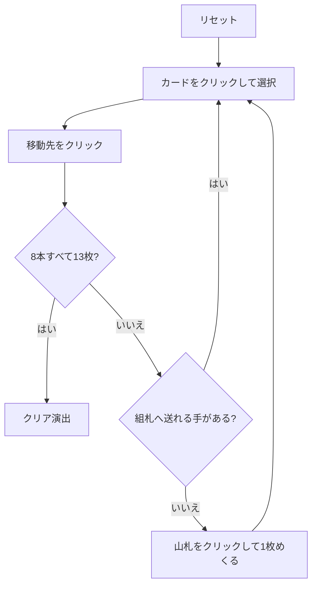

# ロイヤルコティヨン（Web版）遊び方

## ゲーム概要

イギリス発祥の 2 デッキソリティア。52 枚 2 組の 104 枚を、16 枠のタブローと 4 山のリザーブ、そして 8 本の組札で捌く。

核心は**組札が 2 つ飛ばしで積み上がり、しかも折り返す**こと。A 始まりの本は A→3→5→7→9→J→K と来たあと **K の次が 2** になり、2→4→6→8→10→Q と続く。1 本で 13 枚すべての数字を通るので、8 本で 104 枚がちょうど収まる。

## 起動方法

```sh
go run ./cmd/trumpcards web  # CLI経由でWebサーバーを起動
go run ./cmd/server          # 直接Webサーバーを起動
```

ブラウザで `http://localhost:8080` にアクセスし、ナビゲーションバーから「ロイヤルコティヨン」を選択します。
ナビバーのJA/ENボタンで日本語・英語を切り替えられます。

## ルール

- 52 枚 2 組（104 枚）。**16 枠のタブロー**に 1 枚ずつ、**4 山のリザーブ**に 3 枚ずつ配り（計 28 枚）、残り 76 枚が山札
- **組札は 8 本**。前半 4 本は A から、後半 4 本は 2 から始まり、どちらも**同じスートで 2 つ飛ばし**に積む
  - A 始まり: A→3→5→7→9→J→K→**2**→4→6→8→10→Q（13 枚）
  - 2 始まり: 2→4→6→8→10→Q→**A**→3→5→7→9→J→K（13 枚）
- **タブローは 1 枠 1 枚**で、組札へ送ることしかできない
- 空いた枠は**山札か捨て札から補充**できる
- **リザーブは一番上だけ**が使え、**空いた山は二度と埋まらない**
- 山札は 1 枚ずつ捨て札へめくる。**めくり直しは無い（1 巡のみ）**
- 8 本すべてが 13 枚になればクリア

## ゲームの流れ



## 画面の操作方法

| 操作 | 説明 |
|------|------|
| 山札をクリック | 1枚めくって捨て札に置く |
| タブロー枠・リザーブ・捨て札をクリック | 移動元として選択する（もう一度押すと解除） |
| 組札をクリック | 選択中のカードをその組札に置く |
| 空き枠をクリック（選択中に） | 捨て札や山札のカードでその枠を埋める |
| ヒントボタン | 打てる手を1つ提示する |
| 元に戻すボタン | 直前の1手を取り消す |
| オートコンプリートボタン | 送れるカードを自動で組札へ送る |
| リセットボタン | 確認ダイアログのうえで最初からやり直す |
| CLI トグル | 同じゲームをコマンド入力で操作するモードに切り替える |

## 画面構成

- **上部**: フェーズ表示（プレイ中 / クリア）、手数
- **中央上**: 8 本の組札。`A:` と `2:` で系統を示し、次に必要なランクを表示
- **中央**: 山札の残り枚数と捨て札の一番上
- **中央下**: 16 枠のタブロー（4×4）と、その下に 4 山のリザーブ。**枠番号・山番号は読み上げにも含まれます**（「枠 2 ♣ A」「リザーブ 0 ♥ 2（一番上）」）ので、スクリーンリーダーでもどの位置の札か分かります
- **下部**: アクションログ、設定、操作ボタン

## 遊び方のコツ

- **折り返しを忘れない。** K の次は 2、Q の次は A です。K が出たからその本は終わり、ではありません
- **同じ数字の札は 2 枚あり、そのスートの 2 本は別々の順番で全 13 値を通ります。** 2 枚は必ず別々の本に収まります
- **枠を空けることが最優先。** 枠が空けば山札・捨て札の出口が増えます
- **リザーブは掘るほど選択肢が増えますが、空にすると枠が 1 つ永久に消えます。** 急いで掘り切らないこと
- 空き枠は山札から直接埋めると、捨て札を 1 枚節約できます

