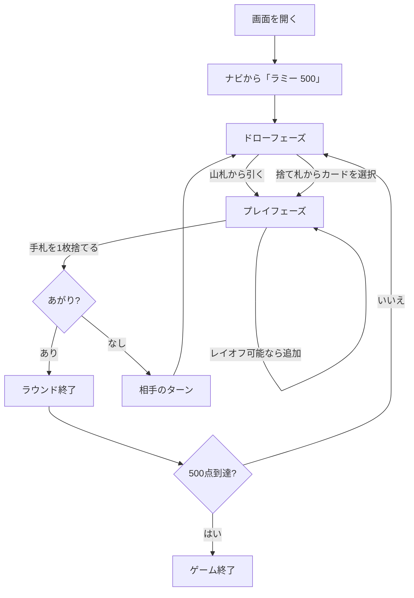

# Rummy 500（Web版）遊び方

## ゲーム概要

Rummy 500（500ラム）は2人で対戦するラミー系カードゲームです。手札からセット（同ランク3枚以上）またはラン（同スート連続3枚以上）のメルドを場に出し、累積得点を競います。先に500点に到達したプレイヤーが勝利です。

## 起動方法

```sh
go run ./cmd/trumpcards web  # CLI経由でWebサーバーを起動
go run ./cmd/server          # 直接Webサーバーを起動
```

ブラウザで `http://localhost:8080` にアクセスし、ナビゲーションバーから「ラミー 500」を選択します。ナビバーのJA/ENボタンで日本語・英語を切り替えられます。

## ルール

### 基本ルール

- プレイヤー数: 2人（あなた vs CPU）
- 配布枚数: 各プレイヤー13枚
- デッキ: ジョーカーを除く52枚
- 1ターンの流れ: ドロー → メルド/レイオフ（任意） → ディスカード

### ドローの特徴

- 山札からの引き取りは通常通り（1枚）。
- **捨て札の山は積まれた順を保持**しており、好きな位置のカードを選択できます。
  選択したカードに加え、その上に積まれていたすべてのカードを手札に取り込みます。

### メルド

- セット: 同ランク3枚以上（最大4枚、全て別スート）
- ラン: 同スート連続3枚以上（Ace は 1 または 15 として扱える。`K-A-2`の折り返しは無効）
- メルドは1ターンに複数出せます。

### レイオフ

- 既に場に出ているメルド（自分または相手）にカードを追加で重ねられます。
- セットには未使用のスートのみ、ランにはメルドの上下に連続するカードのみ追加できます。

### スコアリング

ラウンド終了時に各プレイヤーごとに以下を計算します。

- 場に出したメルドの合計点 → プラス
- 手札に残ったカードの合計点 → マイナス
- カード得点: A = 1点 (`Q-K-A` ランでは 15点)、J/Q/K = 10点、その他 = 数札の値

累積得点が `Point Limit`（既定 500）以上に達したプレイヤーが勝利します。

### ラウンド終了条件

- 誰かが手札を使い切る（"go out"）
- 山札が空になる

## ゲームの流れ



## 画面の操作方法

### ドローフェーズ

1. 「山札から引く」ボタンで山札から1枚引きます。
2. または、捨て札パネル内の任意のカードをクリックします（そのカード以上をすべて受け取ります）。

### プレイフェーズ

1. 手札のカードをクリックして選択します（複数選択可）。
2. 3枚以上の有効なメルドが揃ったら「メルドする」ボタンを押します。
3. 既存メルドに追加するときは「所有者」「メルド#」を選んで1枚を選択し「レイオフ」ボタンを押します。手札を1枚選んでいるあいだは、**その札を実際に置けるメルドだけ**が押せるようになり（緑の枠）、置けないメルドのボタンは無効になります。
4. 最後にカードを1枚選んで「捨てる」ボタンを押すとターンが終了します。

### ラウンド終了フェーズ

- 「次のラウンド」ボタンで次のラウンドを開始します。

## 画面構成

```
┌──────────────────────────────────────────────┐
│  [設定] CPU難易度 / 目標スコア / ヒント        │
├──────────────────────────────────────────────┤
│  捨て札パネル        |  各プレイヤーの情報    │
│  [card][card][card]  |  - 累計/ラウンド得点    │
│                      |  - 場に出したメルド      │
├──────────────────────────────────────────────┤
│  メッセージ / 棋譜                              │
├──────────────────────────────────────────────┤
│  手札（クリックで選択）                          │
│  [山札から引く] [メルドする] [レイオフ] [捨てる] │
└──────────────────────────────────────────────┘
```

## 遊び方のコツ

- 捨て札の途中から大量に引けるルールを利用して、欲しいメルドの種を集めましょう。
- 手札に残った高得点カード（K/Q/J/10/A）は減点になるので、なるべく早くメルドかディスカードで処理します。
- 自分のメルドを増やしておくとレイオフ先が増え、終盤の捨てに困りません。
