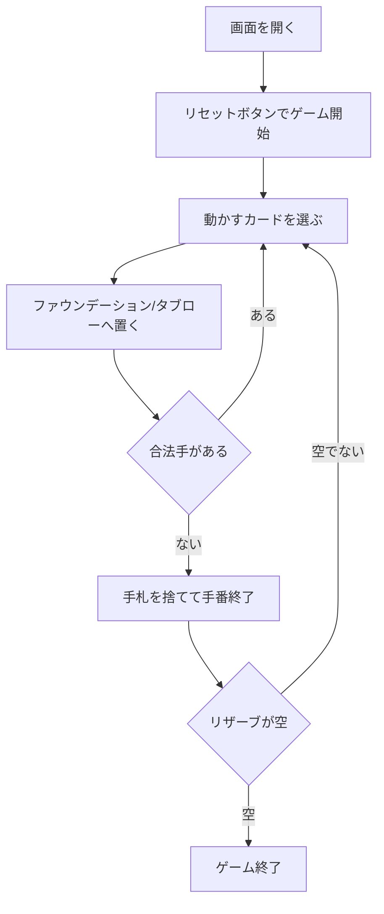

# ロシアンバンク（Web版）遊び方

## ゲーム概要

ロシアンバンク（Russian Bank / クラペット, Crapette）は、CPU と 1 対 1 で競う 2 デッキ（104枚）の対戦型ソリティアです。各プレイヤーは自分の **13 枚のリザーブ（ストック）** を、共有の **8 本のファウンデーション**（A→K 同スート昇順）と **4 列の共有タブロー**（交互色・降順）へ吐き出していきます。先にリザーブを空にしたプレイヤーが勝利します。

## 起動方法

```sh
go run ./cmd/trumpcards web  # CLI経由でWebサーバーを起動
go run ./cmd/server          # 直接Webサーバーを起動
```

ブラウザで `http://localhost:8080` にアクセスし、ナビゲーションバーから「ロシアンバンク」を選択します。
ナビバーのJA/ENボタンで日本語・英語を切り替えられます。

## ルール

### 基本の流れ

1. **手番**: 自分の手番では、合法手が続く限り何手でも指せます。
2. **移動**: 動かすカード（自分のリザーブ／廃札のトップ、共有タブロー列のトップ、相手のリザーブ／廃札のトップ）を選び、ファウンデーションかタブロー列へ置きます。
   - **ファウンデーション**: 空の本には A、以降は同スートで昇順（A→K）。
   - **タブロー**: 空の列には任意のカード、以降は交互色で降順。
3. **手番終了**: 打つ手が無くなったら（または任意で）「手札を捨てて手番終了」で手札を 1 枚廃札に送り、手番を相手に渡します。
4. **ストップ**: 相手（CPU）がファウンデーションへ出せる強制手を取りこぼして手番を終えたら、「ストップ！」で咎められます。

### ゲーム終了

先に自分のリザーブを空にしたプレイヤーが勝者です。両者とも手詰まりになった場合は、残りリザーブの少ない方が勝ち（同数なら引き分け）。

## ゲームの流れ



## 画面の操作方法

- 上部に **ファウンデーション**（8本）と **共有タブロー**（4列）が表示されます。
- その下に CPU・あなたの **リザーブ・廃札・手札** の枚数とトップカードが表示されます。
- 動かすカードをクリックして選択し、ファウンデーション欄か置きたいタブロー列をクリックして移動します。「選択解除」で選び直せます。
- フッターの「手札を捨てて手番終了」「ストップ！」「元に戻す」で手番操作を行います。
- 「ストップ！」は咎められる場面でだけ現れ、**その横に理由（CPU が強制手を取りこぼしています）**が出ます。CUI の黄色い案内と同じ内容です。

### 画面構成

```
┌────────────────────────────────────────────┐
│  ファウンデーション: [♠A][♥A][ - ] ...        │
│  共有タブロー: [♠8][♥5][ - ][♣K]              │
│  ┌── CPU ─────────┐ ┌── あなた ─────────┐   │
│  │ リザーブ 12 ♦7  │ │ リザーブ 11 ♣9     │   │
│  │ 廃札 3 ♥4       │ │ 廃札 2 ♠6          │   │
│  │ 手札 28         │ │ 手札 27            │   │
│  └─────────────────┘ └────────────────────┘  │
│  [ファウンデーションへ] [手札を捨てて手番終了] │
│  [ストップ！] [元に戻す] [リセット]            │
└────────────────────────────────────────────┘
```

## 画面構成

上から順に、ページのコンポーネント構成そのままの並びです。

```
┌──────────────────────────────────────────────────┐
│  ロシアン・バンク                                         │
│  手数: 15  手番: あなた
├──────────────────────────────────────────────────┤
│  相手の山札 [##]  相手の捨て札 [♥5]              │
│  組札（8つ）                                     │
│  [♠A][♥A][ ][ ][ ][ ][ ][ ]                      │
├──────────────────────────────────────────────────┤
│  タブロー（4列）                                 │
│  [1] [2] [3] [4]                                 │
├──────────────────────────────────────────────────┤
│  自分の山札 [##]  自分の捨て札 [♣9]              │
├──────────────────────────────────────────────────┤
│  メッセージ / ヒント                             │
├──────────────────────────────────────────────────┤
│  設定パネル / 棋譜（アクションログ）             │
├──────────────────────────────────────────────────┤
│  [元に戻す] [ヒント] [手番を渡す] [ギブアップ]
│  [リセット]                                      │
└──────────────────────────────────────────────────┘
```

- **組札**: 8つ（52枚2組）。両者が共用します
- **タブロー**: **4列**（`RussianBankTableauCnt`）。色違いの降順で重ねます
- **自分 / 相手の山札・捨て札**: 相手の捨て札の一番上にも積めるのがこのゲームの要で、そこが攻撃手段になります
- **手番**: 打てる手が尽きると相手に手番が移ります
- **メッセージ / ヒント**: 直前の操作の結果と、ヒントボタンを押したときの推奨手
- **設定 / 棋譜**: 難易度などの設定と、これまでの手の履歴（折りたたみ式）
- **リセット**: 新しいゲームを開始します

## 遊び方のコツ

- まず自分のリザーブのトップをファウンデーションやタブローへ出すことを最優先しましょう。リザーブを減らすことが勝利への最短ルートです。
- タブローへ出す前に、その後どんな手が続くかを読みましょう。リザーブのトップが出せる形を作れると一気に進められます。
- CPU の取りこぼしを見逃さず「ストップ！」で咎めると、テンポを奪えます。
