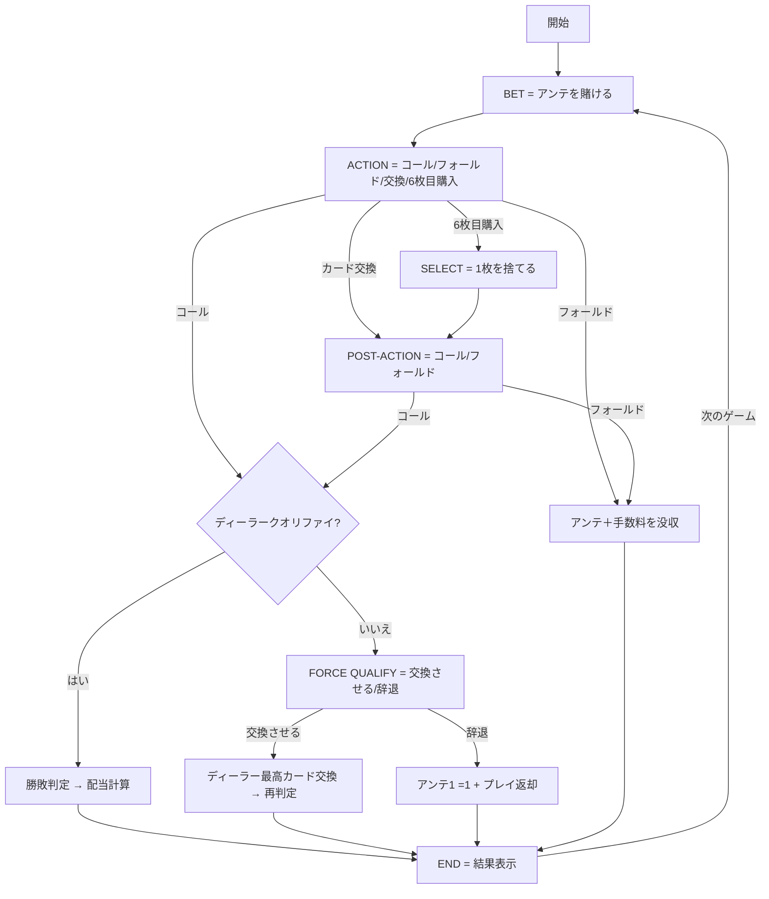

# ロシアンポーカー（Web版）遊び方

## ゲーム概要

オアシスポーカーの発展形で、東欧のカジノを中心に人気のあるカジノポーカーです。カード交換に加え、**6枚目のカードを購入**する選択肢と、ディーラーが未クオリファイ時に**最高カードの交換を強制**できるルールがあり、プレイヤーの判断機会が極めて多いゲームです。

## 起動方法

```sh
go run ./cmd/trumpcards web   # CLI 経由で Web サーバーを起動
go run ./cmd/server           # 直接 Web サーバーを起動
```

ブラウザで `http://localhost:8080` にアクセスし、ナビゲーションから「ロシアンポーカー」を選択します。

## ルール

### 基本ルール

- 52 枚のトランプ（ジョーカーなし）を使用
- プレイヤーとディーラーにそれぞれ 5 枚ずつ配る（ディーラーは 1 枚だけ表向き）
- プレイヤーは以下の 4 つから選択：
  - **コール（プレイ）**: アンテの 2 倍のプレイベットを置いて勝負
  - **フォールド**: アンテを没収して降りる
  - **カード交換**: 1〜5 枚を交換（手数料 = アンテ × 交換枚数）→ その後コール/フォールドを選択
  - **6枚目購入**: アンテ同額を払い 6 枚目を引き、1 枚捨てて 5 枚にする → その後コール/フォールドを選択
- ディーラーは「A と K を含む」または「ペア以上」でクオリファイ
- ディーラー未クオリファイ時、プレイヤーはアンテ同額を払って**ディーラーの最高カードを交換させる**ことができる

### 操作

| フェーズ | 操作 |
|----------|------|
| ベット | アンテを入力し「ベット」ボタン |
| アクション | 「コール」「フォールド」「交換」「6枚目を購入」から選択 |
| カード選択 | 6枚の手札から捨てるカードをタップ |
| コール / フォールド | 交換/購入後の最終決定 |
| 強制クオリファイ | 「カード交換させる」または「辞退」を選択 |
| 結果 | 「次のゲーム」で次の手へ |

### 手札ランキング（強い順）

| ランク | 説明 |
|--------|------|
| ロイヤルフラッシュ | 同じスートの A-K-Q-J-10 |
| ストレートフラッシュ | 同じスートの連続 5 枚 |
| フォーカード | 同じランク 4 枚 |
| フルハウス | スリーカード + ペア |
| フラッシュ | 同じスートの 5 枚 |
| ストレート | 連続する 5 枚 |
| スリーカード | 同じランク 3 枚 |
| ツーペア | ペア 2 組 |
| ワンペア | 同じランク 2 枚 |
| ハイカード | 上記以外 |

### 配当

**プレイ配当倍率（プレイヤー勝ち時、ディーラー資格あり）:**

| 役 | 倍率 |
|----|------|
| ロイヤルフラッシュ | 100:1 |
| ストレートフラッシュ | 50:1 |
| フォーカード | 20:1 |
| フルハウス | 7:1 |
| フラッシュ | 5:1 |
| ストレート | 4:1 |
| スリーカード | 3:1 |
| ツーペア | 2:1 |
| ペア以下 | 1:1 |

**ディーラー未クオリファイ時**: アンテ 1:1 で返却、プレイベットはプッシュ（返却のみ）。

## ゲームの流れ



## 画面の操作方法

- **ベットフェーズ**: アンテ金額を入力して「ベット」をクリック
- **アクションフェーズ**: カードをタップで交換候補を選択。ボタンでアクションを確定
- **セレクトフェーズ**: 6枚のカードから捨てたい 1 枚をタップ
- **強制クオリファイフェーズ**: ディーラーの最高カード交換を強制するか辞退するかを選択

## 画面構成

- 上部: チップ残高、フェーズ表示、CLI モード切替
- 中央: プレイヤーハンド（タップ可能）とディーラーハンド
- 下部: フェーズに応じたアクションボタン

## 遊び方のコツ

- **ペア以上ならコール**が基本戦略。A-K ハイもコール推奨
- **6枚目の購入**は、あと 1 枚でフラッシュやストレートが完成しそうな時に有効
- **強制クオリファイ**は、強い手（フルハウス以上）を持っている時に特に有効 — 配当倍率が大きいため
- カード交換は 1〜2 枚に抑えるのがコスト効率が良い
