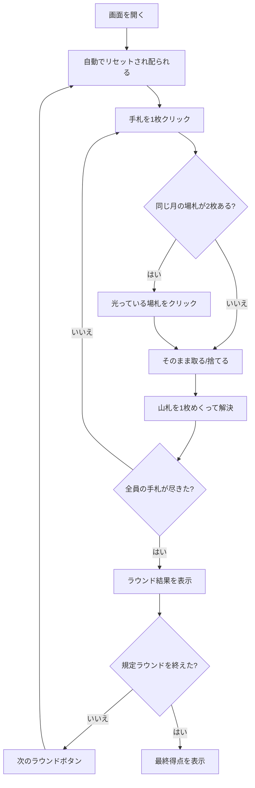

# さくら（Web版）遊び方

## ゲーム概要

さくら（肥後花）は、熊本地方に伝わる**花札（48枚）**の合わせゲームです（2〜4人）。役ではなく**取った札の点数の合計**（光20点・タネ10点・短冊5点・カス1点）で競い、規定ラウンド後に通算点の最も高い人が勝ちます。

## 起動方法

```sh
go run ./cmd/trumpcards web  # CLI経由でWebサーバーを起動
go run ./cmd/server          # 直接Webサーバーを起動
```

ブラウザで `http://localhost:8080` にアクセスし、ナビゲーションバーから「さくら」を選択します。
ナビバーのJA/ENボタンで日本語・英語を切り替えられます。

## ルール

### デッキと配布

- **デッキ**: 花札48枚（12か月 × 各4枚）。こいこいと同じ札です。
- **プレイヤー**: 2〜4人（席0 = あなた、残りは CPU）。設定パネルで人数を変えられます。
- **配布**: 各席に **7枚**、場に **6枚**、残りが山札です。

### 手番

1. 手札を1枚クリックすると、場にある**同じ月**の札を取ります。合う札が無ければその札は場に残ります。
2. 続けて山札から1枚めくり、同じ月の札があれば取ります。
3. 同じ月の札が場に**2枚**あるときは、手札を選ぶと候補の場札が光るので、取るほうをクリックします。

### 点数と追加役

| 札 | 点数 |
|----|------|
| 光 | 20点 |
| タネ | 10点 |
| 短冊 | 5点 |
| カス | 1点 |

| 追加役 | 点数 | 条件 |
|--------|------|------|
| 桜酒 | 30点 | 「桜に幕」と「芒に月」を両方取る |
| 五光 | 100点 | 光札5枚すべてを取る |

### 勝敗

- ラウンドの最高点の席がそのラウンドの勝ちです（同点なら勝者なし）。
- 規定ラウンド（1〜12、既定3）後に**通算点**が最も高い席が勝ちです。同点なら勝ちラウンド数で決めます。

## ゲームの流れ



## 画面の操作方法

### プレイフェーズ

1. 画面下部の自分の手札から1枚をクリックします。
2. 同じ月の場札が2枚あるときは「取る場札を選んでください」と表示されるので、光っている場札をクリックします。
3. CPU の手番は自動で進み、次にあなたの番が来たところで止まります。

### ラウンド終了

- 席ごとの内訳（札の点数 + 追加役 = 合計）が表示されます。
- 「次のラウンド」ボタンで配り直します。

### ゲーム終了

- 最終得点と勝者が表示されます。「新しいゲーム」ボタンで、設定パネルで選んだ人数・ラウンド数で始め直します。

### 設定

| 設定 | 範囲 | 説明 |
|------|------|------|
| 人数 | 2〜4 | 席数。変更はリセット時に反映されます |
| ラウンド数 | 1〜12 | 何ラウンドで決着するか |

### キーボードショートカット

| キー | アクション | 有効条件 |
|------|-----------|---------|
| Tab | 次の札へフォーカス移動 | 常時 |
| Enter / Space | フォーカス中の札を出す | 自分の手番 |

## 画面構成

```
┌────────────────────────────────────────────┐
│ さくら          ラウンド 1/3  山札: 21     │
│                 親: あなた                 │
├────────────────────────────────────────────┤
│  CPU1        CPU2                          │
│  取り札: 4   取り札: 2                     │
│  今局: 22点  今局: 6点                     │
├────────────────────────────────────────────┤
│              場（6枚）                     │
│    [札] [札] [札] [札] [札] [札]           │
├────────────────────────────────────────────┤
│  取り札: 6  今局: 41点  通算: 41点  勝: 0  │
│  追加役: 桜酒 (30)                         │
│  [取った札を小さく並べて表示]              │
│                                            │
│         あなたの手札（7枚）                │
│    [札] [札] [札] [札] [札] [札] [札]      │
├────────────────────────────────────────────┤
│  [次のラウンド]            [リセット]      │
└────────────────────────────────────────────┘
```

- 上段に相手の席（枚数と点数のみ。**手札そのものはサーバから送られません**）。
- 中央が場、その下があなたの取り札と追加役、いちばん下が手札です。

## 遊び方のコツ

- **光札（20点）は1枚で短冊4枚ぶん。** 同じ月に光札があるなら優先して取ります。
- 「桜に幕」（3月）と「芒に月」（8月）を両方そろえると桜酒30点。片方を取ったら、もう一方の月を意識します。
- 合う札が無いときは、いちばん安い札を捨てます。高い札を場に置くと相手に取られます。
- ヒントを有効にすると、取れる札があるかどうかを教えてくれます。
