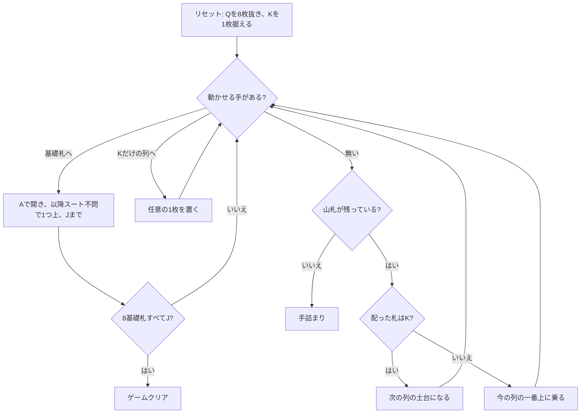

# サリカ法典（Web版）遊び方

## ゲーム概要

52 枚 2 組から**クイーン 8 枚を抜いた 96 枚**で遊ぶソリティア。名前は女子の王位継承を認めないサリカ法典に由来し、抜いた Q は盤の脇に飾るだけで最後まで場に出ない。

まず K を 1 枚据えてそれを列の土台とし、以降 1 枚ずつ配って今の列に積む。**K が出たらそれが次の列の土台**になり、96 枚を配り切ると 8 列になる。基礎札は 8 つで、A を置いて **スートを問わず** J まで積む。K 8 枚を除く 88 枚すべてを積み切ればクリア。

## 起動方法

```sh
go run ./cmd/trumpcards web  # CLI経由でWebサーバーを起動
go run ./cmd/server          # 直接Webサーバーを起動
```

ブラウザで `http://localhost:8080` にアクセスし、ナビゲーションバーから「サリカ法典」を選択します。
ナビバーのJA/ENボタンで日本語・英語を切り替えられます。

## ルール

- 52 枚 2 組から **Q 8 枚を抜いた 96 枚**。Q は飾りで、動かせない
- **配り**: K を 1 枚据えて開始。配ると **今の列の一番上に乗る**。**K が出たら次の列の土台**になる。捨て札は無い
- **基礎札**: 8 つ。A を置いて **スートを問わず** 1 つずつ上げ、**J で完成（11 枚）**。Q は場に無く K は土台なので、12 枚目は存在しない
- **基礎札は列が開いてから**。組札 i は列 i と対なので、その列の K が出るまで使えない
- **タブロー同士は積めない**。唯一の例外が「**K だけの列**」で、そこには任意の 1 枚を置ける
- **土台の K は動かせない**。列の底に据わったまま最後まで残る
- 8 × 11 = 88 枚すべてを基礎札へ積めばクリア。手が尽きれば手詰まり

> 補足: issue #5447 の仕様案とは 3 点異なるが、いずれも実際の規則（PySolFC / Wikipedia）に合わせた。
> (1) **Q は「K の上部スロットへ移す」のではなく、配る前に場から抜く**。移す規則にすると 104 枚のままになり、基礎札 88 枚 + K 8 枚の勘定が合わない。
> (2) 基礎札は同スート昇順ではなく **スート不問**。
> (3) **残り 96 枚を最初にタブローへ配り切るのではない**。1 枚ずつ配り、K で列が区切られてできる。

## ゲームの流れ



## 画面の操作方法

| 操作 | 説明 |
|------|------|
| 列の一番上のカードをクリック | そのカードを移動元として選択する（下のカードは選べない） |
| 山札をクリック | 1 枚配る。**移動元にはならない**（捨て札が無いので、配った札はそのまま列に乗る） |
| 組札をクリック | 選択中のカードをその組札に置く |
| 「K だけの列」をクリック | 選択中のカードをその列に置く。**これが唯一のタブロー移動** |
| ドラッグ＆ドロップ | クリック 2 回と同じ移動をドラッグでも行える |
| ヒントボタン | 組札 → K だけの列 → 配る の順に手を 1 つ提示する |
| 自動完成ボタン | 組札へ送れる札がなくなるまで自動で送る（**場札の組み替えは行わない**） |
| 元に戻す / 手詰まり脱出ボタン | 1 手戻す / 脱出に必要な手数だけまとめて戻す |
| ギブアップ / リセットボタン | 確認ダイアログのうえで投了 / やり直す |
| CLI トグル | 同じゲームをコマンド入力で操作するモードに切り替える |

キーボードショートカット: `d` 配る / `h` ヒント / `a` 自動完成 / `z` 元に戻す / `g` ギブアップ（確認あり）。

## 画面構成

- **上部**: フェーズ表示と手数
- **中央上段**: 8 つの組札（`F0`〜`F7`。空のときは「A」と表示）、山札、そして**退場したクイーン 8 枚**
- **中央下段**: 8 つの列。番号 `#0`〜`#7` はヒント表示の番号と一致する。**まだ K が出ていない列は「未開放」**と表示され、置き場所ではない
- **下部**: ヒント表示、アクションログ、設定、キーボードショートカット一覧

## 遊び方のコツ

- **「K だけの列」は使い切りの逃げ場。** 1 枚置いた時点でその列はもう空きではなくなる。何を逃がすかで局面が決まる
- **配ると列は伸びる一方。** 捨て札が無いので、配った札は必ずどこかの列の上に乗る。基礎札へ送れる手を先に消化してから配る
- **K が出るまでその列の基礎札は使えない。** 序盤に A が出ても、対応する列が開いていなければ置けない
- **「未開放」と「K のみ」を混同しない。** 前者は置き場所ではなく、後者はこのゲーム唯一の置き場所
- A は出たらすぐ組札へ
- 詰まったら元に戻すで分岐をやり直す
