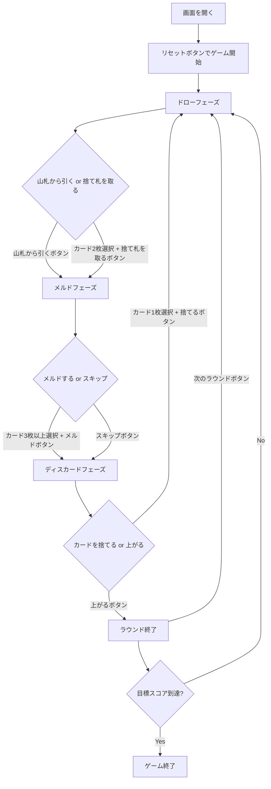

# サンバ（Web版）遊び方

## ゲーム概要

サンバ（Samba）はカナスタを拡張した4人2チーム制のラミー系カードゲームです。標準52枚×3デッキ＋ジョーカー6枚（計162枚）を使用し、同ランクの「セット」に加え、**同スート7枚の連続「サンバ（シーケンス）」**を作れるのが特徴です。座席0・2 対 1・3 のパートナー戦で、先に目標スコア（デフォルト10000点）に到達したチームが勝利します。あなたは座席0（チーム0）です。

## 起動方法

```sh
go run ./cmd/trumpcards web
# または
go run ./cmd/server
```

ブラウザで `http://localhost:8080` を開き、ナビゲーションから「サンバ」を選択してください。

## ルール

### 基本ルール

- **デッキ**: 標準52枚×3デッキ＋ジョーカー6枚＝162枚
- **配布**: 各プレイヤーに13枚
- **チーム**: 座席0・2 対 1・3 の2チーム
- **ワイルドカード**: 2とジョーカーはワイルド
- **赤3**: ハート3・ダイヤ3は自動的に場に出される
- **黒3**: 捨てるだけ（メルド不可、相手のピックアップをブロック）

### メルド

- **セット（同ランク）**: 同ランク3枚以上。ナチュラル最低2枚、ワイルド最大3枚。
- **シーケンス（同スート連続）**: 同スートの連続する3枚以上。ワイルド不可。
- **カナスタ** = 7枚のセット
- **サンバ** = 7枚のシーケンス（すべてナチュラル）

### 初回メルド最低点（チーム累積スコア基準）

| 累積スコア | 最低点 |
|-----------|--------|
| マイナス | 15点 |
| 0〜1499 | 50点 |
| 1500〜2999 | 90点 |
| 3000以上 | 120点 |

### 得点

| ボーナス | 点数 |
|----------|------|
| ナチュラルカナスタ | 500点 |
| ミックスカナスタ | 300点 |
| サンバ（7枚シーケンス） | 1500点 |
| 上がりボーナス | 100点 |
| 赤3（1枚あたり） | 100点 |

### CPU難易度

- Easy: ランダムプレイ
- Normal: 基本戦略
- Hard: 戦略的プレイ

## ゲームの流れ



## 画面の操作方法

### ドローフェーズ

1. 「山札から引く」ボタンをクリック
2. または、手札からナチュラルカード2枚を選択し「捨て札を取る」ボタンをクリック

### メルドフェーズ

1. 手札からメルドするカード3枚以上を選択し「メルド」ボタンをクリック（セットまたはシーケンス）
2. メルドしない場合は「スキップ」ボタンをクリック

### ディスカードフェーズ

1. 手札からカード1枚を選択し「捨てる」ボタンをクリック
2. チームが完成メルドを2つ以上持っている場合は「上がる」ボタンで上がれます

### キーボードショートカット

| キー | アクション | 有効条件 |
|------|-----------|----------|
| ← → | カード選択移動 | 人間の手番 |
| Space | カード選択/解除 | 人間の手番 |
| Enter | 確定 | カード選択中 |
| Escape | 選択解除 | カード選択中 |

## 画面構成

```
┌──────────────────────────────────┐
│ ゲームタイトル / フェーズ表示     │
├──────────────────────────────────┤
│ 設定パネル (CPU難易度/目標スコア) │
├──────────────────────────────────┤
│ チームスコア表示                 │
├────────────────┬─────────────────┤
│ 捨て札エリア   │ スコアテーブル   │
│ メルド表示     │ （チーム列付き） │
│ （セット/サンバ）│ CPU情報        │
├────────────────┴─────────────────┤
│ 手札エリア (カード選択)          │
│ アクションボタン                 │
└──────────────────────────────────┘
```

## 遊び方のコツ

- サンバ（同スート7枚）は1500点の大ボーナス
- ナチュラルカナスタは500点のボーナス
- シーケンスにはワイルドを使えないので、ワイルドはセットに回しましょう
- 捨て札の山が大きい時は積極的に取りましょう
- ワイルドカードを捨てると山がフリーズします
- 黒3で相手の山取りをブロックできます

