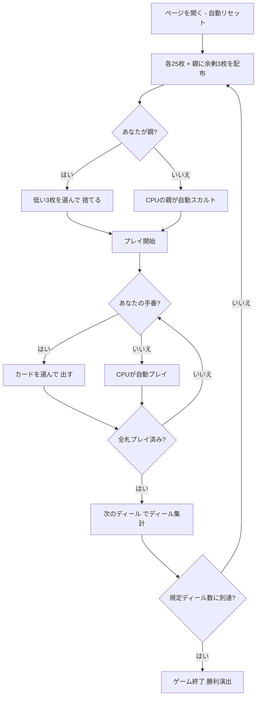

# スカルト（Web版）遊び方

## ゲーム概要

Scarto（スカルト）はイタリア・ピエモンテ発祥の3人用**タロッキ・トリックテイキングゲーム**です。78枚のタロットデッキ（4スート×14枚＝コート札 V・C・D・R、切り札21枚、エクスキューズ）を使い、あなたは**席0**としてCPU2人と対戦します。**ビッド・シアン（交換札）・パートナーはありません**。親（ディーラー）が余剰の3枚を伏せて捨てる「**スカルト**」を行い、残り札でトリックを戦います。各ディールは3人の取り札点数を平均と比較したゼロサム精算で採点します。

## 起動方法

```sh
go run ./cmd/trumpcards web        # REST API + Web GUI サーバを起動
go run ./cmd/trumpcards web --open # 起動してブラウザを開く
```

ブラウザで `/scarto` にアクセスします。

## ルール

### デッキと配布

- **デッキ**: 78枚（4スート×14枚＝1〜10・V・C・D・R、切り札1〜21、エクスキューズ）。
- **プレイヤー**: 3人（あなた = 席0、CPU1〜2）。
- **配布**: 各プレイヤー25枚。親には余剰の3枚が追加で配られます。

### スカルト（捨て札）

親は手札から**低点のピップ札3枚を選んで伏せて捨てます**。捨てた3枚は親の得点札（スカルト）となります。切り札・エクスキューズ・得点札（キング・コート札）は捨てられません（やむを得ない場合のみ非ブー切り札を許可）。あなたが親のときはフッターの手札から選んで「**捨てる**」ボタンで確定します。親がCPUのときは自動で行われ、あなたは待機します。

### フォロー義務とカードの強さ

- リードスートを持っていれば**必ず従わなければなりません（must-follow）**。ボイド時は切り札を含む任意の札を出せます。切り札はすべてのスート札に勝ちます。
- 最も高い切り札、なければリードスートの最も高い札がトリックを取ります。

### 得点計算と勝利条件

- 各ディールの取り札点数を3人の平均と比較し、**ゼロサム精算**（score_i = 3 × 取り札点_i − 総点）でディール得点を計算します。合計は常に0です。
- 規定ディール数（既定 **5**）を配り終えた時点で、累計得点が最上位のプレイヤーが勝利します。同点の場合は引き分けです。

## ゲームの流れ



## 画面の操作方法

- **スカルト**: あなたが親のとき、捨てられる低点札がハイライトされます。3枚選んで「捨てる」ボタンで確定します。
- **プレイ**: プレイ可能な札がハイライトされるので、選んで「出す」します。
- **トリック／ディール進行**: 「次のトリック」でトリック結果を確認、「次のディール」で次のディールへ進みます。
- **その他**: 「リセット」で新規ゲーム、設定でヒントをONにすると推奨アクションが表示されます。

## 画面構成

- **ヘッダー**: ゲーム名・フェーズ表示（スカルト / プレイ / …）・CLI 切り替え
- **情報サイドバー**: 各プレイヤーの累計得点・親（ディーラー）バッジ・獲得トリック数・取り札点数・ディール結果（平均との差）
- **中央**: 現在のトリック
- **フッター**: あなたの手札（プレイ可能札／捨てられる札がハイライト）・アクションボタン（捨てる/出す/次のトリック/次のディール/リセット）

## 遊び方のコツ

- スカルトでは点数の低い短いスートを捨て、切り札やコート札を温存しましょう。
- 切り札とエクスキューズ、キング・コート札（得点札）は捨てられません。
- フォロー義務を意識し、ボイドを作って切り札を切る展開を狙いましょう。
- ヒント（設定でON）は、スカルト・プレイの各局面で推奨アクションを提示します。
